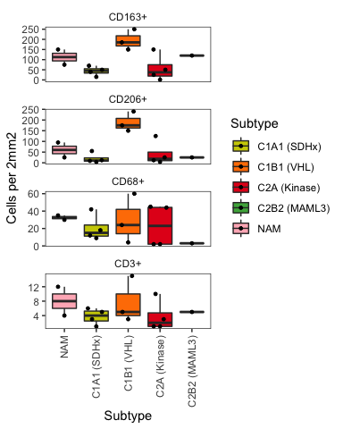

IHC analysis
================
Blake Bowen
2022-07-07

``` r
library(tidyverse)
```

    ## ── Attaching packages ─────────────────────────────────────── tidyverse 1.3.1 ──

    ## ✓ ggplot2 3.3.5     ✓ purrr   0.3.4
    ## ✓ tibble  3.1.3     ✓ dplyr   1.0.7
    ## ✓ tidyr   1.1.3     ✓ stringr 1.4.0
    ## ✓ readr   2.0.0     ✓ forcats 0.5.1

    ## ── Conflicts ────────────────────────────────────────── tidyverse_conflicts() ──
    ## x dplyr::filter() masks stats::filter()
    ## x dplyr::lag()    masks stats::lag()

``` r
library(ggbeeswarm)
```

``` r
ihc <- read_csv("~/Documents/Work/snPCPG_paper/Rebuttal v2/Tables/IHC_data.csv")
```

    ## Rows: 14 Columns: 8

    ## ── Column specification ────────────────────────────────────────────────────────
    ## Delimiter: ","
    ## chr (4): SampleID, ID Number, Subtype, Genotype
    ## dbl (4): CD3 per 2mm2, CD68 per 2mm2, CD163 per 2mm2, CD206 per 2mm2

    ## 
    ## ℹ Use `spec()` to retrieve the full column specification for this data.
    ## ℹ Specify the column types or set `show_col_types = FALSE` to quiet this message.

``` r
colnames(ihc) <- make.names(colnames(ihc))
head(ihc)
```

    ## # A tibble: 6 × 8
    ##   SampleID  ID.Number Subtype Genotype CD3.per.2mm2 CD68.per.2mm2 CD163.per.2mm2
    ##   <chr>     <chr>     <chr>   <chr>           <dbl>         <dbl>          <dbl>
    ## 1 E041      VPH36T    C1A1 (… SDHA                3             9             15
    ## 2 E019      VPH23T    C1A1 (… SDHB                6            18             40
    ## 3 P018-PGL1 P018P1.2… C1A1 (… SDHB                5            42             50
    ## 4 P018-PGL3 P018M3    C1A1 (… SDHB                1            12             70
    ## 5 E024      VPH35T    C1B1 (… VHL                 3             4            150
    ## 6 E041      07SH0498  C1B1 (… VHL                 5            60            250
    ## # … with 1 more variable: CD206.per.2mm2 <dbl>

``` r
# colours
subtypes_genotypes <- c("NAM", "C1A1 (SDHx)", "C1A2 (SDHx-HN)", "C1B1 (VHL)", "C1B2 (EPAS1)", "C2A (Kinase)", "C2B1 (MAX)", "C2B2 (MAML3)", "C2C")
subtype_colours <- c("light pink", "yellow3", "#A65628", "#FF7F00", "#984EA3", "#E41A1C", "#377EB8", "#4DAF4A",  "#F781BF")
subtype_genotype_cols <- setNames(subtype_colours,
                                  subtypes_genotypes)

subtype_genotype_cols <- subtype_genotype_cols[unique(ihc$Subtype)]

plotdata <- ihc %>% 
  pivot_longer(cols = ends_with(".per.2mm2"), names_to = "marker",  values_to = "cells.per.2mm2") %>% 
  mutate(marker = str_replace(marker, pattern = "\\.per\\.2mm2", replacement="+")) %>% 
  mutate(marker = factor(marker, levels = c("CD163+", "CD206+", "CD68+", "CD3+"))) %>% 
  mutate(Subtype = factor(Subtype, levels = intersect(subtypes_genotypes, unique(Subtype))))

ggplot(plotdata, aes(x = Subtype, y = cells.per.2mm2, fill = Subtype)) +
  geom_boxplot(outlier.shape=NA)+
  geom_quasirandom(cex=1)+
  facet_wrap(~marker,ncol = 1, scales = "free_y") + 
  scale_fill_manual(values = subtype_genotype_cols)+
  labs(y = "Cells per 2mm2") +
    theme_bw() + 
  theme(strip.background = element_blank(),
        axis.text.x = element_text(angle = 90, vjust=0.5, hjust=1),
        panel.grid = element_blank())
```

<!-- -->

# ANOVA

``` r
# Exclude the normal samples from the statistical analysis
ihc.stats <- ihc %>% filter(Subtype != "NAM")

# model the number of cells staining positive for each marker as a function of subtype
cd3_aov <- aov(CD3.per.2mm2 ~ Subtype, data = ihc.stats)
summary(cd3_aov)
```

    ##             Df Sum Sq Mean Sq F value Pr(>F)
    ## Subtype      3   33.5   11.17   0.587   0.64
    ## Residuals    8  152.2   19.02

``` r
cd68_aov <- aov(CD68.per.2mm2 ~ Subtype, data = ihc.stats)
summary(cd68_aov)
```

    ##             Df Sum Sq Mean Sq F value Pr(>F)
    ## Subtype      3    541   180.2   0.353  0.789
    ## Residuals    8   4090   511.3

``` r
cd163_aov <- aov(CD163.per.2mm2 ~ Subtype, data = ihc.stats)
summary(cd163_aov)
```

    ##             Df Sum Sq Mean Sq F value Pr(>F)  
    ## Subtype      3  46964   15655   6.398 0.0161 *
    ## Residuals    8  19576    2447                 
    ## ---
    ## Signif. codes:  0 '***' 0.001 '**' 0.01 '*' 0.05 '.' 0.1 ' ' 1

``` r
CD206_aov <- aov(CD206.per.2mm2 ~ Subtype, data = ihc.stats)
summary(CD206_aov)
```

    ##             Df Sum Sq Mean Sq F value  Pr(>F)   
    ## Subtype      3  57281   19094   9.852 0.00461 **
    ## Residuals    8  15504    1938                   
    ## ---
    ## Signif. codes:  0 '***' 0.001 '**' 0.01 '*' 0.05 '.' 0.1 ' ' 1

# T-test

``` r
# compare the VHL subtype with the other subtypes using a t-test
ihc.stats <- ihc.stats %>%
  mutate(VHL = if_else(Subtype == "C1B1 (VHL)", "C1B1 (VHL)", "Other subtypes"))

cd163_vhl_ttest <- t.test(CD163.per.2mm2~VHL, data = ihc.stats)
cd163_vhl_ttest
```

    ## 
    ##  Welch Two Sample t-test
    ## 
    ## data:  CD163.per.2mm2 by VHL
    ## t = 4.0906, df = 3.3467, p-value = 0.02137
    ## alternative hypothesis: true difference in means is not equal to 0
    ## 95 percent confidence interval:
    ##   36.4271 237.7951
    ## sample estimates:
    ##     mean in group C1B1 (VHL) mean in group Other subtypes 
    ##                    195.00000                     57.88889

``` r
cd206_vhl_ttest <- t.test(CD206.per.2mm2~VHL, data = ihc.stats)
cd206_vhl_ttest
```

    ## 
    ##  Welch Two Sample t-test
    ## 
    ## data:  CD206.per.2mm2 by VHL
    ## t = 5.3094, df = 3.0061, p-value = 0.01298
    ## alternative hypothesis: true difference in means is not equal to 0
    ## 95 percent confidence interval:
    ##   63.49268 252.95176
    ## sample estimates:
    ##     mean in group C1B1 (VHL) mean in group Other subtypes 
    ##                    188.33333                     30.11111

``` r
sessionInfo()
```

    ## R version 4.0.2 (2020-06-22)
    ## Platform: x86_64-apple-darwin17.0 (64-bit)
    ## Running under: macOS  10.16
    ## 
    ## Matrix products: default
    ## BLAS:   /Library/Frameworks/R.framework/Versions/4.0/Resources/lib/libRblas.dylib
    ## LAPACK: /Library/Frameworks/R.framework/Versions/4.0/Resources/lib/libRlapack.dylib
    ## 
    ## locale:
    ## [1] en_AU.UTF-8/en_AU.UTF-8/en_AU.UTF-8/C/en_AU.UTF-8/en_AU.UTF-8
    ## 
    ## attached base packages:
    ## [1] stats     graphics  grDevices datasets  utils     methods   base     
    ## 
    ## other attached packages:
    ##  [1] ggbeeswarm_0.6.0 forcats_0.5.1    stringr_1.4.0    dplyr_1.0.7     
    ##  [5] purrr_0.3.4      readr_2.0.0      tidyr_1.1.3      tibble_3.1.3    
    ##  [9] ggplot2_3.3.5    tidyverse_1.3.1 
    ## 
    ## loaded via a namespace (and not attached):
    ##  [1] Rcpp_1.0.7       lubridate_1.7.10 assertthat_0.2.1 digest_0.6.27   
    ##  [5] utf8_1.2.2       R6_2.5.0         cellranger_1.1.0 backports_1.2.1 
    ##  [9] reprex_2.0.0     evaluate_0.14    highr_0.9        httr_1.4.2      
    ## [13] pillar_1.6.1     rlang_0.4.11     readxl_1.3.1     rstudioapi_0.13 
    ## [17] rmarkdown_2.14   labeling_0.4.2   bit_4.0.4        munsell_0.5.0   
    ## [21] broom_0.7.8      compiler_4.0.2   vipor_0.4.5      modelr_0.1.8    
    ## [25] xfun_0.31        pkgconfig_2.0.3  htmltools_0.5.2  tidyselect_1.1.1
    ## [29] fansi_0.5.0      crayon_1.4.1     tzdb_0.1.2       dbplyr_2.1.1    
    ## [33] withr_2.4.2      grid_4.0.2       jsonlite_1.7.2   gtable_0.3.0    
    ## [37] lifecycle_1.0.0  DBI_1.1.1        magrittr_2.0.1   scales_1.1.1    
    ## [41] cli_3.0.1        stringi_1.7.3    vroom_1.5.3      farver_2.1.0    
    ## [45] renv_0.13.2      fs_1.5.0         xml2_1.3.2       ellipsis_0.3.2  
    ## [49] generics_0.1.0   vctrs_0.3.8      tools_4.0.2      bit64_4.0.5     
    ## [53] glue_1.4.2       beeswarm_0.4.0   hms_1.1.0        parallel_4.0.2  
    ## [57] fastmap_1.1.0    yaml_2.2.1       colorspace_2.0-2 rvest_1.0.0     
    ## [61] knitr_1.33       haven_2.4.1
