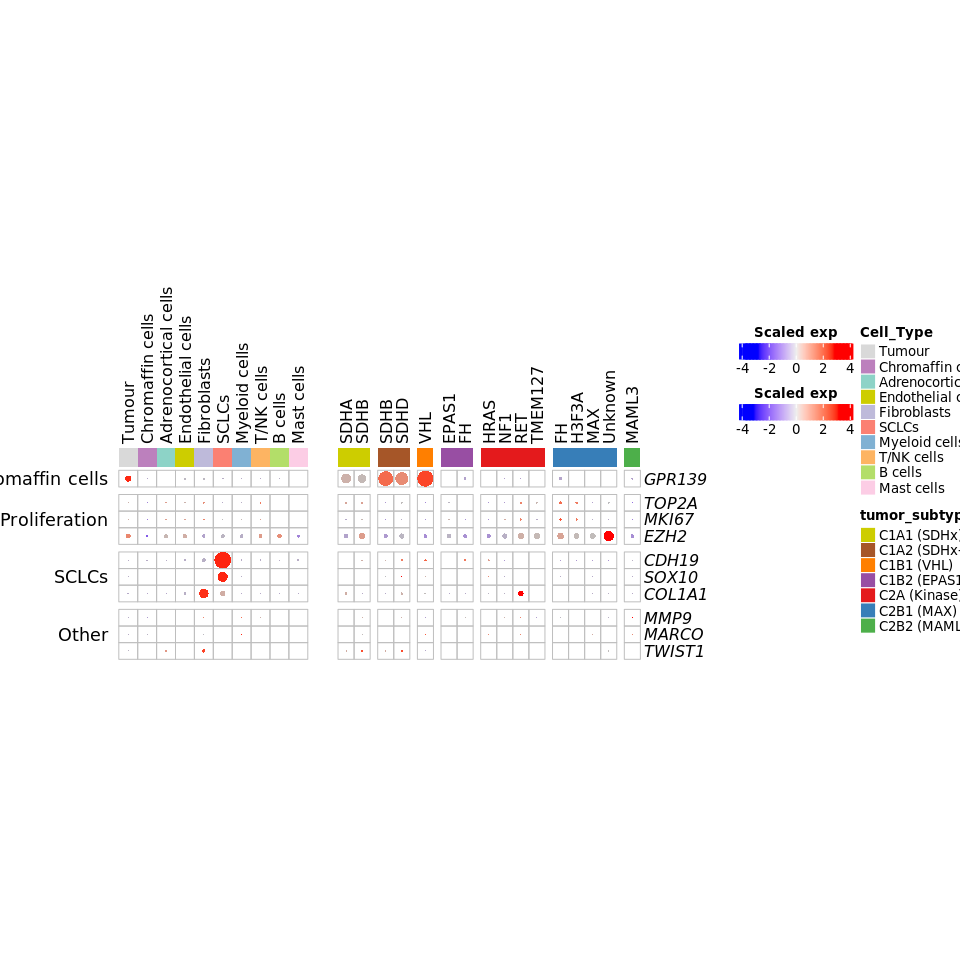

Bulk differential gene-expression: malignant vs non-malignant PCPG
================
Blake Bowen
11/05/2022

``` r
rm(list=ls())

library(limma)
library(edgeR)
library(tidyverse)
library(patchwork)
library(ComplexHeatmap)
library(RColorBrewer)
library(scales)
library(circlize)
library(msigdbr)
library(GSVA)
library(ggsci)
library(ggrepel)

source("singlecell_colour_palettes.R")
source("stacked_violin_plot_functions.R")
# source("volcano_plot_functions.R")
source("calculate_fraction_cells_expressing_functions.R")
source("Figures/dotplot_functions.R")
```

``` r
# read in the bulk rna-seq metadata
bulk_metadata <- read_csv("Data/bulk_metadata.tsv")
```

    ## Rows: 735 Columns: 24

    ## ── Column specification ────────────────────────────────────────────────────────
    ## Delimiter: ","
    ## chr (19): Sample, Sample_raw, Alias, Accession_ID, Dataset, Batch, Location,...
    ## dbl  (5): Purity, ConsensusCluster, Consensus, UMAP_1, UMAP_2

    ## 
    ## ℹ Use `spec()` to retrieve the full column specification for this data.
    ## ℹ Specify the column types or set `show_col_types = FALSE` to quiet this message.

``` r
bulk_metadata$tumor_subtype <- factor(bulk_metadata$tumor_subtype,
                                      levels = c(subtypes_genotypes))

# filter out samples from the metadata that don't have clinical annotation, normal and C2C cluster
# remove tumors belonging to the head and neck cluster
bulk_metadata <- bulk_metadata %>%
  filter(!is.na(Malignancy)) %>% 
  filter(!tumor_subtype %in% c("C2C")) %>% 
  filter(!Location == "Head and neck") %>% 
  mutate(Malignancy = recode(Malignancy, "Benign" = "NonMalignant"))
  
bulk_rna <- read_tsv("Data/bulk_expression_quantile_normalised.tsv") %>% 
  dplyr::rename("Gene" = 1)
```

    ## New names:
    ## * `` -> ...1

    ## Rows: 23270 Columns: 736

    ## ── Column specification ────────────────────────────────────────────────────────
    ## Delimiter: "\t"
    ## chr   (1): ...1
    ## dbl (735): AGZ_001_U133_2, AGZ_002_U133_2, AGZ_003_U133_2, AGZ_004_U133_2, A...

    ## 
    ## ℹ Use `spec()` to retrieve the full column specification for this data.
    ## ℹ Specify the column types or set `show_col_types = FALSE` to quiet this message.

``` r
# remove the samples from the bulk that aren't in the metadata 
# anything without clinical annotation removed 
# normals and C2C adrenocortical admixture removed

bulk_rna <- bulk_rna %>%
  dplyr::select(all_of(c("Gene", bulk_metadata$Sample_raw)))

# check the metadata samples is in the same order as the gene expression matrix
table(bulk_metadata$Sample_raw == colnames(bulk_rna)[2:ncol(bulk_rna)])

# put the counts in a matrix
counts_mat <- bulk_rna %>% 
  column_to_rownames(var = "Gene") %>%
  as.matrix()

# remove rows if every value is NA
counts_mat <- counts_mat[!rowSums(is.na(counts_mat)) == ncol(counts_mat), ]

dim(counts_mat)
dim(bulk_metadata)
```

First, perform MDS dimensional reduction to see what the main sources of
variation are within the dataset.

``` r
mds <- plotMDS(counts_mat, plot = FALSE)

mds_tbl <- tibble(leading_logFC_dim1 = mds$x,
                  leading_logFC_dim2 = mds$y,
                  Sample_raw=colnames(mds$distance.matrix),
                  Dim = "1+2") %>%
  left_join(bulk_metadata)
```

    ## Joining, by = "Sample_raw"

``` r
# Plot some possible and expected sources of variation
mds_ggplot <- ggplot(data = mds_tbl, aes(x = leading_logFC_dim1, y = leading_logFC_dim2))

mds1 <- mds_ggplot +
  geom_point(aes(colour = Batch))

mds2 <- mds_ggplot +
  geom_point(aes(colour = Genotype))

mds3 <- mds_ggplot +
  geom_point(aes(colour = tumor_subtype))

mds4 <- mds_ggplot +
  geom_point(aes(colour = Malignancy))

mds1 + mds2 + mds3 + mds4
```

<!-- -->

The MDS plots show that tumor samples primarily cluster by batch
although they also cluster by tumor\_subtype and malignancy within each
batch.

``` r
# use Magnus's function to account for the partial NA coefficients
compare.groups = function(fit, groups1, groups2, trend=FALSE){
  groups1 = intersect(groups1, colnames(fit$coefficients))
  groups2 = intersect(groups2, colnames(fit$coefficients))
  fit = fit[,c(groups1, groups2)]
  all.unique.groups = !is.na(fit$coefficients) %>% as.data.frame
  unique.groups = all.unique.groups[!duplicated(all.unique.groups),,drop=F]
  y = do.call(rbind, lapply(1:nrow(unique.groups), function(x){
    x = unique.groups[x,]
    fit = fit[,colnames(fit$coefficients)[x]]
    groups1 = intersect(groups1, colnames(fit$coefficients))
    groups2 = intersect(groups2, colnames(fit$coefficients))
    if(length(groups1) == 0 | length(groups2) == 0){return(NULL)}
    coef = paste0("(", paste(groups1, collapse = " + "),")/", length(groups1)," - (", paste(groups2, collapse = " + "),")/", length(groups2))
     y = contrasts.fit(fit, makeContrasts(contrasts = coef, levels=colnames(fit$coefficients))) %>% eBayes(trend=trend) %>% topTable(coef=coef, sort.by = 'p', number = Inf, p.value = 1)
    y = y[rownames(y) %in% rownames(fit$coefficients)[apply(all.unique.groups, 1, function(i){
      sum(i!=x) == 0})],]
    return(y)
  }))
  y$Gene = rownames(y)
  y = y[order(y$P.Value),]
  y$adj.P.Val = p.adjust(y$P.Value, method="BH")
  return(y)
}
```

``` r
# looks like SDHx have decent number of both nonmalignant and malignant
table(bulk_metadata$Malignancy, bulk_metadata$tumor_subtype)
```

    ##               
    ##                CCs (NAM) C1A1 (SDHx) C1A2 (SDHx-HN) C1B1 (VHL) C1B2 (EPAS1)
    ##   Malignant            0          23              8          8            0
    ##   NonMalignant         0          31              9         69           19
    ##               
    ##                C2A (Kinase) C2B1 (MAX) C2B2 (MAML3) C2C
    ##   Malignant               7          2            4   0
    ##   NonMalignant          145         48            9   0

``` r
# create a new variable for the design matrix combining malignancy and subtype
batch <- bulk_metadata$Batch

malignancy_subtype <- paste(bulk_metadata$Malignancy, make.names(bulk_metadata$tumor_subtype), sep = "_") %>% 
  str_replace("\\.\\.", "_") %>% 
  str_replace("\\.$", "") %>% 
  str_replace("\\.", "_")

# a similar single factor design is described in the limma user guide section 9.5.2: 
# https://www.bioconductor.org/packages/devel/bioc/vignettes/limma/inst/doc/usersguide.pdf 
design.subtypes <- model.matrix(~0 + malignancy_subtype + batch)
colnames(design.subtypes) <- str_remove(colnames(design.subtypes), "malignancy_subtype")
fit.subtypes <- lmFit(counts_mat, design = design.subtypes)
```

    ## Warning: Partial NA coefficients for 5694 probe(s)

There seems to be a good representation of malignant and nonmalignant
within the C1A tumor group, with the remaining subtypes having much
lower representation of malignant tumors. Therefore, I will perform 2
separate comparisons of malignant vs non-malignant within the C1A (SDH)
tumors, and within a set of all the other tumor subtypes.

``` r
ggVolcanoPlot <- function(tt,
                          signif_threshold=0.05,
                          genes.label=NULL,
                          n.genes.label=30,
                          logFC_threshold=0.25,
                          genes.groups=NULL,
                          genes.groups.colourpal=NULL
                          ) {
  #' @param tt:                     Top table as output from limma pipeline
  #' @param signif_threshold:       significance threshold to plot 
  #' @param genes.label:            provide a list of genes to label
  #' @param n.genes.label:          provide the number of top differentially expressed genes to label,
  #'                                only if genes.label is not provided 
  #' @param logFC_threshold:        Log fold change cutoff to plot
  #' @param genes.groups:           column name in the top table, desribing group identities for the genes,
  #'                                with names specifying group membership significant genes will be colored
  #'                                according to these
  #' @param genes.groups.colourpal: Colour palette named vector of colour hexcodes mapping to each level of genes.groups
  
  if(!"Gene" %in% colnames(tt)){
    tt <- tt %>%
      rownames_to_column("Gene") %>%
      data.frame()
  }
  
  if(!is.null(genes.label)){
    genes.label <- tt %>%
      filter(.data[["adj.P.Val"]] < signif_threshold &
               abs(.data[["logFC"]]) > logFC_threshold &
               .data[["Gene"]] %in% genes.label) %>% 
      pull(.data[["Gene"]])
  }else {
    genes.label <- tt %>%
      filter(.data[["adj.P.Val"]] < signif_threshold &
               abs(.data[["logFC"]]) > logFC_threshold) %>% 
      slice_max(n = n.genes.label, order_by = .data[["logFC"]]) %>% 
      pull(.data[["Gene"]])
  }
  
  tt <- tt %>% 
    #flag the significant genes, and genes to label
    mutate(sig = if_else(.data[["adj.P.Val"]] < signif_threshold & abs(.data[["logFC"]]) > logFC_threshold, 
                         "significant", "not significant")) %>% 
    mutate(label = if_else(.data[["Gene"]] %in% genes.label, TRUE, FALSE)) %>% 
    arrange(desc(.data[["adj.P.Val"]]))

  if (!is.null(genes.groups)) {
    # alter gene groups to ensure that only significant genes are colored
    # significant but un-annotated genes grouped as "Other"
    tt <- tt %>% 
      mutate(genes_groups_modified=case_when(
        sig != "significant" ~ "not significant",
        sig == "significant" & (!is.na(.data[[genes.groups]])) ~ .data[[genes.groups]],
        sig == "significant" & (is.na(.data[[genes.groups]])) ~ "Other")) %>% 
      mutate(genes_groups_modified = factor(genes_groups_modified,
                                            levels = names(genes.groups.colourpal))) %>% 
      arrange(desc(.data[["genes_groups_modified"]]), desc(.data[["adj.P.Val"]]))
  }
  
  ggVolcano <- ggplot(tt, aes(logFC, -log10(.data[["adj.P.Val"]])))
  
  if(is.null(genes.groups)){
    # if gene groups are not specified, colour by significance
    ggVolcano <- ggVolcano + 
      geom_point(aes(col=sig), size = 0.5) +
      scale_color_manual(values=c("not significant" = "grey",
                                  "significant" = "red")) 
  }else{
    # colour by groups if specified, 
    ggVolcano <- ggVolcano + 
      geom_point(aes(col=genes_groups_modified), size = 0.5) +
      scale_color_manual(values=genes.groups.colourpal)
  }
  ggVolcano <- ggVolcano + 
    # dotted lines at singificance and logFC thresholds
    geom_hline(aes(yintercept= -log10(signif_threshold)), linetype="dashed", alpha=0.5)+
    geom_vline(aes(xintercept = logFC_threshold), linetype="dashed", alpha=0.5)+
    geom_vline(aes(xintercept = -logFC_threshold), linetype="dashed", alpha=0.5)+
    # add labels for 
    geom_text_repel(
      data = filter(tt, .data[["label"]] == TRUE & logFC > 0),
      nudge_x = (max(tt$logFC) + 1) - filter(tt, .data[["label"]] == TRUE & logFC > 0)$logFC,
      segment.size = 0.2,
      direction = "y",
      hjust = 0,
      box.padding = unit(0.5, "lines"),
      # point.padding = unit(0.5, "lines"),
      min.segment.length = unit(0, 'lines'),
      segment.color = "grey",
      size = rel(4),
      max.overlaps = Inf,
      aes(label=.data[["Gene"]])) +
    geom_text_repel(
      data = filter(tt, .data[["label"]] == TRUE & logFC < 0),
      nudge_x = ((min(tt$logFC)) - 1) - filter(tt, .data[["label"]] == TRUE & logFC < 0)$logFC,
      segment.size = 0.2,
      direction = "y",
      hjust = 1,
      box.padding = unit(0.5, "lines"),
      # point.padding = unit(0.5, "lines"),
      min.segment.length = unit(0, 'lines'),
      segment.color = "grey",
      size = rel(4),
      max.overlaps = Inf,
      aes(label=.data[["Gene"]])) +
    ggtitle("")+
    theme_classic() +
    theme(plot.title = element_text(hjust = 0.5, face = "bold"))
  
  limit <- max(abs(range(tt$logFC)))+1
  ggVolcano <- ggVolcano + 
    coord_cartesian(xlim = c((-limit)-1, (limit+1)))
  print(c(-limit-1, limit+1))
  return(ggVolcano)
}
```

``` r
# compare malignant vs nonmalignant within C1A tumors 
tt_all_genes_SDHx <- compare.groups(fit.subtypes,
               groups1 = c("Malignant_C1A1_SDHx", "Malignant_C1A2_SDHx_HN"),
               groups2 = c("NonMalignant_C1A1_SDHx", "NonMalignant_C1A2_SDHx_HN"))

ggVolcanoPlot(tt_all_genes_SDHx)
```

    ## [1] -5.202099  5.202099

<!-- -->

``` r
# compare malignant vs nonmalignant in all the non-SDHx tumors
tt_all_genes_not_SDHx <- compare.groups(
  fit.subtypes,
  # compare all subtypes other than SDHx
  groups1 = c("Malignant_C1B1_VHL", "Malignant_C2A_Kinase", "Malignant_C2B1_MAX", "Malignant_C2B2_MAML3"),
  groups2 = c("NonMalignant_C1B1_VHL", "NonMalignant_C1B2_EPAS1", "NonMalignant_C2A_Kinase", "NonMalignant_C2B1_MAX", "NonMalignant_C2B2_MAML3"))

ggVolcanoPlot(tt_all_genes_not_SDHx)
```

    ## [1] -6.245274  6.245274

<!-- -->

``` r
# look at: https://github.com/csoneson/ARMOR/blob/master/scripts/edgeR_dge.Rmd 
# look at: https://bioconductor.org/packages/devel/bioc/vignettes/GSVA/inst/doc/GSVA.html#62_Differential_expression_at_pathway_level

# get genesets from the msigdb
Hs.H <- msigdbr::msigdbr(species = "Homo sapiens", category = "H")
Hs.C8 <- msigdbr::msigdbr(species = "Homo sapiens", category = "C8")

# put the genesets into list form
Hs.H.list <- lapply(split(Hs.H, f = Hs.H$gs_name), function(w) w$gene_symbol)

# also do GSVA for the fetal medulla gene sets from Janksy et al 2021
source("Analysis/load_signature_genesets_jansky.R")
```

    ## Rows: 1974 Columns: 5

    ## ── Column specification ────────────────────────────────────────────────────────
    ## Delimiter: ","
    ## chr (2): cluster, gene
    ## dbl (3): average logFC, adjusted P-value, percent expressed

    ## 
    ## ℹ Use `spec()` to retrieve the full column specification for this data.
    ## ℹ Specify the column types or set `show_col_types = FALSE` to quiet this message.

``` r
jansky.genesets.list <- list(
  JANSKY_late_chromaffin_genes = latechromaffin_genes %>% pull(gene),
  JANSKY_early_chromaffin_genes = chromaffin_genes %>% pull(gene),
  JANSKY_connecting_chromaffin_genes = connecting_chromaffin_genes %>% pull(gene),
  JANSKY_bridge_genes = bridge_genes %>% pull(gene),
  JANSKY_early_neuroblast_genes = neuroblast_genes %>% pull(gene),
  JANSKY_late_neuroblast_genes = lateneuroblast_genes %>% pull(gene),
  JANSKY_cycling_SCP_genes = cycling_SCP_genes %>% pull(gene),
  JANSKY_cycling_neuroblast_genes = cycling_neuroblast_genes %>% pull(gene),
  JANSKY_early_SCP_genes = SCP_genes %>% pull(gene),
  JANSKY_late_SCP_genes = late_SCP_genes %>% pull(gene))

pseudobulk_dge_all <- read_csv("Data/Pseudobulk all DGE.csv")
```

    ## Rows: 687498 Columns: 8

    ## ── Column specification ────────────────────────────────────────────────────────
    ## Delimiter: ","
    ## chr (2): Gene, Contrast
    ## dbl (6): logFC, AveExpr, t, P.Value, adj.P.Val, B

    ## 
    ## ℹ Use `spec()` to retrieve the full column specification for this data.
    ## ℹ Specify the column types or set `show_col_types = FALSE` to quiet this message.

``` r
# filter out genes below significance threshold cutoff of 0.05 adj p value
# filter out genes with log fold change below 3 
pseudobulk_dge <- pseudobulk_dge_all %>% 
  filter(grepl("_normal" , Contrast)) %>%
  mutate(Contrast = Contrast %>% str_replace_all("\\.", "_") %>%
           str_replace("Sustentacular_cells", "SCLCs") %>% 
           str_remove("_normal")) %>% 
  filter(adj.P.Val < 0.05) %>% 
  filter(logFC > 3)

# chose logFC cutoff to have a good number of genes in each set (200-400 genes)
# this can be tweaked further if necessary
zethoven.celltypes.list <- lapply(split(pseudobulk_dge,
                                        f = pseudobulk_dge$Contrast),
                                  function(y) y$Gene)
names(zethoven.celltypes.list) <- paste0("ZETHOVEN_", names(zethoven.celltypes.list))

all_genesets <- c(Hs.H.list, jansky.genesets.list, zethoven.celltypes.list)
```

``` r
# run GSVA for all of the genesets
gsva_res <- gsva(counts_mat, all_genesets, min.sz=10, max.sz=500)
```

    ## Warning in .filterFeatures(expr, method): 5694 genes with constant expression
    ## values throuhgout the samples.

    ## Warning in .filterFeatures(expr, method): Since argument method!="ssgsea", genes
    ## with constant expression values are discarded.

``` r
table(rowSums(is.na(counts_mat)) > 0)

sdGenes <- apply(counts_mat, 1, sd)
mask <- sdGenes == 0 | is.na(sdGenes)
geneswithconstantexpression <- rownames(counts_mat)[mask] 
intersect(geneswithconstantexpression,
          unlist(all_genesets)) # look which gens in the sets were discarded

gsva_res  %>%
  data.frame() %>%
  rownames_to_column(var = "Geneset") %>%
  write_csv("Results/gsva_matrix_all_genesets.csv")
```

``` r
# perform differential pathway expression analysis within the SDHx subtypes
fit.pathways.SDHx <- lmFit(gsva_res, design.subtypes)
contrast.mat.subtypes <- makeContrasts(
   "malignant_vs_nonmalignant_in_C1A" = (Malignant_C1A1_SDHx + Malignant_C1A2_SDHx_HN) - (NonMalignant_C1A1_SDHx + NonMalignant_C1A2_SDHx_HN),
   "malignant_vs_nonmalignant_in_all_excluding_C1A" = (Malignant_C1B1_VHL + Malignant_C2A_Kinase + Malignant_C2B1_MAX + Malignant_C2B2_MAML3)/4 - (NonMalignant_C1B1_VHL +
NonMalignant_C1B2_EPAS1 + NonMalignant_C2A_Kinase + NonMalignant_C2B1_MAX + NonMalignant_C2B2_MAML3)/5,
   levels = colnames(design.subtypes))
fit.pathways.SDHx <- contrasts.fit(fit.pathways.SDHx, contrasts = contrast.mat.subtypes)
fit.pathways.SDHx <- eBayes(fit.pathways.SDHx)
res <- decideTests(fit.pathways.SDHx, p.value=0.05)
summary(res)
```

    ##        malignant_vs_nonmalignant_in_C1A
    ## Down                                  3
    ## NotSig                               59
    ## Up                                    5
    ##        malignant_vs_nonmalignant_in_all_excluding_C1A
    ## Down                                                0
    ## NotSig                                             67
    ## Up                                                  0

``` r
tt_pathways_SDHx <- topTable(fit.pathways.SDHx, coef="malignant_vs_nonmalignant_in_C1A", n=Inf)

tt_pathways_all_subtypes_not_C1A <- topTable(fit.pathways.SDHx, coef="malignant_vs_nonmalignant_in_all_excluding_C1A", n=Inf)

volcano_SDHx_pathways <- ggVolcanoPlot(tt_pathways_SDHx, logFC_threshold = 0.1) + labs(title = "SDHx")
```

    ## [1] -2.633844  2.633844

``` r
volcano_SDHx_pathways
```

<!-- -->

``` r
tt_pathways_SDHx <- tt_pathways_SDHx %>%
  rownames_to_column(var = "Gene")

tt_pathways_SDHx %>% 
  filter(str_detect(Gene, "^HALLMARK")) %>% 
  knitr::kable(caption = "Differentially expressed HALLMARK gene sets (SDHx malignant vs SDHx nonmalignant)")
```

| Gene                                          |       logFC |     AveExpr |           t |   P.Value | adj.P.Val |          B |
| :-------------------------------------------- | ----------: | ----------: | ----------: | --------: | --------: | ---------: |
| HALLMARK\_G2M\_CHECKPOINT                     |   0.4212271 | \-0.0213506 |   4.2722054 | 0.0000246 | 0.0008249 |   2.192644 |
| HALLMARK\_MITOTIC\_SPINDLE                    |   0.1858675 | \-0.0570053 |   3.0866654 | 0.0021762 | 0.0341567 | \-1.937833 |
| HALLMARK\_E2F\_TARGETS                        |   0.2717832 | \-0.0775687 |   3.0079546 | 0.0028094 | 0.0341567 | \-2.167745 |
| HALLMARK\_GLYCOLYSIS                          |   0.1594324 | \-0.0536257 |   2.7989453 | 0.0053946 | 0.0498327 | \-2.750757 |
| HALLMARK\_SPERMATOGENESIS                     |   0.1170740 | \-0.0654402 |   2.4264524 | 0.0157228 | 0.1170476 | \-3.689732 |
| HALLMARK\_PI3K\_AKT\_MTOR\_SIGNALING          |   0.0875882 | \-0.1036464 |   1.9664492 | 0.0499915 | 0.3349428 | \-4.669807 |
| HALLMARK\_FATTY\_ACID\_METABOLISM             | \-0.0933360 | \-0.0467843 | \-1.7857819 | 0.0749508 | 0.4565186 | \-4.999802 |
| HALLMARK\_INTERFERON\_ALPHA\_RESPONSE         | \-0.1683792 | \-0.2422240 | \-1.6559164 | 0.0985838 | 0.4879687 | \-5.217708 |
| HALLMARK\_INTERFERON\_GAMMA\_RESPONSE         | \-0.1428183 | \-0.2363445 | \-1.6394652 | 0.1019636 | 0.4879687 | \-5.244156 |
| HALLMARK\_MTORC1\_SIGNALING                   |   0.1145143 | \-0.0521190 |   1.5631955 | 0.1188588 | 0.5309024 | \-5.363374 |
| HALLMARK\_PEROXISOME                          | \-0.0681575 | \-0.0539798 | \-1.3408060 | 0.1808034 | 0.7571143 | \-5.678958 |
| HALLMARK\_UV\_RESPONSE\_DN                    | \-0.0981976 | \-0.0567102 | \-1.2635357 | 0.2071897 | 0.8165713 | \-5.777409 |
| HALLMARK\_TGF\_BETA\_SIGNALING                | \-0.1031964 | \-0.0938915 | \-1.1950462 | 0.2328320 | 0.8497010 | \-5.859829 |
| HALLMARK\_MYC\_TARGETS\_V2                    |   0.1196735 | \-0.0357648 |   1.1678718 | 0.2436081 | 0.8497010 | \-5.891268 |
| HALLMARK\_UNFOLDED\_PROTEIN\_RESPONSE         |   0.0818814 | \-0.0247356 |   1.1302116 | 0.2591168 | 0.8497010 | \-5.933652 |
| HALLMARK\_BILE\_ACID\_METABOLISM              | \-0.0591305 | \-0.0143024 | \-1.0829510 | 0.2795332 | 0.8497010 | \-5.984889 |
| HALLMARK\_APOPTOSIS                           | \-0.0797931 | \-0.0860437 | \-1.0556646 | 0.2918081 | 0.8497010 | \-6.013481 |
| HALLMARK\_KRAS\_SIGNALING\_UP                 | \-0.0846767 | \-0.0962858 | \-1.0400301 | 0.2990029 | 0.8497010 | \-6.029537 |
| HALLMARK\_KRAS\_SIGNALING\_DN                 |   0.0366188 | \-0.0865468 |   1.0006984 | 0.3176245 | 0.8512338 | \-6.068875 |
| HALLMARK\_INFLAMMATORY\_RESPONSE              | \-0.1020781 | \-0.1004767 | \-0.9610577 | 0.3371488 | 0.8513681 | \-6.106996 |
| HALLMARK\_XENOBIOTIC\_METABOLISM              | \-0.0469485 | \-0.1084134 | \-0.8956269 | 0.3710325 | 0.8513681 | \-6.166565 |
| HALLMARK\_ANGIOGENESIS                        |   0.1018410 | \-0.0098648 |   0.8766254 | 0.3812571 | 0.8513681 | \-6.183081 |
| HALLMARK\_TNFA\_SIGNALING\_VIA\_NFKB          | \-0.1117604 | \-0.0979440 | \-0.8535288 | 0.3939166 | 0.8513681 | \-6.202682 |
| HALLMARK\_IL2\_STAT5\_SIGNALING               | \-0.0635984 | \-0.0741776 | \-0.7628970 | 0.4460094 | 0.8737215 | \-6.274557 |
| HALLMARK\_NOTCH\_SIGNALING                    | \-0.0569702 | \-0.0622775 | \-0.7074477 | 0.4797322 | 0.8737215 | \-6.314570 |
| HALLMARK\_P53\_PATHWAY                        | \-0.0460142 | \-0.0339347 | \-0.6909231 | 0.4900457 | 0.8737215 | \-6.325912 |
| HALLMARK\_PANCREAS\_BETA\_CELLS               |   0.0422932 | \-0.0801541 |   0.6612302 | 0.5088749 | 0.8737215 | \-6.345621 |
| HALLMARK\_MYC\_TARGETS\_V1                    |   0.0425086 | \-0.1300506 |   0.6566546 | 0.5118099 | 0.8737215 | \-6.348581 |
| HALLMARK\_MYOGENESIS                          | \-0.0444534 | \-0.0561692 | \-0.6533289 | 0.5139488 | 0.8737215 | \-6.350720 |
| HALLMARK\_APICAL\_SURFACE                     | \-0.0445091 | \-0.0401696 | \-0.6473926 | 0.5177781 | 0.8737215 | \-6.354511 |
| HALLMARK\_ADIPOGENESIS                        | \-0.0341218 | \-0.0405740 | \-0.6301389 | 0.5289914 | 0.8737215 | \-6.365333 |
| HALLMARK\_UV\_RESPONSE\_UP                    | \-0.0352365 | \-0.1327069 | \-0.6214799 | 0.5346654 | 0.8737215 | \-6.370654 |
| HALLMARK\_HEDGEHOG\_SIGNALING                 |   0.0485852 |   0.0022204 |   0.5897593 | 0.5557109 | 0.8864911 | \-6.389519 |
| HALLMARK\_WNT\_BETA\_CATENIN\_SIGNALING       |   0.0365801 | \-0.1657345 |   0.5470796 | 0.5846528 | 0.8923254 | \-6.413345 |
| HALLMARK\_CHOLESTEROL\_HOMEOSTASIS            | \-0.0414519 | \-0.0454526 | \-0.4804131 | 0.6312167 | 0.8923254 | \-6.446988 |
| HALLMARK\_ANDROGEN\_RESPONSE                  |   0.0335848 | \-0.0349855 |   0.4546914 | 0.6495971 | 0.8923254 | \-6.458803 |
| HALLMARK\_COAGULATION                         | \-0.0318791 | \-0.1326609 | \-0.4541917 | 0.6499563 | 0.8923254 | \-6.459026 |
| HALLMARK\_HEME\_METABOLISM                    |   0.0209949 | \-0.0622818 |   0.4321071 | 0.6659145 | 0.8923254 | \-6.468642 |
| HALLMARK\_ESTROGEN\_RESPONSE\_EARLY           |   0.0243040 | \-0.0451920 |   0.3972078 | 0.6914425 | 0.8992613 | \-6.482860 |
| HALLMARK\_COMPLEMENT                          | \-0.0270730 | \-0.1625561 | \-0.3884116 | 0.6979341 | 0.8992613 | \-6.486255 |
| HALLMARK\_DNA\_REPAIR                         | \-0.0133270 | \-0.0719875 | \-0.2341786 | 0.8149754 | 0.9899374 | \-6.533438 |
| HALLMARK\_REACTIVE\_OXYGEN\_SPECIES\_PATHWAY  | \-0.0152690 | \-0.1552595 | \-0.2021128 | 0.8399393 | 0.9899374 | \-6.540313 |
| HALLMARK\_IL6\_JAK\_STAT3\_SIGNALING          | \-0.0188408 | \-0.1661048 | \-0.1869544 | 0.8517985 | 0.9899374 | \-6.543212 |
| HALLMARK\_OXIDATIVE\_PHOSPHORYLATION          | \-0.0102992 | \-0.0855500 | \-0.1187339 | 0.9055504 | 0.9899374 | \-6.553461 |
| HALLMARK\_EPITHELIAL\_MESENCHYMAL\_TRANSITION |   0.0124845 | \-0.0141185 |   0.1022754 | 0.9185933 | 0.9899374 | \-6.555249 |
| HALLMARK\_ALLOGRAFT\_REJECTION                | \-0.0054676 | \-0.3533516 | \-0.0902353 | 0.9281489 | 0.9899374 | \-6.556388 |
| HALLMARK\_APICAL\_JUNCTION                    | \-0.0020695 | \-0.1491529 | \-0.0395060 | 0.9685082 | 0.9899374 | \-6.559623 |
| HALLMARK\_PROTEIN\_SECRETION                  |   0.0033933 | \-0.0177590 |   0.0365655 | 0.9708511 | 0.9899374 | \-6.559733 |
| HALLMARK\_ESTROGEN\_RESPONSE\_LATE            | \-0.0009755 | \-0.0486246 | \-0.0173267 | 0.9861853 | 0.9899374 | \-6.560243 |
| HALLMARK\_HYPOXIA                             | \-0.0009142 | \-0.0764652 | \-0.0126204 | 0.9899374 | 0.9899374 | \-6.560312 |

Differentially expressed HALLMARK gene sets (SDHx malignant vs SDHx
nonmalignant)

``` r
tt_pathways_SDHx %>%
  filter(str_detect(Gene, "^JANSKY")) %>% 
  knitr::kable(caption = "Differentially expressed fetal adrenal medulla cell type specific gene sets (SDHx malignant vs SDHx nonmalignant)")
```

| Gene                                  |       logFC |     AveExpr |           t |   P.Value | adj.P.Val |          B |
| :------------------------------------ | ----------: | ----------: | ----------: | --------: | --------: | ---------: |
| JANSKY\_cycling\_neuroblast\_genes    |   0.6338440 |   0.0156012 |   4.8200038 | 0.0000021 | 0.0001405 |   4.508612 |
| JANSKY\_late\_SCP\_genes              | \-0.3055182 |   0.0025108 | \-2.9813768 | 0.0030588 | 0.0341567 | \-2.244102 |
| JANSKY\_early\_SCP\_genes             | \-0.2595631 |   0.0043206 | \-2.7664679 | 0.0059502 | 0.0498327 | \-2.837746 |
| JANSKY\_late\_chromaffin\_genes       | \-0.0847186 |   0.0090093 | \-1.0285296 | 0.3043705 | 0.8497010 | \-6.041195 |
| JANSKY\_late\_neuroblast\_genes       | \-0.0389052 |   0.0121529 | \-0.5328695 | 0.5944428 | 0.8923254 | \-6.420882 |
| JANSKY\_early\_neuroblast\_genes      | \-0.0515963 |   0.0144315 | \-0.5258183 | 0.5993285 | 0.8923254 | \-6.424548 |
| JANSKY\_cycling\_SCP\_genes           |   0.0350376 |   0.0088521 |   0.4327327 | 0.6654603 | 0.8923254 | \-6.468376 |
| JANSKY\_connecting\_chromaffin\_genes | \-0.0134036 | \-0.0085862 | \-0.1753881 | 0.8608703 | 0.9899374 | \-6.545272 |
| JANSKY\_early\_chromaffin\_genes      |   0.0056345 | \-0.0024234 |   0.0680945 | 0.9457471 | 0.9899374 | \-6.558111 |
| JANSKY\_bridge\_genes                 | \-0.0037425 |   0.0065557 | \-0.0384277 | 0.9693674 | 0.9899374 | \-6.559664 |

Differentially expressed fetal adrenal medulla cell type specific gene
sets (SDHx malignant vs SDHx nonmalignant)

``` r
tt_pathways_SDHx %>%
  filter(str_detect(Gene, "^ZETHOVEN")) %>% 
  knitr::kable(caption = "Differentially expressed cell type-specific gene sets (SDHx malignant vs SDHx nonmalignant)")
```

| Gene                            |       logFC |     AveExpr |           t |   P.Value | adj.P.Val |           B |
| :------------------------------ | ----------: | ----------: | ----------: | --------: | --------: | ----------: |
| ZETHOVEN\_SCLCs                 | \-0.4419695 |   0.0037290 | \-3.6199464 | 0.0003356 | 0.0074940 | \-0.2329753 |
| ZETHOVEN\_Endothelial\_cells    | \-0.2265610 | \-0.0071651 | \-1.6774297 | 0.0943003 | 0.4879687 | \-5.1827283 |
| ZETHOVEN\_Fibroblasts           | \-0.1208661 |   0.0001767 | \-0.9181989 | 0.3591110 | 0.8513681 | \-6.1464875 |
| ZETHOVEN\_Chromaffin\_cells     | \-0.0696633 |   0.0188256 | \-0.8659782 | 0.3870615 | 0.8513681 | \-6.1921813 |
| ZETHOVEN\_B\_cells              |   0.0864609 | \-0.0053750 |   0.6569780 | 0.5116022 | 0.8737215 | \-6.3483727 |
| ZETHOVEN\_Adrenocortical\_cells | \-0.0348396 | \-0.0024957 | \-0.3436828 | 0.7312795 | 0.9244476 | \-6.5023441 |
| ZETHOVEN\_T\_NK\_cells          |   0.0135098 | \-0.0114175 |   0.0921643 | 0.9266172 | 0.9899374 | \-6.5562152 |

Differentially expressed cell type-specific gene sets (SDHx malignant vs
SDHx nonmalignant)

``` r
# pseudobulk_dge_for_supp <- pseudobulk_dge %>% 
#   rename("cell_type" = Contrast) %>% 
#   select(-AveExpr, -P.Value, -t, -B)
# table(pseudobulk_dge_for_supp$cell_type)
# 
# pseudobulk_dge_for_supp %>%
#   write_tsv("Results/Supplementary Table_X (normal cell type gene signatures)")
```

``` r
pcpg_rna <- readRDS("Data/pcpg_with_metadata_and_qc.RDS")

# make table with DEG lists from both comparisons (malignant vs nonmalignant)

# Add in:
# 1. cell-type expression levels (log-fold change), significance, direction
# 2. which of the significant genesets are they in
# 3. percent cells expressing for each cell type
# 4. percent cells expressing for each cell subtype 

# maligant vs benign markers
m_vs_nm_in_all_res <- tt_all_genes_not_SDHx %>%
  filter(adj.P.Val < 0.05 & abs(logFC) > 0.5) %>% 
  select(Gene, logFC, adj.P.Val) %>% 
  rename(logFC_malignant_vs_nonmalignant_in_all_except_C1A = logFC,
          adj_P_Val_malignant_vs_nonmalignant_in_all_except_C1A = adj.P.Val)

m_vs_nm_in_SDHx_res <- tt_all_genes_SDHx %>%
  filter(adj.P.Val < 0.05 & abs(logFC) > 0.5) %>% 
  select(Gene, logFC, adj.P.Val) %>% 
  rename(logFC_malignant_vs_nonmalignant_in_C1A = logFC,
          adj_P_Val_malignant_vs_nonmalignant_in_C1A = adj.P.Val)

# create the table for all the results
dge_res_table <- m_vs_nm_in_all_res %>% 
  full_join(m_vs_nm_in_SDHx_res, by = "Gene")

# presence in any of the genesets that were tested
genesets_genes <- setNames(unlist(all_genesets, use.names = F), rep(names(all_genesets),
lengths(all_genesets)))

dge_res_table <- dge_res_table %>%
  # which geneset(s) each gene is in 
  mutate(Genesets = as.character(map(Gene, function(g){paste0(names(genesets_genes[genesets_genes %in% g]), collapse = ", ")})))

# get the percentage cells expressing for each cell type
fraction_expressing_cell_types <- CalcFractionCellsExpressing(pcpg_rna, "Cell_Type")
```

    ## New names:
    ## * NA -> ...1
    ## * NA -> ...2
    ## * NA -> ...3
    ## * NA -> ...4
    ## * NA -> ...5
    ## * ...

``` r
colnames(fraction_expressing_cell_types) <- paste0("% cells expressing ",
                                                   colnames(fraction_expressing_cell_types))

# get fractions expressing for each subtype
fraction_expressing_cell_subtypes <- CalcFractionCellsExpressing(pcpg_rna, "cell_subtype")
```

    ## New names:
    ## * NA -> ...1
    ## * NA -> ...2
    ## * NA -> ...3
    ## * NA -> ...4
    ## * NA -> ...5
    ## * ...

``` r
fraction_expressing_cell_subtypes <- fraction_expressing_cell_subtypes %>%
  select(!all_of(intersect(pcpg_rna$Cell_Type, pcpg_rna$cell_subtype))) # remove the cell subtypes that overlap with the major cell lineages
colnames(fraction_expressing_cell_subtypes) <- paste0("% cells expressing ",
                                                      colnames(fraction_expressing_cell_subtypes))

# only keep the following subtypes in the final table because otherwise it will be too big 
subtypes_of_interest <- c("Macrophages", "Pericytes","ACSM3+ Fibroblasts",  "FMO2+ Fibroblasts", "MFAP5+ Fibroblasts", "Myofibroblasts", "Smooth muscle cells", "Lymphatic ECs", "Stalk-like ECs", "Tip-like ECs")
subtypes_of_interest_cols <- paste0("% cells expressing ", subtypes_of_interest)
fraction_expressing_cell_subtypes <- fraction_expressing_cell_subtypes %>%
  select(subtypes_of_interest_cols)
```

    ## Note: Using an external vector in selections is ambiguous.
    ## ℹ Use `all_of(subtypes_of_interest_cols)` instead of `subtypes_of_interest_cols` to silence this message.
    ## ℹ See <https://tidyselect.r-lib.org/reference/faq-external-vector.html>.
    ## This message is displayed once per session.

``` r
dge_res_table <- dge_res_table %>%
  left_join(fraction_expressing_cell_types %>%
              rownames_to_column(var="Gene"), by = "Gene") %>% 
  left_join(fraction_expressing_cell_subtypes %>%
              rownames_to_column(var="Gene"), by = "Gene") %>%
  # make a column to summarise/consolidate gene functional groups based on the genesets they are in
  # will colour the volcano plot figures using these groups
  mutate(genes_groups = case_when(
    grepl("E2F_TARGETS|G2M_CHECKPOINT|MITOTIC_SPINDLE|JANSKY_cycling_neuroblast_genes", Genesets) ~ "Proliferation",
    grepl("ZETHOVEN_SCLCs|JANSKY_early_SCP_genes|JANSKY_late_SCP_genes", Genesets) ~ "SCLCs",
    grepl("HALLMARK_MYOGENESIS", Genesets) ~ "Myogenesis",
    grepl("ZETHOVEN_T_NK_cells|HALLMARK_IL2_STAT5_SIGNALING", Genesets) ~ "T cells",
    grepl("ZETHOVEN_Fibroblasts", Genesets) ~ "Fibroblasts",
    grepl("ZETHOVEN_Endothelial_cells", Genesets) ~ "Endothelial cells",
    # grepl("EPITHELIAL_MESENCHYMAL_TRANSITION", Genesets) ~ "EMT",
    # grepl("HALLMARK_KRAS_SIGNALING_UP|HALLMARK_KRAS_SIGNALING_DN", Genesets) ~ "KRAS signalling",
    # grepl("HALLMARK_APOPTOSIS", Genesets) ~ "Apoptosis",
    grepl("hromaffin", Genesets) ~ "Chromaffin cells",
    TRUE ~ "Other"))

# reorder columns 
dge_res_table <- dge_res_table %>% select(c(1:5,
                           "Genesets",
                           "genes_groups",
                           contains((names(cell.cols))),
                           subtypes_of_interest_cols))

write_tsv(dge_res_table, "Results/DGE_malignant_vs_nonmalignant_cell_types_vs_rest.tsv")
```

``` r
# just highlight the genes of interest for the final figure
genes.label <- c("MKI67", "TOP2A", "CDH19", "SOX10", "PTPRZ1", "ERBB3", "PLP1",  "COL1A1", "MMP9", "MMP12", "TWIST1", "EZH2", "GPR139", "MARCO", "TERT")

# TODO: highlight genes depending on which pathways they are in 
# get the groups 

gene_groups_df <- dge_res_table %>%
  select(Gene, genes_groups)

tt_all_genes_not_SDHx <- tt_all_genes_not_SDHx %>% 
  left_join(gene_groups_df, by = "Gene")

tt_all_genes_SDHx <- tt_all_genes_SDHx %>% 
  left_join(gene_groups_df, by = "Gene")

gene_groups_all <- c("not significant", unique(gene_groups_df$genes_groups))

# Figure 8 panels:
# PANEL A-B differential gene expression volcano plots:

genes.groups.colourpal = setNames(object = c("lightgrey", "black", pal_d3('category20')(length(gene_groups_all)-2)), nm = gene_groups_all)[c(3:9,2,1)]

volcano_all_subtypes_rna <- ggVolcanoPlot(tt_all_genes_not_SDHx,
                                          logFC_threshold=0.5,
                                          genes.label = genes.label,
                                          genes.groups = "genes_groups",
                                          genes.groups.colourpal = genes.groups.colourpal) +
  labs(title = "All subtypes (not SDHx)")
```

    ## [1] -6.245274  6.245274

``` r
volcano_SDHx_rna <- ggVolcanoPlot(tt_all_genes_SDHx,
                                  logFC_threshold=0.5,
                                  genes.label = genes.label,
                                  genes.groups = "genes_groups",
                                  genes.groups.colourpal = genes.groups.colourpal) +
  labs(title = "Within SDHx (C1A)")
```

    ## [1] -5.202099  5.202099

``` r
# PANEL C-D: differential pathway expresssion

tt_pathways_all_subtypes_not_C1A <- tt_pathways_all_subtypes_not_C1A %>% 
  rownames_to_column(var = "Gene") %>% 
    mutate(pathways_groups = case_when(
    grepl("E2F_TARGETS|G2M_CHECKPOINT|MITOTIC_SPINDLE|JANSKY_cycling_neuroblast_genes", Gene) ~ "Proliferation",
    grepl("ZETHOVEN_SCLCs|JANSKY_early_SCP_genes|JANSKY_late_SCP_genes", Gene) ~ "SCLCs",
    grepl("HALLMARK_MYOGENESIS", Gene) ~ "Myogenesis",
    grepl("ZETHOVEN_T_NK_cells|HALLMARK_IL2_STAT5_SIGNALING", Gene) ~ "T cells",
    grepl("ZETHOVEN_Fibroblasts", Gene) ~ "Fibroblasts",
    grepl("ZETHOVEN_Endothelial_cells", Gene) ~ "Endothelial cells",
    # grepl("EPITHELIAL_MESENCHYMAL_TRANSITION", Gene) ~ "EMT",
    # grepl("HALLMARK_KRAS_SIGNALING_UP|HALLMARK_KRAS_SIGNALING_DN", Gene) ~ "KRAS signalling",
    # grepl("HALLMARK_APOPTOSIS", Gene) ~ "Apoptosis",
    # grepl("hromaffin", Gene) ~ "Chromaffin cells",
    TRUE ~ "Other"))

tt_pathways_SDHx <- tt_pathways_SDHx %>% 
    mutate(pathways_groups = case_when(
    grepl("E2F_TARGETS|G2M_CHECKPOINT|MITOTIC_SPINDLE|JANSKY_cycling_neuroblast_genes", Gene) ~ "Proliferation",
    grepl("ZETHOVEN_SCLCs|JANSKY_early_SCP_genes|JANSKY_late_SCP_genes", Gene) ~ "SCLCs",
    grepl("HALLMARK_MYOGENESIS", Gene) ~ "Myogenesis",
    grepl("ZETHOVEN_T_NK_cells|HALLMARK_IL2_STAT5_SIGNALING", Gene) ~ "T cells",
    grepl("ZETHOVEN_Fibroblasts", Gene) ~ "Fibroblasts",
    grepl("ZETHOVEN_Endothelial_cells", Gene) ~ "Endothelial cells",
    # grepl("EPITHELIAL_MESENCHYMAL_TRANSITION", Gene) ~ "EMT",
    # grepl("HALLMARK_KRAS_SIGNALING_UP|HALLMARK_KRAS_SIGNALING_DN", Gene) ~ "KRAS signalling",
    # grepl("HALLMARK_APOPTOSIS", Gene) ~ "Apoptosis",
    # grepl("hromaffin", Gene) ~ "Chromaffin cells",
    TRUE ~ "Other"))

volcano_all_subtypes_pathways <- ggVolcanoPlot(tt_pathways_all_subtypes_not_C1A,
                                               logFC_threshold = 0.1,
                                               genes.groups = "pathways_groups",
                                               genes.groups.colourpal = genes.groups.colourpal) +
  labs(title = "All subtypes (not SDHx)")
```

    ## [1] -2.146045  2.146045

``` r
volcano_SDHx_pathways <- ggVolcanoPlot(tt_pathways_SDHx,
                                       logFC_threshold = 0.1,
                                       genes.groups = "pathways_groups",
                                       genes.groups.colourpal = genes.groups.colourpal) +
  labs(title = "Within SDHx (C1A)")
```

    ## [1] -2.633844  2.633844

``` r
# combined figure 8:
all_volcanoes <- volcano_all_subtypes_rna + volcano_SDHx_rna +
  volcano_all_subtypes_pathways + volcano_SDHx_pathways + plot_layout(ncol = 2, guides = "collect")

all_volcanoes
```

<!-- -->

``` r
ggsave(plot = all_volcanoes, filename = "Figures/volcanos_malignant_vs_benign.pdf",
       height = 20, width = 30, units = "cm")
```

The top Malignant vs NonMalignant DEGs are dominated by cell-cycle
related genes.

``` r
# specify the genes called out in the manuscript to plot
malignancy_genes <- c("MKI67", "TOP2A", "CDH19", "SOX10", "COL1A1", "MMP9", "TWIST1", "EZH2", "GPR139", "MARCO") # MMP12 not in the seurat object

gene_df <- dge_res_table[dge_res_table$Gene %in% malignancy_genes, c("Gene", "genes_groups")]
gene_df$genes_groups <- factor(gene_df$genes_groups,
                               levels = c("Chromaffin cells", "Proliferation",  "SCLCs", "T cells",  "Other"))
gene_df <- arrange(gene_df, genes_groups)

# to reorder the dotplot columns 
pcpg_rna$Cell_Type <- factor(pcpg_rna$Cell_Type, levels=names(cell.cols))

# make the heatmap
dotplot1 = HeatmapDotPlot.Seurat(pcpg_rna,
                                assay = "SCT",
                                features = gene_df$Gene,
                                gene_grouping = gene_df$genes_groups,
                                aggr.by = c("Cell_Type"),
                                column_title = NULL,
                                annot.columns = c("Cell_Type"),
                                annot.colours = list("Cell_Type" = cell.cols[unique(pcpg_rna$Cell_Type)]),
                                show_annotation_name = FALSE,
                                slot = "data",
                                col = c("blue", "grey", "red"),
                                column_title_rot = 90,
                                row_names_gp = gpar(fontface = "italic"),
                                column_names_side = "top",
                                cluster_columns = FALSE,
                                cluster_column_slices = FALSE,
                                cluster_rows = FALSE,
                                show_column_dend = FALSE,
                                heatmap_legend_param  = hm_legend_params)

dotplot1
```

<!-- -->

``` r
# make the heatmap
dotplot2 = HeatmapDotPlot.Seurat(subset(pcpg_rna, subset = Cell_Type == "Tumour"),
                                assay = "SCT",
                                features = gene_df$Gene,
                                gene_grouping = gene_df$genes_groups,
                                aggr.by = c("Genotype", "tumor_subtype"),
                                split.by = "tumor_subtype",
                                column_title = NULL,
                                annot.columns = c("tumor_subtype"),
                                annot.colours = list("tumor_subtype" = subtype_genotype_cols),
                                show_annotation_name = FALSE,
                                slot = "data",
                                col = c("blue", "grey", "red"),
                                column_title_rot = 90,
                                row_names_gp = gpar(fontface = "italic"),
                                column_names_side = "top",
                                cluster_columns = FALSE,
                                cluster_column_slices = FALSE,
                                cluster_rows = FALSE,
                                show_column_dend = FALSE,
                                heatmap_legend_param  = hm_legend_params)
dotplot2
```

<!-- -->

``` r
draw(dotplot1 + dotplot2)
```

<!-- -->

``` r
pdf(file = "Figures/malignant_vs_benign_dotplot.pdf",
    width = 8,
    height = 6)

draw(dotplot1 + dotplot2,
     annotation_legend_list=hm.legend,
     merge_legend = TRUE,
     heatmap_legend_side = "bottom",
     annotation_legend_side = "right")

dev.off()
```

    ## png 
    ##   2

``` r
# PANEL A: Venn diagram

library(ggvenn)

all_subtypes_sig_genes <- tt_all_genes_not_SDHx %>%
  filter(adj.P.Val < 0.05 & abs(logFC) > 0.5) %>% 
  pull(Gene)

SDHx_sig_genes <- tt_all_genes_SDHx %>%
  filter(adj.P.Val < 0.05 & abs(logFC) > 0.5) %>% 
  pull(Gene)

venn_data <- list("All subtypes (not SDHx)" = all_subtypes_sig_genes,
                  " Within C1A (SDHx)" = SDHx_sig_genes)

venn_diagram <- ggvenn(venn_data,
      fill_color = c("#0073C2FF", "#EFC000FF"),
        stroke_size = 0.25, set_name_size = 4, show_percentage = F)

venn_diagram
```

<!-- -->

``` r
ggsave(plot=venn_diagram, 
       filename="Figures/venn_malignant_vs_benign.pdf",
       width=10, height=10, units="cm")
```

``` r
# PANEL B: Violin plot 

# organise all the plotting data
plot_rna <- bulk_rna %>%
  pivot_longer(cols = -Gene,
               names_to = "Sample_raw",
               values_to = "Count")

# specify metadata columns that will be used in the plot
md_plot_vars <- c("Sample_raw", "Malignancy", "tumor_subtype", "Batch", "Location")

plot_data <-  bulk_metadata %>%
  select(all_of(md_plot_vars)) %>% 
  left_join(plot_rna, by = "Sample_raw") 

malignancy_genes_vln <- ggViolinPlot(plot_data = plot_data,
             split.by = "Malignancy",
               genelist = malignancy_genes, 
              col.pal = malignancy_cols) +
  facet_grid(.data[["Gene"]] ~ .data[["tumor_subtype"]], switch="y", ) +
  scale_x_discrete(position = "bottom") &
  theme(axis.text.x = element_text(hjust = 1)) 
```

    ## Scale for 'x' is already present. Adding another scale for 'x', which will
    ## replace the existing scale.

``` r
malignancy_genes_vln
```

    ## Warning: Removed 162 rows containing non-finite values (stat_ydensity).

    ## Warning: Groups with fewer than two data points have been dropped.

    ## Warning: Removed 162 rows containing non-finite values (stat_boxplot).

<!-- -->

``` r
ggsave(plot = malignancy_genes_vln,
       filename = "Figures/malignancy_genes_vln.pdf",
       width = 7.5, height = 6)
```

    ## Warning: Removed 162 rows containing non-finite values (stat_ydensity).

    ## Warning: Groups with fewer than two data points have been dropped.

    ## Warning: Removed 162 rows containing non-finite values (stat_boxplot).

``` r
# specify list of specific marker genes to plot in the violin plots

# # pro-angiogenic cell type marker genes
# angio_markers <- c("DLL4", "MCAM", "VEGFA", "EPAS1", "ANGPT2", "HEY1") # TODO: remove LEF1 later 
# 
# # immune cell type marker genes 
# myeloid_markers <- c("CD68","CD86", "HLA-DRA", "CD163", "MARCO", "PLAU", "CXCL2")
# lymphoid_markers <- c("CD4", "CD8A", "GNLY", "GZMB")
# immune_markers <- c(myeloid_markers,   lymphoid_markers)
# 
# # glial markers
# sclc_markers <- c("CDH19", "SOX10")
# 
# genes.of.interest <- c(angio_markers, myeloid_markers, lymphoid_markers, sclc_markers)
```

``` r
# 
# # angiogenic markers violin plots
# angio_all_malig_vln <- ggViolinPlot(
#   plot_data = plot_data,
#   split.by = "Malignancy",
#   plot.title = "All subtypes",
#   genelist = angio_markers, 
#   col.pal = malignancy_cols) 
# angio_SDHx_malig_vln <- ggViolinPlot(
#   plot_data = plot_data,
#   genelist = angio_markers, 
#   tumor_subtype_list = c("C1A1 (SDHx)"),
#   split.by = "Malignancy",
#   plot.title = "C1A1 (SDHx)",
#   col.pal = malignancy_cols)  
# 
# angio_vln <- angio_all_malig_vln  + angio_SDHx_malig_vln 
# 
# angio_vln
# 
# angio_vln %>% 
#   ggsave(height = 150, width = 300, units = "mm",
#          filename = "Figures/malignancy_angio_markers_vln_stacked.pdf")
```

``` r
# 
# # myeloid markers violin plots
# myeloid_all_malig_vln <- ggViolinPlot(
#   plot_data = plot_data,
#   split.by = "Malignancy",
#   plot.title = "All subtypes",
#   genelist = myeloid_markers, 
#   col.pal = malignancy_cols) 
# 
# myeloid_SDHx_malig_vln <- ggViolinPlot(
#   plot_data = plot_data,
#   genelist = myeloid_markers, 
#   tumor_subtype_list = c("C1A1 (SDHx)"),
#   split.by = "Malignancy",
#   plot.title = "C1A1 (SDHx)",
#   col.pal = malignancy_cols)
# 
# myeloid_vln <- myeloid_all_malig_vln + myeloid_SDHx_malig_vln  
# 
# myeloid_vln
# 
# myeloid_vln %>%
#   ggsave(height = 150, width = 300, units = "mm",
#          filename = "Figures/malignancy_myelloid_markers_vln_stacked.pdf")
```

``` r
# 
# # lymphocyte markers violin plots
# lymphoid_all_malig_vln <- ggViolinPlot(
#   plot_data = plot_data,
#   split.by = "Malignancy",
#   plot.title = "All subtypes",
#   genelist = lymphoid_markers, 
#   col.pal = malignancy_cols)
# 
# lymphoid_SDHx_malig_vln <- ggViolinPlot(
#   plot_data = plot_data,
#   genelist = lymphoid_markers, 
#   tumor_subtype_list = c("C1A1 (SDHx)"),
#   split.by = "Malignancy",
#   plot.title = "C1A1 (SDHx)",
#   col.pal = malignancy_cols)
# 
# lymphoid_vln <- lymphoid_all_malig_vln + lymphoid_SDHx_malig_vln 
# 
# lymphoid_vln

# 
# lymphoid_vln %>%
#   ggsave(height = 150, width = 300, units = "mm",
#          filename = "Figures/malignancy_lymphoid_markers_vln_stacked.pdf")
# 
```

``` r
# 
# # sclc markers violin plots
# sclc_all_malig_vln <- ggViolinPlot(
#   plot_data = plot_data,
#              split.by = "Malignancy",
#   plot.title = "All subtypes",
#              genelist = sclc_markers, 
#              col.pal = malignancy_cols)
# 
# sclc_SDHx_malig_vln <- ggViolinPlot(
#   plot_data = plot_data,
#   genelist = sclc_markers, 
#   tumor_subtype_list = c("C1A1 (SDHx)"),
#              split.by = "Malignancy",
#              col.pal = malignancy_cols)
# 
# sclc_vln <- sclc_all_malig_vln + sclc_SDHx_malig_vln 
# sclc_vln

# sclc_vln %>% 
#   ggsave(height = 150, width = 300, units = "mm",
#          filename = "Figures/malignancy_sclc_markers_vln_stacked.pdf")
```

``` r
angio_genes <- c("VEGFA", "EPAS1", "FLT1", "DLL4", "HEY1", "ANGPT2", "MCAM", "PECAM1", "PDGFRB")

tt_MAML3_vs_C2 <- compare.groups(fit.subtypes,
               groups1 = c("NonMalignant_C2B2_MAML3",
                           "Malignant_C2B2_MAML3"),
               groups2 = c("NonMalignant_C2A_Kinase",
                           "Malignant_C2A_Kinase",
                           "NonMalignant_C2B1_MAX",
                           "Malignant_C2B1_MAX"))
tt_MAML3_vs_C2 <- tt_MAML3_vs_C2 %>%
  filter(Gene %in% angio_genes)

# recalculate the BH-adjusted P-values as I'm only looking at these pre-selected marker genes and don't need to adjust for multiple testing for all genes
tt_MAML3_vs_C2$adj.P.Val <- p.adjust(tt_MAML3_vs_C2$P.Value, method="BH")

tt_MAML3_vs_C2$Subtype <- "C2B2(MAML3)_vs_C2"

tt_MAML3_vs_C2 <- tt_MAML3_vs_C2 %>%
  select(Gene, logFC, AveExpr, t, P.Value, adj.P.Val, B, Gene, Subtype)

write_csv(tt_MAML3_vs_C2, "Results/MAML3_vs_C2_DGE.csv")
```
