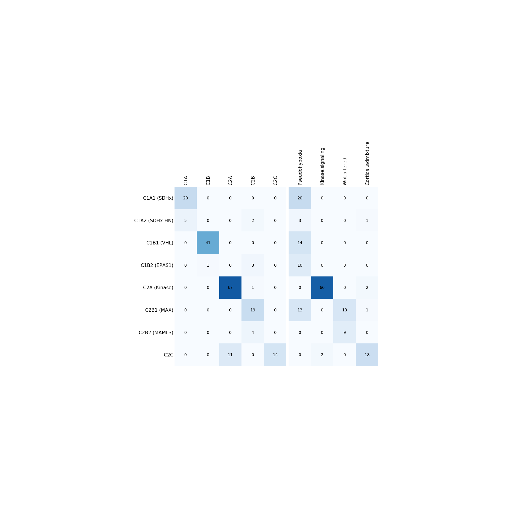
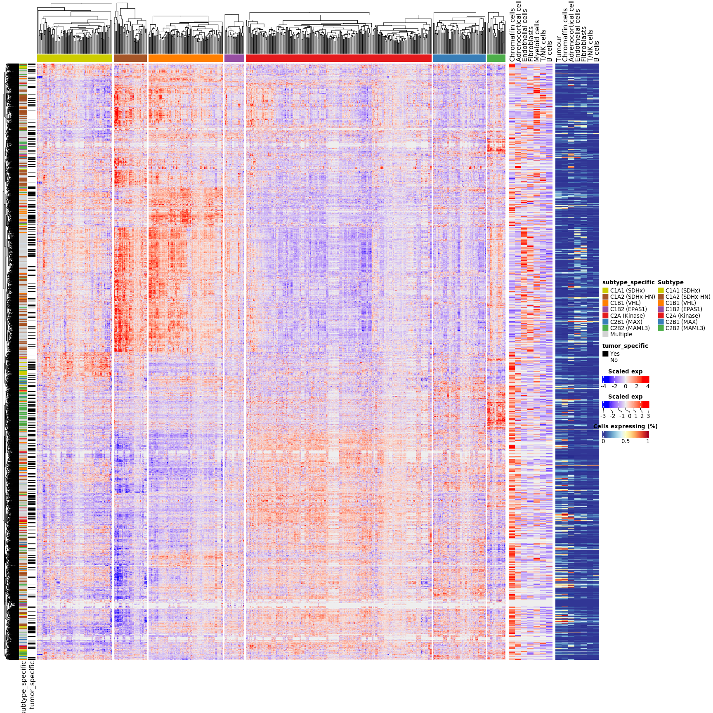
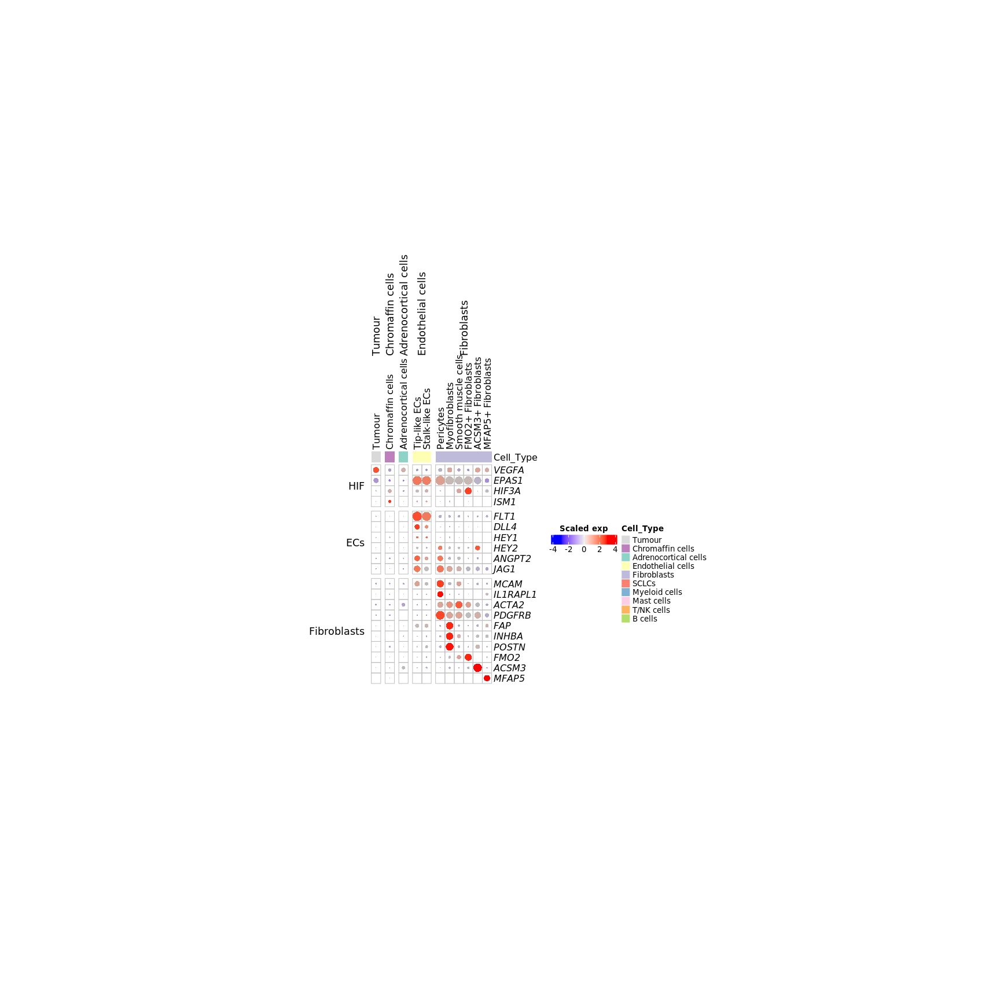
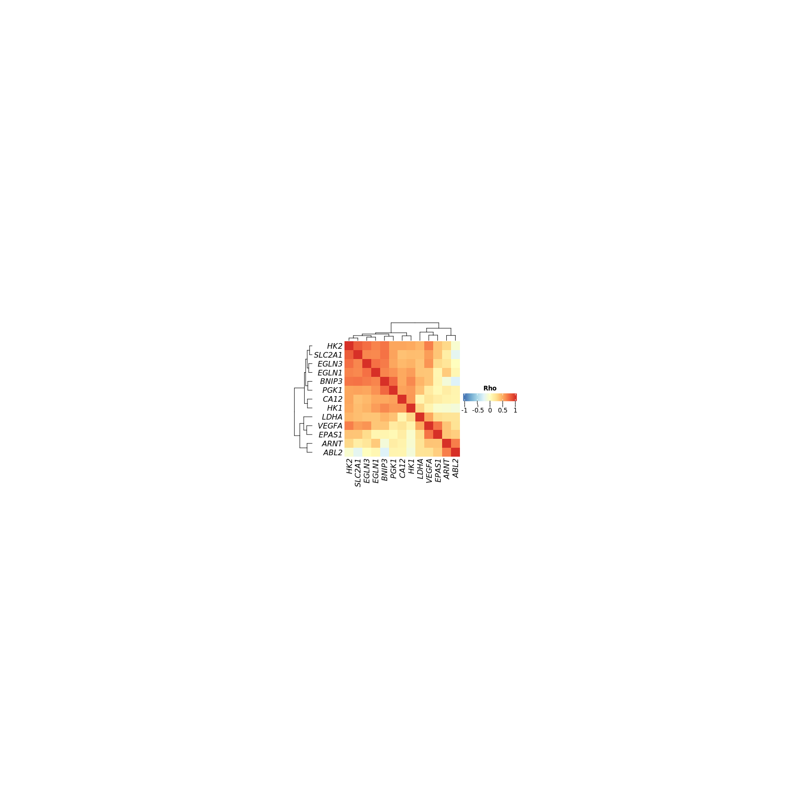
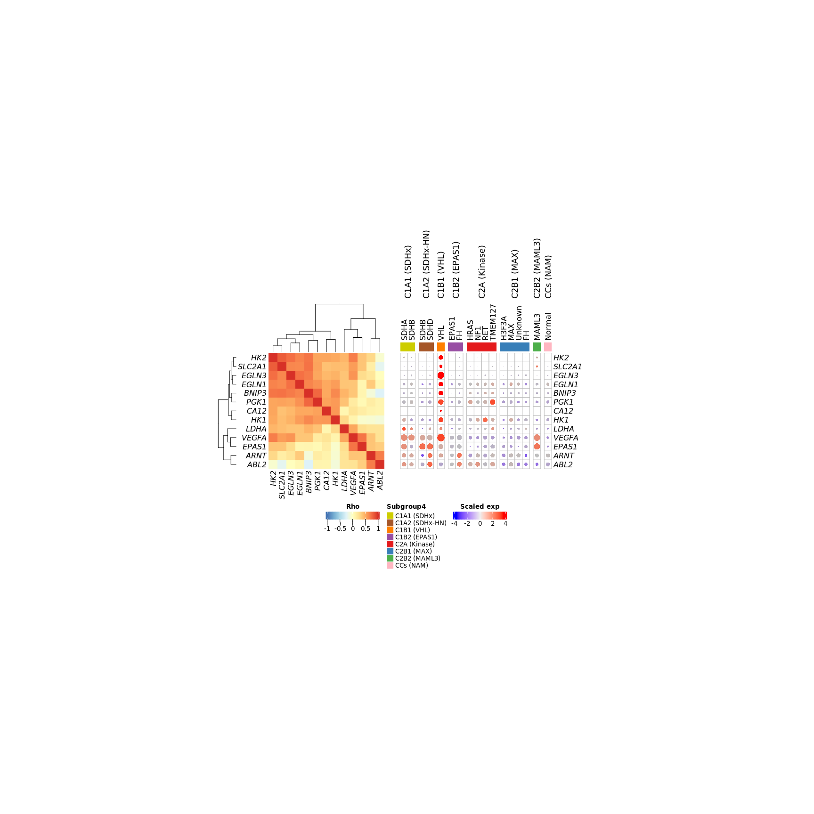
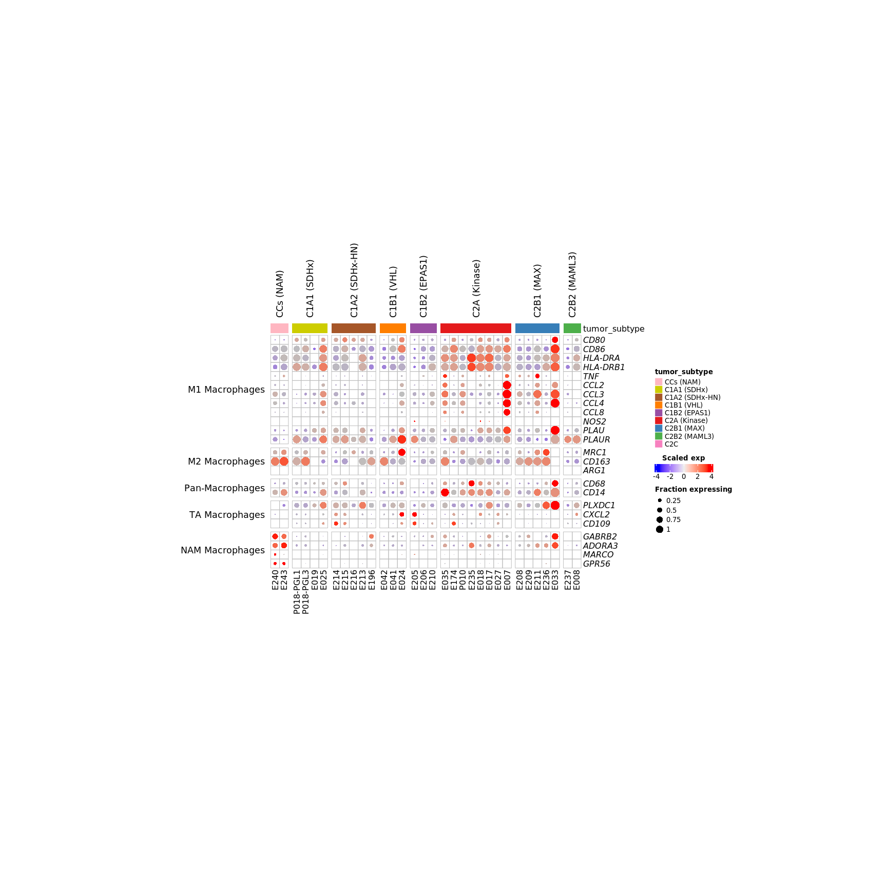
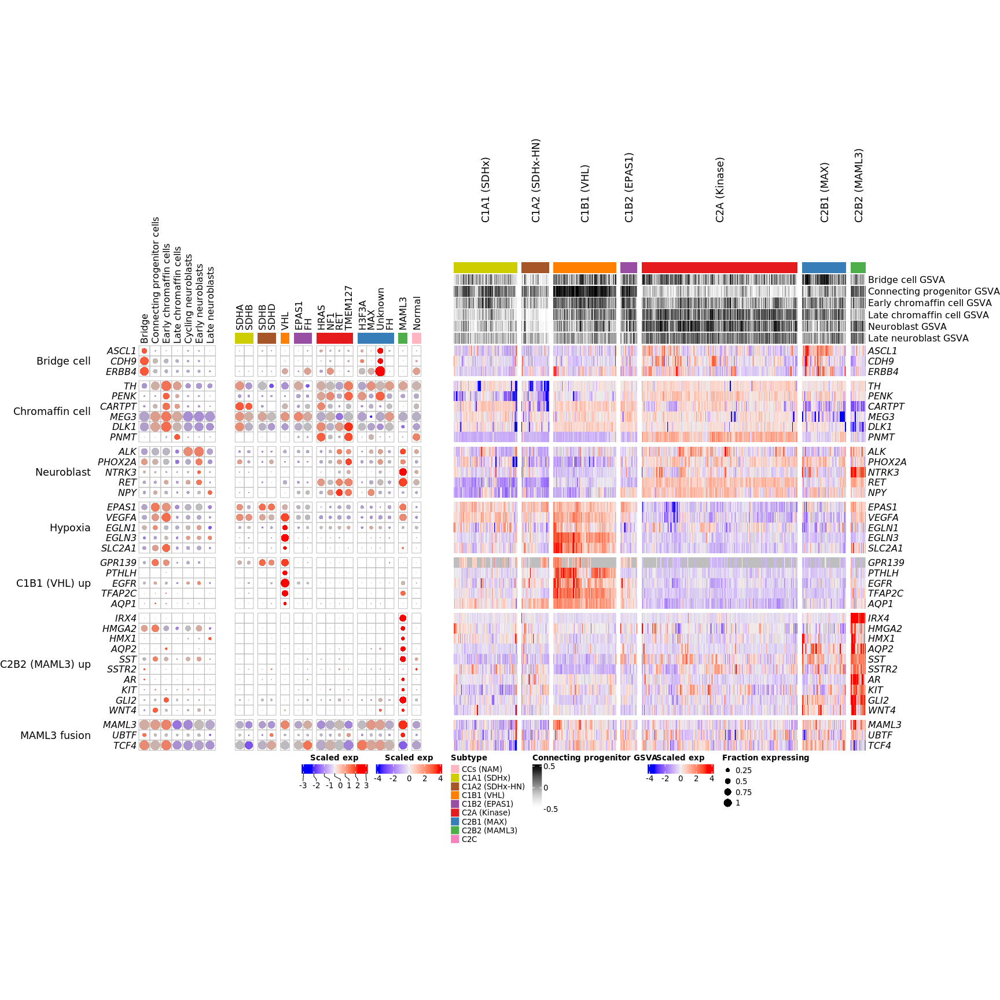
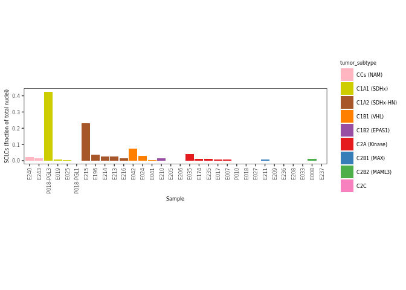

heatmaps\_and\_dotplots
================
Blake Bowen
27/06/2022

``` r
rm(list=ls())
# library(RColorBrewer)
library(ComplexHeatmap)
```

    ## Loading required package: grid

    ## ========================================
    ## ComplexHeatmap version 2.6.2
    ## Bioconductor page: http://bioconductor.org/packages/ComplexHeatmap/
    ## Github page: https://github.com/jokergoo/ComplexHeatmap
    ## Documentation: http://jokergoo.github.io/ComplexHeatmap-reference
    ## 
    ## If you use it in published research, please cite:
    ## Gu, Z. Complex heatmaps reveal patterns and correlations in multidimensional 
    ##   genomic data. Bioinformatics 2016.
    ## 
    ## This message can be suppressed by:
    ##   suppressPackageStartupMessages(library(ComplexHeatmap))
    ## ========================================

``` r
library(Seurat)
library(tidyverse)
```

    ## Registered S3 method overwritten by 'cli':
    ##   method     from    
    ##   print.boxx spatstat

    ## ── Attaching packages ─────────────────────────────────────── tidyverse 1.3.1 ──

    ## ✓ ggplot2 3.3.5     ✓ purrr   0.3.4
    ## ✓ tibble  3.1.3     ✓ dplyr   1.0.7
    ## ✓ tidyr   1.1.3     ✓ stringr 1.4.0
    ## ✓ readr   2.0.0     ✓ forcats 0.5.1

    ## ── Conflicts ────────────────────────────────────────── tidyverse_conflicts() ──
    ## x dplyr::filter() masks stats::filter()
    ## x dplyr::lag()    masks stats::lag()

``` r
# library(RColorBrewer)
library(patchwork)
# library(ggsci)
# library(scales)
library(ComplexHeatmap)
library(circlize)
```

    ## ========================================
    ## circlize version 0.4.13
    ## CRAN page: https://cran.r-project.org/package=circlize
    ## Github page: https://github.com/jokergoo/circlize
    ## Documentation: https://jokergoo.github.io/circlize_book/book/
    ## 
    ## If you use it in published research, please cite:
    ## Gu, Z. circlize implements and enhances circular visualization
    ##   in R. Bioinformatics 2014.
    ## 
    ## This message can be suppressed by:
    ##   suppressPackageStartupMessages(library(circlize))
    ## ========================================

``` r
# library(org.Hs.eg.db)

# source("Figures/dotplot_functions.R")
source("Analysis/load_signature_genesets_jansky.R")
```

    ## Rows: 1974 Columns: 5

    ## ── Column specification ────────────────────────────────────────────────────────
    ## Delimiter: ","
    ## chr (2): cluster, gene
    ## dbl (3): average logFC, adjusted P-value, percent expressed

    ## 
    ## ℹ Use `spec()` to retrieve the full column specification for this data.
    ## ℹ Specify the column types or set `show_col_types = FALSE` to quiet this message.

``` r
source("singlecell_colour_palettes.R")
```

    ## 
    ## Attaching package: 'scales'

    ## The following object is masked from 'package:purrr':
    ## 
    ##     discard

    ## The following object is masked from 'package:readr':
    ## 
    ##     col_factor

``` r
# dot plot functions 

#----
# Dotplot Functions
#----

HeatmapDotPlot = function(colour, size,colour.label="Scaled exp", size.label="Fraction expressing", cell.size = 0.5, scale=TRUE, cluster_columns=FALSE, cluster_rows=FALSE, col=c("blue","red"), show_heatmap_legend=TRUE, row_title_rot = 0, ...){
  size = as.matrix(size)/max(size)
  size = sqrt(size)
  if(scale){
    colour = colour %>% t() %>% scale() %>% t()
  }
  if(is.character(col)){
    if(scale){
      col_fun = colorRamp2(seq(from=-3, to=3, length.out=length(col)), col)
    } else {
      col_fun = colorRamp2(seq(from=min(colour), to=max(colour), length.out=length(col)), col)
    }
  } else {
    col_fun = col
  }
  hm = Heatmap(matrix = colour,
               row_gap = unit(2, "mm"), 
               column_gap = unit(2, "mm"), 
               cell_fun = function(j, i, x, y, width, height, fill){
                 grid.rect(x = x, y = y, width = width, height = height, 
                           gp = gpar(col = "grey", fill = NA))
                 grid.circle(x = x, y = y, r = 0.5*(size[i,j])*max(unit.c(width, height)), 
                             gp = gpar(fill = col_fun(colour[i, j]), col = NA))
               },
               rect_gp = gpar(type="none"), height = unit(nrow(colour)*cell.size, "cm"), width = unit(ncol(colour)*cell.size, "cm"),
               cluster_columns=cluster_columns, cluster_rows=cluster_rows, show_heatmap_legend = TRUE, row_title_rot = row_title_rot, ...)
  hm.legend = list()
  if(!is.null(size.label)){
    hm.legend = c(hm.legend, list(Legend(title = size.label,
                                         labels = c(0.25, 0.50, 0.75, 1.00) %>% as.character,
                                         size=unit.c(unit(sqrt(0.25)*cell.size, "cm"),
                                                     unit(sqrt(0.5)*cell.size, "cm"),
                                                     unit(sqrt(0.75)*cell.size , "cm"),
                                                     unit(sqrt(1.0)*cell.size, "cm")),
                                         type = "points",
                                         grid_height = unit(cell.size,"cm"),
                                         grid_width=unit(cell.size,"cm"),
                                         legend_height=unit(4*cell.size*2, "cm"),
                                         background = NA)))
  }
  if(!is.null(colour.label)){
    hm.legend = c(hm.legend, list(Legend(title=colour.label,
                                         col_fun = col_fun)))
  }
  return(hm) 
}

HeatmapDotPlot.Seurat = function(object, cells = NULL, features = NULL, assay = "RNA", slot="data", aggr.by = "orig.ident", split.by = NULL, gene_grouping = NULL, annot.columns=NULL, annot.colours = NULL, aggr.fun = mean, cell.size=0.5, show_legend=TRUE,show_annotation_name=FALSE, annotation_labels = NULL, legend_title = NULL, ...){
  if(class(aggr.fun) == "character"){aggr.fun = get(aggr.fun)}
  data = GetAssayData(object, slot=slot, assay=assay)
  if(length(features) > 0){
    data = data[intersect(features, rownames(data)), ]
    missing.genes = setdiff(features, rownames(data))
    if(length(missing.genes) > 1) {cat(paste("Features not found in specified assay:", paste(missing.genes, collapse =", "), "\n"))}
  }
  aggr = object@meta.data[,aggr.by,drop=F]
  aggr = apply(aggr, 1, paste, collapse="_____")
  aggr.levels = levels(factor(object@meta.data[,aggr.by[1]]))
  if(length(aggr.by) > 1){
    for(a in aggr.by[-1]){
      aggr.levels = unlist(lapply(aggr.levels, function(aggr.level){paste(aggr.level, levels(factor(object@meta.data[,a])), sep='_____')}))
    }
  }
  aggr = factor(aggr, levels = aggr.levels)
  meta.data = object@meta.data
  if(length(cells) > 0){
    if(is.character(cells)[1]){cells = match(cells, colnames(data))}
    data = data[,cells]
    aggr = aggr[cells]
    meta.data = meta.data[cells,]
  }
  aggr = factor(aggr, levels=intersect(levels(aggr), unique(as.character(aggr))))
  data = lapply(levels(aggr), function(x){data[,aggr==x,drop=F]}) %>% setNames(levels(aggr))
  colour = do.call(cbind, lapply(data, function(data){apply(data,1,aggr.fun)})) # average expression
  size = do.call(cbind, lapply(data, function(data){apply(as.matrix(data) > min(data),1, mean)})) # % expressed, assuming min(data) corresponds to 0 counts
  meta.data = meta.data[match(names(data), aggr),,drop=F]
  colnames(colour) = gsub("_____.*$", "", colnames(colour))
  colnames(size) = gsub("_____.*$", "", colnames(size))
  grouping = NULL
  if(length(split.by) == 1){
    grouping = meta.data[,split.by]
  }
  if(length(annot.columns) > 0){
    if(length(annot.colours) > 0){
      annot = HeatmapAnnotation(df = meta.data[,annot.columns,drop=F], col = annot.colours, which="column", show_legend = show_legend, show_annotation_name = show_annotation_name)
    } else {
      annot = HeatmapAnnotation(df = meta.data[,annot.columns,drop=F], which="column", show_legend=show_legend, show_annotation_name = show_annotation_name)
    }
    hm = HeatmapDotPlot(colour=colour, size=size, cell.size=cell.size, top_annotation = annot, show_heatmap_legend=show_legend, column_split=grouping, row_split = gene_grouping, ...)
  } else {
    hm = HeatmapDotPlot(colour=colour, size=size, cell.size=cell.size, column_split=grouping, row_split = gene_grouping, ...)
  }
  return(hm)
}

cell.size = 0.5
label="Scaled exp"
size.label="Fraction expressing"
hm.legend = list()
dot.legend = list()
dot.legend = c(dot.legend, list(Legend(title = size.label,
                                     labels = c(0.25, 0.50, 0.75, 1.00) %>% as.character,
                                     size=unit.c(unit(sqrt(0.25)*cell.size, "cm"),
                                                 unit(sqrt(0.5)*cell.size, "cm"),
                                                 unit(sqrt(0.75)*cell.size , "cm"),
                                                 unit(sqrt(1.0)*cell.size, "cm")),
                                     type = "points",
                                     grid_height = unit(cell.size,"cm"),
                                     grid_width=unit(cell.size,"cm"),
                                     legend_height=unit(4*cell.size*2, "cm"),
                                     background = NA)))

# ----
# set up the legend graphical parameters 
# ----

hm_legend_params <- list(title = "Scaled exp",
                         legend_width = unit(3, "cm"),
                         title_position = "topcenter",
                         direction = "horizontal")
```

``` r
CalcFractionCellsExpressing <- function(seurat, split.by) {
  #' Fast calculate fraction of cells expressing within identity class "split.by", for each gene in seurat object
  #' @param seurat: seurat object
  #' @param split.by: metadata column in seurat object containing cell identity labels used to group the cells by 
  
  all_groups <- unique(seurat[[split.by]][,1])
  fraction_expressing_celltypes <- bind_cols(
    map(all_groups, function(v){
      # get all counts for each group in split.by
      cell_type_counts <- seurat@assays$RNA@counts[,seurat[[split.by]][,1]==v]
      total_n_cells_in_celltype <- ncol(cell_type_counts)
      n_cells_expressing_each_gene <- tabulate(cell_type_counts@i + 1)
      # if the last genes in the matrix have no nonzeros these aren't included in the output,
      # therefore I add zeros at the end manually 
      n_cells_expressing_each_gene <- append(n_cells_expressing_each_gene,
                                             rep(0, nrow(cell_type_counts) - length(n_cells_expressing_each_gene)))
      fraction_cells_expressing_each_gene <- n_cells_expressing_each_gene/total_n_cells_in_celltype
      return(fraction_cells_expressing_each_gene)
    })
  )
  
  fraction_expressing_celltypes <- data.frame(fraction_expressing_celltypes)
  colnames(fraction_expressing_celltypes) <- all_groups
  rownames(fraction_expressing_celltypes) <- rownames(seurat@assays$RNA@counts)
  
  return(fraction_expressing_celltypes)
}
```

# Figure 2

``` r
###########
# Panel E: 
###########

# calculating overlap between our classifications
# vs previous subtyping of the same samples
# and visualisation of these results with confusion-matrix-like heatmaps

bulk_metadata <- read_csv("Data/Table S3. Pheo-atlas metadata.csv")
```

    ## Rows: 735 Columns: 23

    ## ── Column specification ────────────────────────────────────────────────────────
    ## Delimiter: ","
    ## chr (18): Sample, Sample_raw, Alias, Accession_ID, Dataset, Batch, Location,...
    ## dbl  (5): Purity, ConsensusCluster, Consensus, UMAP_1, UMAP_2

    ## 
    ## ℹ Use `spec()` to retrieve the full column specification for this data.
    ## ℹ Specify the column types or set `show_col_types = FALSE` to quiet this message.

``` r
bulk_metadata <- bulk_metadata %>%
  filter(Subtype != "Normal") %>% 
  mutate(
    Subgroup4 = recode(Subtype, !!!subtype_key2))

# ----
# make a confusion matrix with the TCGA samples
# ----

tcga_clusters <- bulk_metadata %>%
  select(Sample, Subgroup4, TCGA_Cluster) %>% 
  filter(is.na(TCGA_Cluster) == FALSE) 

# make a matrix showing the intersection of each classification
tcga_cm <- tcga_clusters %>% 
  group_by(Subgroup4, TCGA_Cluster) %>% 
  summarise(n()) %>% 
  ungroup() %>%
  pivot_wider(names_from = TCGA_Cluster, values_from = `n()`) %>% 
  select(Subgroup4, Pseudohypoxia, `Kinase signaling`, `Wnt-altered`, `Cortical admixture`) %>% 
  data.frame()
```

    ## `summarise()` has grouped output by 'Subgroup4'. You can override using the `.groups` argument.

``` r
tcga_cm[is.na(tcga_cm)] <- 0
rownames(tcga_cm) <- tcga_cm$Subgroup4
tcga_cm$Subgroup4 <- NULL
tcga_cm <- as.matrix(tcga_cm)

col_fun = colorRamp2(
  seq(0, 80, len = 9),
  brewer.pal(9, "Blues"))

tcga_hm <- Heatmap(tcga_cm,
        cluster_columns = F,
        column_names_side = "top",
        col = col_fun,
        cluster_rows = F, 
        row_names_side = "left",
        width = ncol(tcga_cm)*unit(20, "mm"), 
        height = nrow(tcga_cm)*unit(20, "mm"), 
        cell_fun = function(j, i, x, y, width, height, fill) {
          grid.text(sprintf("%.0f", tcga_cm[i, j]), x, y, gp = gpar(fontsize = 10))},
        #heatmap_legend_param  = list(title = "")
        show_heatmap_legend = F)

# ----
# Castro-vega clusters confusion matrix
# ----

castrovega_clusters <- bulk_metadata %>%
  select(Sample, Subgroup4, Castro_Vega_mRNA_Classification)

# make a matrix showing the intersection of each classification
castrovega_cm <- castrovega_clusters %>% 
  group_by(Subgroup4, Castro_Vega_mRNA_Classification) %>% 
  summarise(n()) %>% 
  ungroup() %>%
  pivot_wider(names_from = Castro_Vega_mRNA_Classification, values_from = `n()`) %>% 
  select(Subgroup4, C1A, C1B, C2A, C2B, C2C) %>% 
  data.frame()
```

    ## `summarise()` has grouped output by 'Subgroup4'. You can override using the `.groups` argument.

``` r
castrovega_cm[is.na(castrovega_cm)] <- 0
rownames(castrovega_cm) <- castrovega_cm$Subgroup4
castrovega_cm$Subgroup4 <- NULL
castrovega_cm <- as.matrix(castrovega_cm)

col_fun = colorRamp2(
  seq(0, 80, len = 9),
  brewer.pal(9, "Blues"))

castrovega_hm <- Heatmap(castrovega_cm,
                   cluster_columns = F,
                   column_names_side = "top",
                   col = col_fun,
                   cluster_rows = F, 
                   row_names_side = "left",
                   width = ncol(castrovega_cm)*unit(20, "mm"), 
                   height = nrow(castrovega_cm)*unit(20, "mm"), 
                   cell_fun = function(j, i, x, y, width, height, fill) {
                     grid.text(sprintf("%.0f", castrovega_cm[i, j]), x, y, gp = gpar(fontsize = 10))},
                   #heatmap_legend_param  = list(title = "")
                   show_heatmap_legend = F)

castrovega_hm + tcga_hm
```

<!-- -->

``` r
# dev.off()
# pdf(file = "Figures/confusion_matrices.pdf", height = 10, width = 10)
# castrovega_hm + tcga_hm
# dev.off()

###########
# Panel F
###########

all.clusters = c("Kinase", "IDC", "MAML3", "PH-NOS", "VHL", "SDHx", "SDHx (H&N)", "Cortical admixture", "Normal")
all.clusters2 = c("C2A", "C2Bi", "C2Bii", "C1Bii", "C1Bi", "C1Ai", "C1Aii", "C2C", "Normal")

# Read in bulk batch normalised expression
bulk_norm_expression <- read_tsv("Data/bulk_expression_batch_normalised.tsv")
```

    ## Rows: 23270 Columns: 736

    ## ── Column specification ────────────────────────────────────────────────────────
    ## Delimiter: "\t"
    ## chr   (1): Gene
    ## dbl (735): AGZ_001_U133_2, AGZ_002_U133_2, AGZ_003_U133_2, AGZ_004_U133_2, A...

    ## 
    ## ℹ Use `spec()` to retrieve the full column specification for this data.
    ## ℹ Specify the column types or set `show_col_types = FALSE` to quiet this message.

``` r
# Read in the bulk metadata
bulk_md <- read_csv("Data/Table S3. Pheo-atlas metadata.csv") %>%
  mutate(Sample = colnames(bulk_norm_expression[,2:ncol(bulk_norm_expression)]))
```

    ## Rows: 735 Columns: 23

    ## ── Column specification ────────────────────────────────────────────────────────
    ## Delimiter: ","
    ## chr (18): Sample, Sample_raw, Alias, Accession_ID, Dataset, Batch, Location,...
    ## dbl  (5): Purity, ConsensusCluster, Consensus, UMAP_1, UMAP_2

    ## 
    ## ℹ Use `spec()` to retrieve the full column specification for this data.
    ## ℹ Specify the column types or set `show_col_types = FALSE` to quiet this message.

``` r
# check samples are in the same order
table(colnames(bulk_norm_expression[,2:ncol(bulk_norm_expression)]) == bulk_md$Sample)
```

    ## 
    ## TRUE 
    ##  735

``` r
# read in tumour vs rest DGE
de_tables <- read_tsv("/data/gpfs/projects/punim0010/projects/Pattison_projects/PPGL_sc_RNA_seq_compendium/Bulk/Bulk DE/bulk_de_by_subtype_reversed.tsv") %>%
  filter(!Cluster %in% c("Cortical.admixture")) %>%
  # use logFC threshold of +- 0.5 and pval of 0.05
  filter(adj.P.Val < 0.05) %>%
  filter(abs(logFC) > 0.5) %>%
  # make column describing if over or underexpressed 
  mutate(direction = ifelse(logFC > 0 , "Up", "Down")) %>% 
  mutate(gene_direction = paste(gene, direction, sep = "_")) %>% 
  group_by(gene) %>%
  mutate(count = n()) %>%
  ungroup() %>% 
  # rename the clusters so that they are consistent with the bulk metadata
  mutate(Cluster = recode(Cluster,
    "SDHx_HN" = "SDHx (H&N)",
    "PH_NOS" = "PH-NOS"))
```

    ## Rows: 185961 Columns: 8

    ## ── Column specification ────────────────────────────────────────────────────────
    ## Delimiter: "\t"
    ## chr (2): gene, Cluster
    ## dbl (6): logFC, AveExpr, t, P.Value, adj.P.Val, B

    ## 
    ## ℹ Use `spec()` to retrieve the full column specification for this data.
    ## ℹ Specify the column types or set `show_col_types = FALSE` to quiet this message.

``` r
# read in tumour vs normal DGE 
tumour_normal <- read_csv("/data/gpfs/projects/punim0010/projects/Pattison_projects/PPGL_sc_RNA_seq_compendium/Tables/Paper_tables/Pseudobulk tumour vs chromaffin DGE.csv") %>%
  filter(Contrast %in% c("C1Ai","C1Aii","C1Bi", "C1Bii","C2A", "C2Bi", "C2Bii")) %>%
  filter(adj.P.Val < 0.05) %>%
  filter(abs(logFC) > 0.5) %>%
  # make column describing if over or underexpressed 
  mutate(direction = ifelse(logFC > 0 , "Up", "Down")) %>%
  mutate(gene_direction = paste(Gene, direction, sep = "_"))
```

    ## Rows: 8073 Columns: 8

    ## ── Column specification ────────────────────────────────────────────────────────
    ## Delimiter: ","
    ## chr (2): Gene, Contrast
    ## dbl (6): logFC, AveExpr, t, P.Value, adj.P.Val, B

    ## 
    ## ℹ Use `spec()` to retrieve the full column specification for this data.
    ## ℹ Specify the column types or set `show_col_types = FALSE` to quiet this message.

``` r
# make a vector containing old and new cluster names 
names_df <- data.frame(Cluster = c(all.clusters, "Multiple"),
                       Comete = c(all.clusters2, "Multiple"))

DE_in_pseudobulk_tumour_v_normal.genes <- tumour_normal$gene_direction

# Get the genes that are DE in only one sample
one_sample <- de_tables %>%
  ungroup() %>%
  mutate(DE_in_pseudobulk = ifelse(gene_direction %in% tumour_normal$gene_direction, "Yes", "No")) %>%
  mutate(DE_in_pseudobulk = factor(DE_in_pseudobulk, levels = c("Yes", "No"))) %>%
  left_join(names_df) %>%
  mutate(Comete = replace(Comete, count > 1, "Multiple")) %>%
  arrange(DE_in_pseudobulk) %>%
  filter(!duplicated(gene))
```

    ## Joining, by = "Cluster"

``` r
# Get genes unique to a subtype (bulk) and DE in both bulk and PB
DE_in_both <- filter(one_sample, 
                     DE_in_pseudobulk == "Yes")

# Genes that will end up in the heatmap
Heatmap_genes <- de_tables %>%
  filter(gene %in% one_sample$gene) %>%
  # Join on the mean proportion of cells expressing this gene in each cell type 
  mutate(Gene_is_DE_in_tumour_PB = ifelse(gene %in% DE_in_both$gene, "Yes", "No"))

subgroups.lvl <- c("C1Ai", "C1Aii", "C1Bi", "C1Bii", "C2A", "C2Bi", "C2Bii", "Multiple")

bulk_md <- bulk_md %>%
  mutate(Subtype_old = Subtype) %>% 
  rename(Cluster = Subtype)

anno <- bulk_md %>%
  left_join(names_df, by = "Cluster") %>%
  rename(Subtype = Comete) %>%
  filter(!Subtype %in% c("C2C", "Normal")) %>%
  mutate(Subtype = recode(Subtype, !!!subtype_key1)) %>% 
  mutate(Subtype = factor(Subtype, levels = subtype_key1)) %>%
  arrange(Subtype)

# Convert to matrix, select genes and z score scale
bulk_norm_expression_mat <- as.matrix(bulk_norm_expression[,2:ncol(bulk_norm_expression)])
rownames(bulk_norm_expression_mat) <- bulk_norm_expression$Gene
# Select columns and rows
bulk_norm_expression_mat <- bulk_norm_expression_mat[one_sample$gene,anno$Sample]
# Z score transform
bulk_norm_expression_mat <- t(scale(t(bulk_norm_expression_mat)))

# Set NAs to 0
bulk_norm_expression_mat[is.na(bulk_norm_expression_mat)] <- 0

# Top annotation describing the subtype
gen_anno1 <- data.frame(Subtype = anno$Subtype)
top_ano <- HeatmapAnnotation(df = gen_anno1,
                             col = list("Subtype" = c(subtype_genotype_cols[2:8],
                                                      "Multiple" = "lightgrey")),
                             show_annotation_name = FALSE)

# Left annotation
gen_anno <- data.frame(subtype_specific = recode(one_sample$Comete, !!!subtype_key1),
                       tumor_specific = one_sample$DE_in_pseudobulk,
                       stringsAsFactors = F)
left_anno <- rowAnnotation(df = gen_anno,
                           col = list(subtype_specific= c(subtype_genotype_cols[2:8],
                                                     "Multiple" = "lightgrey"),
                                      tumor_specific = c("Yes" = "Black",
                                                        "No" ="White")))

hm1 <- Heatmap(bulk_norm_expression_mat,
               cluster_columns = T,
               cluster_rows = T,
               show_row_names = F,
               show_column_names  = F,
               top_annotation = top_ano,
               left_annotation = left_anno,
               column_split = anno$Subtype,
               column_title = NULL,
               cluster_row_slices = F,
               cluster_column_slices = F,
               row_title_rot = 0,
               heatmap_legend_param = list(title = "Scaled exp", legend_width = unit(3, "cm"), title_position = "topcenter", direction = "horizontal"))
```

    ## The automatically generated colors map from the minus and plus 99^th of
    ## the absolute values in the matrix. There are outliers in the matrix
    ## whose patterns might be hidden by this color mapping. You can manually
    ## set the color to `col` argument.
    ## 
    ## Use `suppressMessages()` to turn off this message.

    ## `use_raster` is automatically set to TRUE for a matrix with more than
    ## 2000 rows. You can control `use_raster` argument by explicitly setting
    ## TRUE/FALSE to it.
    ## 
    ## Set `ht_opt$message = FALSE` to turn off this message.

``` r
# dev.off()
# pdf("Figures/bulk_de_heatmap_all_degs.pdf", width =15, height=7)
# hm1
# dev.off()

# ----
# Andrew's pseudobulk z-score expression matrix  
# ----

# Make a heatmap out of the pseudobulk data for normal cells to put next to the bulk
pseudobulk_cpm <- read_csv("/data/gpfs/projects/punim0010/projects/Pattison_projects/PPGL_sc_RNA_seq_compendium/Tables/Pseudobulk_log2_CPM.csv")
```

    ## Rows: 15786 Columns: 170

    ## ── Column specification ────────────────────────────────────────────────────────
    ## Delimiter: ","
    ## chr   (1): gene
    ## dbl (169): E035_Sustentacular.cells, E035_Chromaffin.cells, E035_Adrenocorti...

    ## 
    ## ℹ Use `spec()` to retrieve the full column specification for this data.
    ## ℹ Specify the column types or set `show_col_types = FALSE` to quiet this message.

``` r
pseudobulk_matrix <- as.matrix(pseudobulk_cpm[,2:ncol(pseudobulk_cpm)])
rownames(pseudobulk_matrix) <- pseudobulk_cpm$gene

# Order of cell types that I want
cell_types <- c("Chromaffin.cells", "Sustentacular.cells","Adrenocortical.cells",  "Endothelial.cells", "Fibroblasts", "Myeloid.cells", "T.NK.cells", "B.cells")

# Read in and join on the single nuclei metadata
# Read in the single nuclei metadata
sn_md <- read_tsv("Data/pseudobulk_metadata.tsv")
```

    ## Rows: 32 Columns: 26

    ## ── Column specification ────────────────────────────────────────────────────────
    ## Delimiter: "\t"
    ## chr (20): orig.ident, Genotype, Subgroup, Driver, Oncogene.TSG, Gender, Subg...
    ## dbl  (6): Bulk_UMAP_1, Bulk_UMAP_2, Pseudobulk_UMAP_1, Pseudobulk_UMAP_2, Ps...

    ## 
    ## ℹ Use `spec()` to retrieve the full column specification for this data.
    ## ℹ Specify the column types or set `show_col_types = FALSE` to quiet this message.

``` r
pseudobulk_annotation <- data.frame(Sample_cell_type = colnames(pseudobulk_matrix),check.names = F)%>%
  mutate(Sample = gsub("_.*" ,"" , Sample_cell_type))%>%
  mutate(Cell_type = gsub(".*_" ,"" ,  Sample_cell_type))%>%
  left_join(sn_md)%>%
  mutate(Cluster = gsub("-", "_", Subgroup3))%>%
  left_join(names_df)%>%
  rename(Subtype = Comete)%>%
  mutate(Cell_type = factor(Cell_type, levels = cell_types))%>%
  arrange(Cell_type)
```

    ## Joining, by = "Sample"

    ## Joining, by = "Cluster"

``` r
pseudobulk_matrix <- pseudobulk_matrix[,pseudobulk_annotation$Sample_cell_type]
# Z score transform
# Average over cell types
means_list <- list()
for(i in 1:length(unique(pseudobulk_annotation$Cell_type))){
  cell_type <- unique(pseudobulk_annotation$Cell_type)[i]
  samples <- filter(pseudobulk_annotation, Cell_type == cell_type)
  means <- rowMeans(pseudobulk_matrix[,samples$Sample_cell_type]) %>%
    data.frame(check.rows = F, check.names = F)
  colnames(means) <- cell_type
  means_list[[i]]<- means
}

pseudobulk_matrix <- bind_cols(means_list)%>%
  as.matrix()

pseudobulk_matrix <- t(scale(t(pseudobulk_matrix)))
# Match the rows of the second matrix to the first
matched <- match(rownames(bulk_norm_expression_mat),rownames(pseudobulk_matrix))
pseudobulk_matrix <- pseudobulk_matrix[matched,]
# Set NAs to 0
pseudobulk_matrix[is.na(pseudobulk_matrix)] <- 0
# Reset rownames
# rownames(pseudobulk_matrix) <- rownames(bulk_norm_expression_mat)

# reformat the column names 
colnames(pseudobulk_matrix) <- gsub(pattern = "\\.",
                                    replacement = " ",
                                    x = colnames(pseudobulk_matrix))
# reformat the column names 
colnames(pseudobulk_matrix) <- gsub(pattern = "T NK",
                                    replacement = "T/NK",
                                    x = colnames(pseudobulk_matrix))

hm2_column_order <- all.cell.types[all.cell.types %in% colnames(pseudobulk_matrix)]

hm2 <- Heatmap(pseudobulk_matrix[,hm2_column_order],
               cluster_columns = FALSE,
               cluster_rows = FALSE,
               column_names_side = "top",
               show_row_names = F,
               show_column_names  = T,
               column_title_rot = 90,
               width = ncol(pseudobulk_matrix[,hm2_column_order])*unit(4, "mm"),
               heatmap_legend_param  = list(title = "Scaled exp", legend_width = unit(3, "cm"), title_position = "topcenter", direction = "horizontal"))

# ----
# Make a single cell heatmap showing fraction expressing for the single nuclei 
# ---- 

# read in the snRNA-seq data 
rna <- readRDS("Data/sn.PPGLs.filtered.with.decontX.RDS")

# add the updated sample metadata 
pb_metadata <- read_tsv("Data/pseudobulk_metadata.tsv") %>% 
  mutate(Genotype_Subgroup4 = paste(Genotype, Subgroup4, sep = "_")) # make a metadata column to aggregate samples with same genotype and subgroup
```

    ## Rows: 32 Columns: 26

    ## ── Column specification ────────────────────────────────────────────────────────
    ## Delimiter: "\t"
    ## chr (20): orig.ident, Genotype, Subgroup, Driver, Oncogene.TSG, Gender, Subg...
    ## dbl  (6): Bulk_UMAP_1, Bulk_UMAP_2, Pseudobulk_UMAP_1, Pseudobulk_UMAP_2, Ps...

    ## 
    ## ℹ Use `spec()` to retrieve the full column specification for this data.
    ## ℹ Specify the column types or set `show_col_types = FALSE` to quiet this message.

``` r
# check for duplicated column names
dup.cols <- names(pb_metadata)[names(pb_metadata) %in% names(rna[[]])]
# merge the metadata tables
metadata_new <- rna[[]] %>%
  dplyr::select(!dup.cols[2:6]) %>% # remove the old annotations (except sample names) and replace with new ones
  left_join(pb_metadata, by = "orig.ident")
rownames(metadata_new) <- rownames(rna[[]])
rna@meta.data <- metadata_new

# ----
# Calculate fraction cells expressing each gene in each cluster 
# ----

pseudobulk.fraction.expressed.all <- CalcFractionCellsExpressing(rna, split.by = "Cell_Type") %>%
  rownames_to_column("gene") %>%
  tibble()
```

    ## New names:
    ## * NA -> ...1
    ## * NA -> ...2
    ## * NA -> ...3
    ## * NA -> ...4
    ## * NA -> ...5
    ## * ...

``` r
# write_tsv(pseudobulk.fraction.expressed.all, "Data/pseudobulk.fraction.expressed.all.tsv")

# ----
# make matrix for the heatmap 
# ---- 

# pseudobulk.fraction.expressed.all <- read_tsv("Data/pseudobulk.fraction.expressed.all.tsv")
# Match the rows of the second matrix to the first, filter out genes I don't want to plot
matched <- match(rownames(bulk_norm_expression_mat),pseudobulk.fraction.expressed.all$gene)
pseudobulk_fraction_cells_expressing <- pseudobulk.fraction.expressed.all[matched,]
# get the gene names
genes_order <- pseudobulk_fraction_cells_expressing$gene
# convert to matrix, remove gene column 
pseudobulk_fraction_cells_expressing_matrix <- as.matrix(pseudobulk_fraction_cells_expressing[2:ncol(pseudobulk_fraction_cells_expressing)])
# set NA counts to zero
pseudobulk_fraction_cells_expressing_matrix[is.na(pseudobulk_fraction_cells_expressing_matrix)] <- 0
# set matrix rownames
rownames(pseudobulk_fraction_cells_expressing_matrix) <- genes_order

# fix the column names 
colnames(pseudobulk_fraction_cells_expressing_matrix) <- gsub(pattern = "\\.fraction\\.cells\\.expressing",
                                         replacement = "",
                                         colnames(pseudobulk_fraction_cells_expressing_matrix))
colnames(pseudobulk_fraction_cells_expressing_matrix) <- gsub(pattern = "\\.",
                                                              replacement = " ",
                                                              colnames(pseudobulk_fraction_cells_expressing_matrix))
# Add the backslash
colnames(pseudobulk_fraction_cells_expressing_matrix)[colnames(pseudobulk_fraction_cells_expressing_matrix) == "Macrophages Monocytes"] <- "Myeloid cells"
colnames(pseudobulk_fraction_cells_expressing_matrix)[colnames(pseudobulk_fraction_cells_expressing_matrix) == "T cells"] <- "T/NK cells"

# specify order of the heatmap columns  
columns.order <- c(
  all.cell.types #,  subgroups.lvl
  )
columns.order <- columns.order[columns.order %in% colnames(pseudobulk_fraction_cells_expressing_matrix)]
# change order of heatmap columns to the right order
pseudobulk_fraction_cells_expressing_matrix <- pseudobulk_fraction_cells_expressing_matrix[,columns.order]

# specify the colour gradient to use for this heatmap
col_fun2 = colorRamp2(
  seq(0.01, 1, len = 11),
  rev(brewer.pal(11, "RdYlBu")))

columns.order
```

    ## [1] "Tumour"               "Chromaffin cells"     "Adrenocortical cells"
    ## [4] "Endothelial cells"    "Fibroblasts"          "T/NK cells"          
    ## [7] "B cells"              "Mast cells"

``` r
colnames(pseudobulk_fraction_cells_expressing_matrix)
```

    ## [1] "Tumour"               "Chromaffin cells"     "Adrenocortical cells"
    ## [4] "Endothelial cells"    "Fibroblasts"          "T/NK cells"          
    ## [7] "B cells"              "Mast cells"

``` r
# ----
# organise metadata for annotating the pseudobulk fraction-expressing heatmap
# ----

# calculate the fraction of total DEGs that are expressed in the normal tissue
# number of DEGs that are expressed in over 20% of cells in each cell type  
ndegs_expresed_in_normal <- colSums(ifelse(pseudobulk_fraction_cells_expressing_matrix > 0.2, 1, 0))
frac_degs_expresed_in_normal <- (ndegs_expresed_in_normal/nrow(pseudobulk_fraction_cells_expressing_matrix))

# ----
# Plot the heatmap 
# ----

# removed mast cells column because no mast cells are present in the pseudobulk expression matrix
hm_deg_fractionexpressing <-  Heatmap(
  pseudobulk_fraction_cells_expressing_matrix[, colnames(pseudobulk_fraction_cells_expressing_matrix)[colnames(pseudobulk_fraction_cells_expressing_matrix) != "Mast cells"]],
  width = ncol(pseudobulk_fraction_cells_expressing_matrix[, colnames(pseudobulk_fraction_cells_expressing_matrix)[colnames(pseudobulk_fraction_cells_expressing_matrix) != "Mast cells"]])*unit(4, "mm"), 
  col = col_fun2,
  column_names_side = "top",
  cluster_rows = FALSE,
  show_row_names = FALSE,
  cluster_columns = FALSE,
  heatmap_legend_param  = list(title = "Cells expressing (%)",
                               legend_width = unit(3, "cm"),
                               title_position = "topcenter",
                               direction = "horizontal"))

hm1 + hm2 + hm_deg_fractionexpressing
```

<!-- -->

# Figure 3

``` r
#######
# Panel B:
#######

pcpg_rna <- readRDS("Data/pcpg_with_metadata_and_qc.RDS")

sample_order <- pcpg_rna[[c("Sample", "tumor_subtype")]] %>% 
  arrange(tumor_subtype) %>%
  distinct() %>%
  pull(Sample)

pcpg_rna$Sample <- factor(pcpg_rna$Sample, levels = sample_order)

#####
# Angiogenic cells analysis
#####

# Angio cell types
angio_cell_types <- c("Tumour", "Chromaffin cells", "Adrenocortical cells", "Tip-like ECs", "Stalk-like ECs", "Pericytes","Myofibroblasts", "Smooth muscle cells", "FMO2+ Fibroblasts", "ACSM3+ Fibroblasts", "MFAP5+ Fibroblasts")

# angiogenesis-related genes 
angio_genes <- c("VEGFA", "EPAS1", "HIF3A","ISM1", "FLT1", "DLL4", "HEY1", "HEY2", "ANGPT2", "JAG1", "MCAM", "IL1RAPL1",  "ACTA2", "PDGFRB", "FAP", "INHBA", "POSTN", "FMO2",  "ACSM3", "MFAP5")

# get just angiogenic cell types, plus tumor and chromaffin and adrenocortical cells 
angio_rna <- subset(pcpg_rna, subset = cell_subtype %in% angio_cell_types)

# gene groupings
angio_classes <- c(rep("HIF",4), rep("ECs",6),rep("Fibroblasts",10))
angio_classes <- factor(angio_classes, levels = c("HIF", "Tumour", "ECs", "Fibroblasts"))

angio_rna$Cell_Type <- factor(angio_rna$Cell_Type, levels = c("Tumour", "Chromaffin cells", "Adrenocortical cells", "Endothelial cells", "Fibroblasts", "SCLCs", "Myeloid cells",  "Mast cells", "T/NK cells", "B cells"))  
# set plotting order
angio_rna$cell_subtype <- factor(angio_rna$cell_subtype, levels=c("Tumour", "Chromaffin cells", "Adrenocortical cells", "Tip-like ECs", "Stalk-like ECs", "Pericytes","Myofibroblasts", "Smooth muscle cells", "FMO2+ Fibroblasts", "ACSM3+ Fibroblasts", "MFAP5+ Fibroblasts"))

hm_angio = HeatmapDotPlot.Seurat(angio_rna,
                                 features=angio_genes,
                                 aggr.by="cell_subtype",
                                 split.by="Cell_Type",
                                 annot.columns = c("Cell_Type"),
                                 annot.colours=list(Cell_Type=cell.cols),
                                 assay = "SCT",
                                 show_annotation_name=TRUE,
                                 slot="data",
                                 col=c("blue", "grey", "red"),
                                 column_title_rot=90,
                                 row_names_gp=gpar(fontface="italic"),
                                 show_column_names =T,
                                 column_names_side="top",
                                 row_title_rot = 0,
                                 gene_grouping = angio_classes,
                                 cluster_row_slices = F,
                                 cluster_rows = F,
                                 heatmap_legend_param = hm_legend_params)

hm_angio
```

<!-- -->

``` r
#######
# Panel E,F:
#######

# ----
# Organise the single cell PCPG data 
# ----

# read in the PCPG data
plot_rna <- readRDS("Data/pcpg_chromaffincells.RDS")

# remove the SCLCs
plot_rna <- subset(plot_rna,
                   subset = Subgroup4 %in% c("Tumour-associated SLCs","Normal SLCs"),
                   invert=TRUE)

pcpg_md <- plot_rna@meta.data
subtypes_genotypes <- c("CCs (NAM)", "C1A1 (SDHx)", "C1A2 (SDHx-HN)", "C1B1 (VHL)", "C1B2 (EPAS1)", "C2A (Kinase)", "C2B1 (MAX)", "C2B2 (MAML3)", "C2C")
subtypes_old <- c("Chromaffin cells", "C1Ai", "C1Aii", "C1Bi", "C1Bii", "C2A", "C2Bi", "C2Bii", "C2C")
subtype_key1 = setNames(subtypes_genotypes, subtypes_old)
pcpg_md <- pcpg_md %>%
  # Recode the subtype for plotting
  mutate(Subgroup4 = recode(Subgroup4,!!!subtype_key1)) %>% 
  mutate(Genotype = if_else(Subgroup4 == "CCs (NAM)","Normal", Genotype))
  # Recode the genotype for plotting

plot_rna@meta.data <- pcpg_md

# manually arrange genotype order
plot_rna$Genotype <-  factor(plot_rna$Genotype, levels = c("SDHA", "SDHB", "SDHD", "VHL", "EPAS1",  "HRAS", "NF1", "RET", "TMEM127", "H3F3A", "MAX", "Unknown", "FH", "MAML3", "Normal"))

# ----
# HIF gene correlation matrix 
# ----

# The HIF target genes are (mostly) pheo-associated HIF signalling genes from Jochmanova et al (https://academic.oup.com/jnci/article/105/17/1270/908345?login=true)
# A few were filtered out from the single cell data (presumably due to low expression in all cell types?)

# this matrix was made in the HIF_target_correlation.R script
spearman_correlations <- read.csv("Results/VEGFA_spearman_correlation_HIF_target_genes.tsv",
                                  row.names = 1)
spearman_correlations_mat <- as.matrix(spearman_correlations)
# these genes were removed as they had low expression and didn't correlate with the other genes
genes.remove <- c("CCND1",
                  "TGFB3",
                  "NOS2",
                  "ALDOA",
                  "ADM",
                  "PFKM")
spearman_correlations_mat <- spearman_correlations_mat[!rownames(spearman_correlations_mat) %in% genes.remove,
                                                       !colnames(spearman_correlations_mat) %in% genes.remove]

ylgnbu_col_fun = colorRamp2(seq(-1,1,len = 9), rev(brewer.pal(9, "RdYlBu")))

# plot the Spearman correlation heatmap 
hm_hif_target_cor_spearman <- Heatmap(spearman_correlations_mat,
                                      width = ncol(spearman_correlations_mat)*unit(5, "mm"), 
                                      height = nrow(spearman_correlations_mat)*unit(5, "mm"),
                                      col = ylgnbu_col_fun,
                                      column_title_rot = 90,
                                      row_names_side = "left",
                                      row_dend_side = "left",
                                      row_names_gp = gpar(fontface = "italic"),
                                      column_names_gp = gpar(fontface = "italic"),
                                      heatmap_legend_param  = list(
                                        title = "Rho", 
                                        legend_width = unit(3, "cm"),
                                        title_position = "topcenter",
                                        direction = "horizontal"))
hm_hif_target_cor_spearman
```

<!-- -->

``` r
HIF_genes <- c(rownames(hm_hif_target_cor_spearman@matrix))

# plot gene expression in the snRNA-seq
dot_hif_pcpg = HeatmapDotPlot.Seurat(plot_rna,
                                     split.by = "Subgroup4", 
                                     features = HIF_genes,
                                     aggr.by = c("Genotype", "Subgroup4"),
                                     annot.columns = c("Subgroup4"),
                                     annot.colours = list("Subgroup4" = subtype_genotype_cols),
                                     assay = "SCT",
                                     show_annotation_name = FALSE,
                                     slot = "data",
                                     col = c("blue", "grey", "red"),
                                     column_title_rot = 90,
                                     row_names_gp = gpar(fontface = "italic"),
                                     # left_annotation = side_anno_deg,
                                     show_column_names = TRUE,
                                     column_names_side = 'top',
                                     cluster_columns = FALSE,
                                     cluster_column_slices = FALSE,
                                     cluster_rows = FALSE,
                                     show_column_dend = FALSE,
                                     show_row_dend = TRUE,
                                     show_legend = TRUE,
                                     heatmap_legend_param = hm_legend_params)

draw(hm_hif_target_cor_spearman + dot_hif_pcpg,
     annotation_legend_list=hm.legend,
     merge_legend = TRUE,
     heatmap_legend_side = "bottom",
     annotation_legend_side = "bottom")
```

<!-- -->

``` r
# dev.off()
# pdf(file = "Figures/HIF_genes_dotplot.pdf", height = 24, width = 30)
# draw(hm_hif_target_cor_spearman + dot_hif_pcpg, 
#      annotation_legend_list=hm.legend, 
#      merge_legend = TRUE,
#      heatmap_legend_side = "bottom",
#      annotation_legend_side = "bottom")
# dev.off()
```

# Figure 4

``` r
##########
# PANEL C:
##########

# MACROPHAGE DOT PLOT ----
# make a smaller seurat object with just myeloid cell types 
macrophage_seurat <- subset(pcpg_rna, subset = cell_subtype == "Macrophages")

# specify genes to plot
# reviewer mentioned: CD206 (MRC1), Oxid Nitric (NOS2), Arginase-1 (ARG1), CD86, HLA-DR1
m1_genes <- c("CD80", "CD86", "HLA-DRA", "HLA-DRB1","TNF", "CCL2", "CCL3", "CCL4", "CCL8",  "NOS2",  "PLAU", "PLAUR")
m2_genes <- c("MRC1",  "CD163", "ARG1")
pan_mac_genes <- c("CD68", "CD14")
TA_macrophage_genes <- c("PLXDC1", "CXCL2", "CD109")
NAM_macrophage_genes <- c("GABRB2","ADORA3", "MARCO", "GPR56")

macrophage_genes <- c(m1_genes, m2_genes, pan_mac_genes, TA_macrophage_genes,
                   NAM_macrophage_genes)

macrophage_genes_groups <- c(rep("M1 Macrophages", length(m1_genes)),
                          rep("M2 Macrophages", length(m2_genes)),
                          rep("Pan-Macrophages", length(pan_mac_genes)),
                          rep("TA Macrophages", length(TA_macrophage_genes)),
                          rep("NAM Macrophages", length(NAM_macrophage_genes)))

macrophage_genes_groups <- factor(macrophage_genes_groups,
                               levels = c("M1 Macrophages", "M2 Macrophages",
                                          "Pan-Macrophages", "TA Macrophages",
                                          "NAM Macrophages"))

macrophage_seurat$tumor_subtype <- factor(macrophage_seurat$tumor_subtype, levels = subtype_key1)

# macrophage dotplot
hm_macrophages = HeatmapDotPlot.Seurat(macrophage_seurat,
                                       cells=which(macrophage_seurat$number_cell_subtype_in_tumor_subtype >= 20),
                                       features=macrophage_genes,
                                       aggr.by=c("Sample", "tumor_subtype"),
                                       split.by=c("tumor_subtype"),
                                       gene_grouping=macrophage_genes_groups,
                                       annot.columns=c("tumor_subtype"),
                                       annot.colours=list("tumor_subtype" = subtype_genotype_cols),
                                       assay="SCT",
                                       show_annotation_name=TRUE,
                                       slot="data",
                                       col=c("blue", "grey", "red"),
                                       column_title_rot=90,
                                       row_names_gp=gpar(fontface="italic"),
                                       show_column_names=T,
                                       row_title_rot=0,
                                       cluster_row_slices=F,
                                       cluster_rows=F, 
                                       heatmap_legend_param = hm_legend_params)

draw(hm_macrophages,annotation_legend_list = dot.legend, merge_legend = TRUE)
```

<!-- -->

``` r
dev.off()
```

    ## null device 
    ##           1

``` r
pdf(file = "Figures/hm_macrophages.pdf", height = 10, width = 20)
draw(hm_macrophages, annotation_legend_list = dot.legend, merge_legend = TRUE)
dev.off()
```

    ## null device 
    ##           1

``` r
##########
# PANEL F: 
##########

# MYELOID (NON-MACROPHAGE) DOT PLOT ----

# specify cell types to plot:
myeloid <- c("CD16- Monocytes", "CD16+ Monocytes",
             "CD1C+ DCs", "IDO1+ DCs", "Mast cells")
# make a smaller seurat object with just myeloid cell types 
myeloid_seurat <- subset(pcpg_rna, subset = cell_subtype %in% myeloid)
myeloid_seurat$cell_subtype <- factor(myeloid_seurat$cell_subtype, levels = myeloid)

dendritic_cell_genes <- c("CD1C","IDO1")
mast_cell_genes <- c("TPSAB1")
myeloid_genes <- c(dendritic_cell_genes, mast_cell_genes)
myeloid_genes_groups <- c(rep("Dendritic cells", length(dendritic_cell_genes)),
                                rep("Mast cells", length(mast_cell_genes)))

myeloid_genes_groups <- factor(myeloid_genes_groups,
                                     levels = c("Dendritic cells",
                                                "Mast cells"))
# myeloid dotplot
hm_myeloid = HeatmapDotPlot.Seurat(myeloid_seurat,
                                       cells=which(myeloid_seurat$number_cell_subtype_in_tumor_subtype >= 20),
                                       features=myeloid_genes,
                                       aggr.by=c("cell_subtype", "tumor_subtype"),
                                       split.by=c("cell_subtype"),
                                       gene_grouping=myeloid_genes_groups,
                                       annot.columns=c("tumor_subtype"),
                                       annot.colours=list("tumor_subtype" = subtype_genotype_cols),
                                       assay="SCT",
                                       show_annotation_name=TRUE,
                                       slot="data",
                                       col=c("blue", "grey", "red"),
                                       column_title_rot=90,
                                       row_names_gp=gpar(fontface="italic"),
                                       show_column_names=F,
                                       row_title_rot=0,
                                       cluster_row_slices=F,
                                       cluster_rows=F, 
                                       heatmap_legend_param = hm_legend_params)

draw(hm_myeloid,annotation_legend_list = dot.legend, merge_legend = TRUE)

# dev.off()
# pdf(file = "Figures/hm_myeloid.pdf", height = 10, width = 20)
# draw(hm_myeloid, annotation_legend_list = dot.legend, merge_legend = TRUE)
# dev.off()
```

``` r
# Panel E,F,G,H:

# ----
# Organise Jansky data
# ----

# read in the Jansky data
fetal_medulla_jansky <- readRDS("Data/Jansky_2021/snRNA_adrenal_medulla_jansky.RDS")
fetal_medulla_jansky$cell_type <- Idents(object = fetal_medulla_jansky)

discrete_palette <- pal_d3(palette = "category20")(length(unique(Idents(fetal_medulla_jansky))))
colours_jansky <- setNames(object = discrete_palette, nm = as.character(unique(Idents(fetal_medulla_jansky))))

# remove the SCP cell types
fetal_medulla_jansky <- subset(fetal_medulla_jansky,
                               subset = cell_type %in% c("SCPs","cycling SCPs", "late SCPs" ), 
                               invert = TRUE)

jansky_md <- fetal_medulla_jansky@meta.data

jansky_md <- jansky_md %>%
  mutate(cell_type_plot = recode(cell_type,
                                 "connecting Chromaffin cells" = "Connecting progenitor cells",
                                 "Chromaffin cells" = "Early chromaffin cells",
                                 "late Chromaffin cells" = "Late chromaffin cells",
                                 "Neuroblasts" = "Early neuroblasts",
                                 "cycling Neuroblasts" = "Cycling neuroblasts",
                                 "late Neuroblasts" = "Late neuroblasts"))
fetal_medulla_jansky@meta.data <- jansky_md


# ----
# Make a list of  fetal marker genes from Jansky, and additional interesting genes 
# ----

# TODO: mark the receptors in adobe illustrator

# medulla markers
bridge_cell_markers <- c("ASCL1",
                         "CDH9",
                         "ERBB4")

chromaffin_markers <- c("TH",
                        "PENK",
                        "CARTPT",
                        "MEG3",
                        "DLK1",
                        "PNMT")

neuroblast_markers <- c("ALK",
                        "PHOX2A",
                        "NTRK3",
                        "RET",
                        "NPY")
hypoxia <- c("EPAS1",
             "VEGFA",
             "EGLN1",
             "EGLN3",
             "SLC2A1")

C1Bi_up <- c("SSTR2")

C1Bi_up <- c("GPR139",
             "PTHLH",
             "EGFR",
             "TFAP2C",
             "AQP1")

C2Bii_up <- c("IRX4",
              "HMGA2",
              "HMX1",
              "AQP2",
              "SST",
              "SSTR2",
              "AR",
              "KIT",
              "GLI2",
              "WNT4")

MAML3_fusion <- c("MAML3",
                  "UBTF",
                  "TCF4")

genes_plot <- c(
  bridge_cell_markers,
  chromaffin_markers,
  neuroblast_markers,
  hypoxia,
  C1Bi_up, 
  C2Bii_up,
  MAML3_fusion)

gene_ontologies <- c(
  rep("Bridge cell", length(bridge_cell_markers)),
  rep("Chromaffin cell", length(chromaffin_markers)),
  rep("Neuroblast", length(neuroblast_markers)),
  rep("Hypoxia", length(hypoxia)),
  rep("C1B1 (VHL) up", length(C1Bi_up)),
  rep("C2B2 (MAML3) up", length(C2Bii_up)),
  rep("MAML3 fusion", length(MAML3_fusion)))

gene_ontologies <- factor(gene_ontologies,
                          levels = c("Bridge cell",
                                     "Chromaffin cell",
                                     "Neuroblast",
                                     "Hypoxia",
                                     "C1B1 (VHL) up",
                                     "C2B2 (MAML3) up",
                                     "MAML3 fusion"))

genes_plot_df <- tibble(gene = genes_plot,
                        gene_ontology = gene_ontologies)

# ----
# Organise the bulk data 
# ---- 

# specify plotting order
genotypes.lvl <- c("Normal", "SDHB", "SDHA", "SDHD", "VHL", "EPAS1", "FH", "HRAS", "NF1", "RET", "TMEM127", "MAX", "H3F3A", "Unknown", "MAML3")

# read in the bulk rna-seq metadata
bulk_metadata <- read_tsv("Data/bulk_metadata_gsva.tsv")
```

    ## Rows: 628 Columns: 34

    ## ── Column specification ────────────────────────────────────────────────────────
    ## Delimiter: "\t"
    ## chr (18): Sample, Sample_raw, Alias, Accession_ID, Dataset, Batch, Location,...
    ## dbl (16): Age, Purity, ConsensusCluster, Consensus, UMAP_1, UMAP_2, gsva_chr...

    ## 
    ## ℹ Use `spec()` to retrieve the full column specification for this data.
    ## ℹ Specify the column types or set `show_col_types = FALSE` to quiet this message.

``` r
# specify order I want the subgroups to be plotted
bulk_metadata <- bulk_metadata %>%
  mutate(Subgroup4 = recode(Subgroup4, !!!subtype_key1))
bulk_metadata$Subgroup4 <- factor(bulk_metadata$Subgroup4, levels = c(subtypes_genotypes))

# Read in bulk data (batch-normalised expression matrix)
bulk_rna <- read_tsv("Data/bulk_expression_batch_normalised.tsv")
```

    ## Rows: 23270 Columns: 736

    ## ── Column specification ────────────────────────────────────────────────────────
    ## Delimiter: "\t"
    ## chr   (1): Gene
    ## dbl (735): AGZ_001_U133_2, AGZ_002_U133_2, AGZ_003_U133_2, AGZ_004_U133_2, A...

    ## 
    ## ℹ Use `spec()` to retrieve the full column specification for this data.
    ## ℹ Specify the column types or set `show_col_types = FALSE` to quiet this message.

``` r
# remove the samples from the bulk that aren't in the metadata (normals and adrenocortical admixture)
bulk_rna <- bulk_rna %>%
  dplyr::select(all_of(c("Gene", bulk_metadata$Sample_raw)))

# Get the batch normed expression from the bulk
bulk_plot_mat <- as.matrix(bulk_rna[,2:ncol(bulk_rna)])
# Add genes as rownames
rownames(bulk_plot_mat) <- bulk_rna$Gene
# Z score transform
bulk_plot_mat <- t(scale(t(bulk_plot_mat)))

# filter out the genes that arent in the bulk (1 LncRNA gene)
genes_plot_df <- genes_plot_df[genes_plot_df$gene %in% rownames(bulk_plot_mat), ]
# subset the gene expression matrix to just include the genes i want to plot
bulk_heatmap_deg <- bulk_plot_mat[genes_plot_df$gene, ]

# organise heatmap annotations 
# check the order of samples in the metadata matches the gex matrix 
table(bulk_metadata$Sample == colnames(bulk_plot_mat))
```

    ## 
    ## FALSE  TRUE 
    ##   255   373

``` r
# ----
# Plot curated gene expression in the pcpg
# ----

dot_deg_pcpg = HeatmapDotPlot.Seurat(plot_rna,
                                     #split.by = "Genotype", 
                                     features = genes_plot_df$gene,
                                     gene_grouping = genes_plot_df$gene_ontology,
                                     aggr.by = c("Genotype","Subgroup4"),
                                     split.by = "Subgroup4",
                                     column_title = NULL,
                                     annot.columns = c("Subgroup4"),
                                     annot.colours = list("Subgroup4" = subtype_genotype_cols),
                                     assay = "SCT",
                                     show_annotation_name = FALSE,
                                     slot = "data",
                                     col = c("blue", "grey", "red"),
                                     column_title_rot = 90,
                                     row_names_gp = gpar(fontface = "italic"),
                                     # left_annotation = side_anno_deg,
                                     show_column_names = TRUE,
                                     column_names_side = "top",
                                     cluster_columns = FALSE,
                                     cluster_column_slices = FALSE,
                                     cluster_rows = FALSE,
                                     show_column_dend = FALSE,
                                     show_row_dend = TRUE,
                                     show_legend = FALSE,
                                     heatmap_legend_param  = hm_legend_params )

# dev.off()
# pdf(file = "Figures/pcpg_dotplot_degs.pdf", height = 28, width = 18)
# dot_deg_pcpg
# dev.off()

# double check that the samples and annotation are in the same order 
#colnames(dot_deg_pcpg@matrix) == sample.order

# ----
# Plot the curated genes in the Jansky Data 
# ---- 

dot_deg_fetal = HeatmapDotPlot.Seurat(fetal_medulla_jansky,
                                      features = genes_plot_df$gene,
                                      gene_grouping = genes_plot_df$gene_ontology,
                                      aggr.by = "cell_type_plot",
                                      cluster_row_slices = FALSE,
                                      cluster_columns = FALSE,
                                      cluster_rows = FALSE,
                                      assay = "RNA",
                                      row_names_side = "left",
                                      column_names_side = "top",
                                      slot = "data",
                                      col = c("blue", "grey", "red"),
                                      column_title_rot = 90,
                                      # left_annotation = side_anno_deg,
                                      row_names_gp = gpar(fontface = "italic"),
                                      heatmap_legend_param  = hm_legend_params)

# ----
# plot the curated genes in the Bulk
# ----

# make an annotation with all the GSVA scores 
# to get the 1 and 99th percentile cat all the gsva scores cat these all together 
gsva_all_scores <- c(bulk_metadata$gsva_bridge_cell,
                     bulk_metadata$gsva_connecting_chromaffin_cell,
                     bulk_metadata$gsva_chromaffin_cell,
                     bulk_metadata$gsva_late_chromaffin_cell,
                     bulk_metadata$gsva_neuroblast,
                     bulk_metadata$gsva_late_neuroblast)
# this function automatically sets the scale between the 0.01th and 99th percentile
greys_col_fun = colorRamp2(seq(quantile(gsva_all_scores, 0.01, na.rm = TRUE), quantile(gsva_all_scores, 0.99, na.rm = TRUE), len = 9), brewer.pal(9, "Greys"))

top_anno_bulk <- HeatmapAnnotation(
  "Subtype" = bulk_metadata$Subgroup4,
  #"Genotype" = bulk_metadata$Genotype,
  "Bridge cell GSVA" = bulk_metadata$gsva_bridge_cell,
  "Connecting progenitor GSVA" = bulk_metadata$gsva_connecting_chromaffin_cell,
  "Early chromaffin cell GSVA" = bulk_metadata$gsva_chromaffin_cell,
  "Late chromaffin cell GSVA" = bulk_metadata$gsva_late_chromaffin_cell,
  "Neuroblast GSVA" = bulk_metadata$gsva_neuroblast,
  "Late neuroblast GSVA" = bulk_metadata$gsva_late_neuroblast,
  show_annotation_name = c("Subtype" = FALSE),
  annotation_legend_param = list(
    "Subtype" = list(legend_height = unit(3, "cm")),
    # use this legend for all gsva scores
    "Bridge cell GSVA" = list(title = "GSVA score",
                              legend_width = unit(3, "cm"),
                              legend_height = unit(3, "cm")
                              )),
  col = list("Subtype" = subtype_genotype_cols,
             #"Genotype" = genotype.cols,
             "Bridge cell GSVA" = greys_col_fun,
             "Connecting progenitor GSVA" = greys_col_fun,
             "Early chromaffin cell GSVA" = greys_col_fun,
             "Late chromaffin cell GSVA" = greys_col_fun,
             "Neuroblast GSVA" = greys_col_fun, 
             "Late neuroblast GSVA" = greys_col_fun), 
  show_legend = c("Subtype" = TRUE,
                  "Genotype" = FALSE,
                  "Bridge cell GSVA" = TRUE, 
                  "Connecting progenitor GSVA" = FALSE, 
                  "Early chromaffin cell GSVA" = FALSE, 
                  "Late chromaffin cell GSVA" = FALSE, 
                  "Neuroblast GSVA" = FALSE, 
                  "Late neuroblast GSVA" = FALSE))

# plot the heatmap 
bulk_hm_deg <- Heatmap(bulk_heatmap_deg,
                       column_split = bulk_metadata$Subgroup4,
                       width = ncol(bulk_heatmap_deg)*unit(0.3, "mm"), 
                       height = unit(300, "mm"),
                       row_gap = unit(2, "mm"), 
                       column_gap = unit(2, "mm"),
                       row_title_rot = 0,
                       top_annotation = top_anno_bulk,
                       column_title_rot = 90,
                       cluster_columns = TRUE, 
                       show_column_dend = FALSE,
                       cluster_column_slices = FALSE,
                       cluster_rows = FALSE,
                       show_row_dend = FALSE,
                       cluster_row_slices = FALSE,
                       show_row_names = TRUE,
                       row_names_side = "right",
                       show_column_names  = FALSE,
                       row_names_gp = gpar(fontface = "italic"),
                       heatmap_legend_param  = hm_legend_params)

cell.size = 0.5
label="Scaled exp"
size.label="Fraction expressing"
hm.legend = list()
hm.legend = c(hm.legend, list(Legend(title = size.label,
                                     labels = c(0.25, 0.50, 0.75, 1.00) %>% as.character,
                                     size=unit.c(unit(sqrt(0.25)*cell.size, "cm"),
                                                 unit(sqrt(0.5)*cell.size, "cm"),
                                                 unit(sqrt(0.75)*cell.size , "cm"),
                                                 unit(sqrt(1.0)*cell.size, "cm")),
                                     type = "points",
                                     grid_height = unit(cell.size,"cm"),
                                     grid_width=unit(cell.size,"cm"),
                                     legend_height=unit(4*cell.size*2, "cm"),
                                     background = NA)))

# ----
# Combine the plots into one 
# ---- 
draw(dot_deg_fetal + dot_deg_pcpg + bulk_hm_deg, annotation_legend_list=hm.legend,
     merge_legend = TRUE,
     heatmap_legend_side = "bottom",
     annotation_legend_side = "bottom")
```

<!-- -->

``` r
# save the plot
# dev.off()
# pdf(file = "Figures/jansky_dotplot_degs_genotype.pdf",
# height = 28, width = 24)
# draw(dot_deg_fetal + dot_deg_pcpg + bulk_hm_deg, annotation_legend_list=hm.legend,
#      merge_legend = TRUE,
#      heatmap_legend_side = "bottom",
#      annotation_legend_side = "bottom")
# dev.off()
```

``` r
# Figure 5A: SCLC bar plot

# read in the PCPG data
table(pcpg_rna$Cell_Type)
```

    ## 
    ## Adrenocortical cells              B cells     Chromaffin cells 
    ##                 3301                  267                 2798 
    ##    Endothelial cells          Fibroblasts           Mast cells 
    ##                 5430                 2901                  147 
    ##        Myeloid cells                SCLCs           T/NK cells 
    ##                 7830                 3478                 1873 
    ##               Tumour 
    ##                81213

``` r
# calculate percentage of total cells that are SCLCs
md <- pcpg_rna@meta.data

md <- md %>%
  group_by(Sample) %>% 
  mutate(total_ncells_sample = n()) %>% 
  ungroup() %>% 
  group_by(Sample, Cell_Type) %>% 
  mutate(ncells_celltype_sample = n()) %>% 
  ungroup() %>% 
  mutate(fraction_celltype_of_sample = ncells_celltype_sample/total_ncells_sample)

# get the data to plot 
sclcs_plot <- md %>%
  filter(Cell_Type == "SCLCs") %>% 
  select(Sample, fraction_celltype_of_sample, tumor_subtype) %>%
  distinct()

# add the samples with zero SCLCs back to the data frame so that they are plotted 
sclcs_plot <- md %>%
  select(Sample, tumor_subtype) %>%
  distinct() %>% 
  filter(!Sample %in% sclcs_plot$Sample) %>% # these are all samples filtered from the sclcs plot df
  mutate(fraction_celltype_of_sample = 0) %>% # set SCLC count to zero
  bind_rows(sclcs_plot) 

sclcs_plot$tumor_subtype = factor(sclcs_plot$tumor_subtype,
                                  levels = subtypes_genotypes)

# order of plotting
sample_levels <- sclcs_plot %>%
  arrange(tumor_subtype, -fraction_celltype_of_sample) %>%
  pull(Sample) %>% 
  unique()

sclcs_plot$Sample <- factor(sclcs_plot$Sample, levels = sample_levels) 

# make a barplot plot for just the SCLCs
sclcs_bar <- ggplot(data = sclcs_plot,
                            aes(x = Sample, y = fraction_celltype_of_sample))+
  geom_col(aes(fill = tumor_subtype))+
  scale_colour_manual(values = subtype_genotype_cols)+
  scale_fill_manual(values = subtype_genotype_cols)+
  theme_bw() +
  theme(axis.text.x = element_text(angle = 90, hjust = 1, vjust = 0.5,size = 6), 
        aspect.ratio = 0.25,
        panel.spacing = unit(5, "mm"),
        text = element_text(size = 6),
        legend.title = element_text(size = 6),
        legend.text = element_text(size = 6), axis.text.y = element_text(size = 6),
        panel.grid=element_blank(),
        strip.background = element_blank()) +
  labs(x = "Sample", y = "SCLCs (fraction of total nuclei)", colour = "Subtype")

sclcs_bar
```

<!-- -->

``` r
# ggsave(sclcs_bar,
#        filename = "Figures/SCLCs_cell_fraction_bar.pdf",
#        width = unit(6, "cm"),
#        height = unit(4, "cm"))
```
