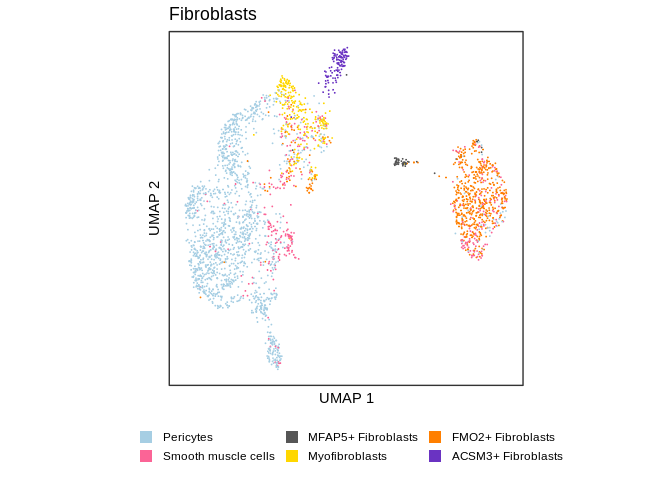
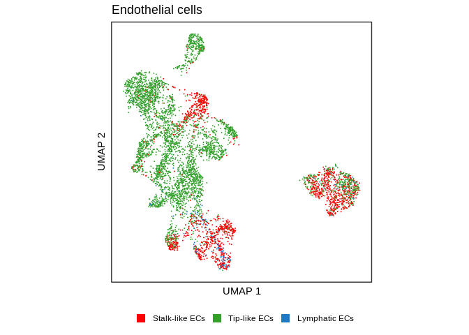
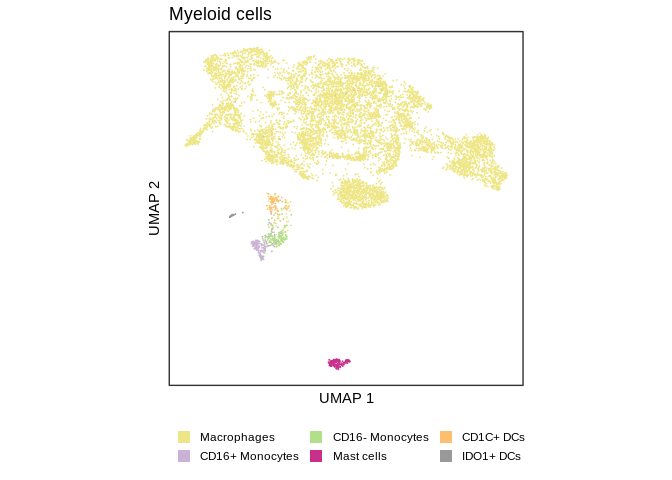
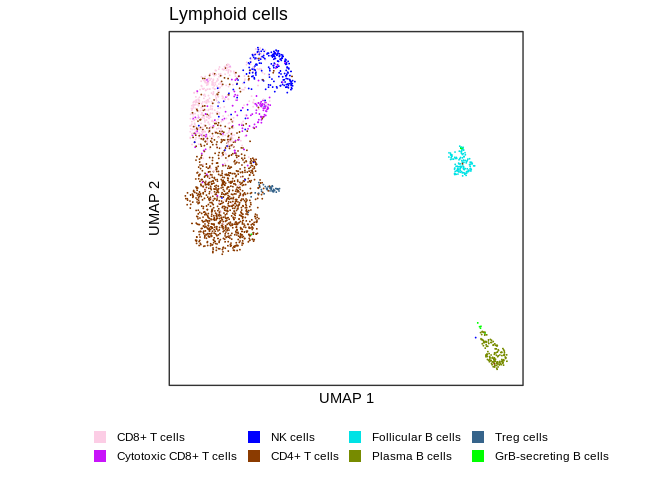
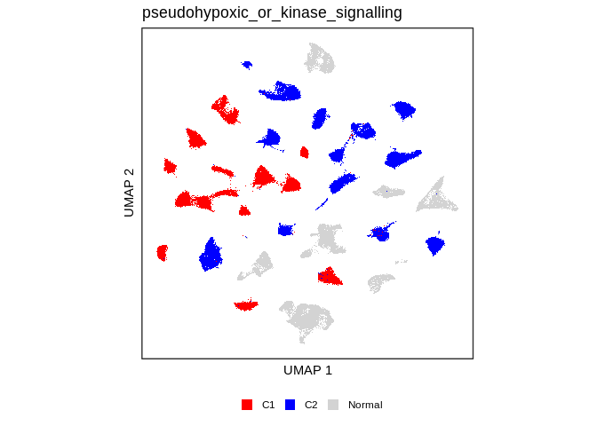
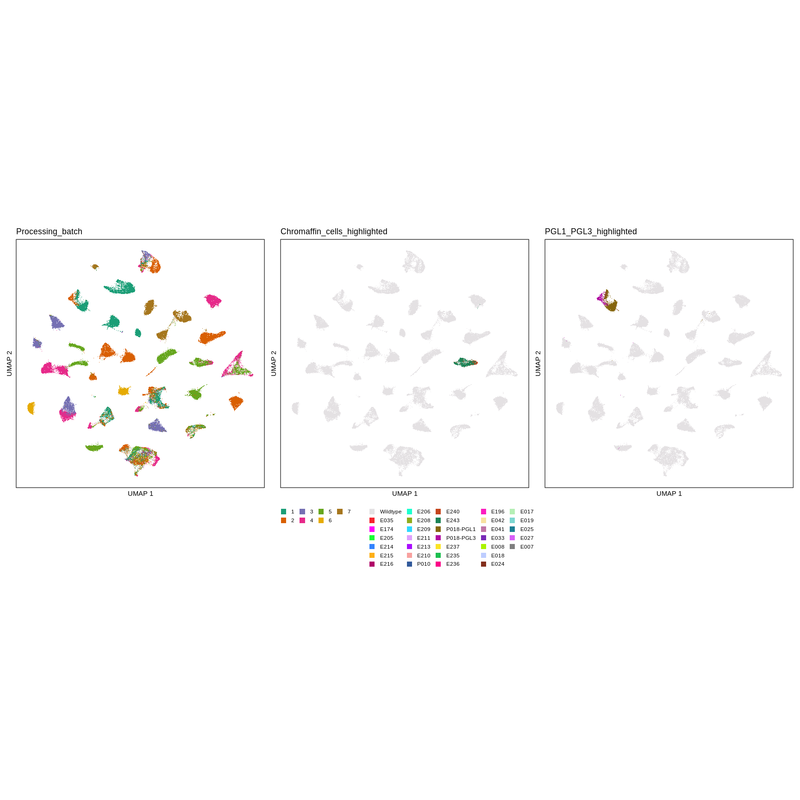
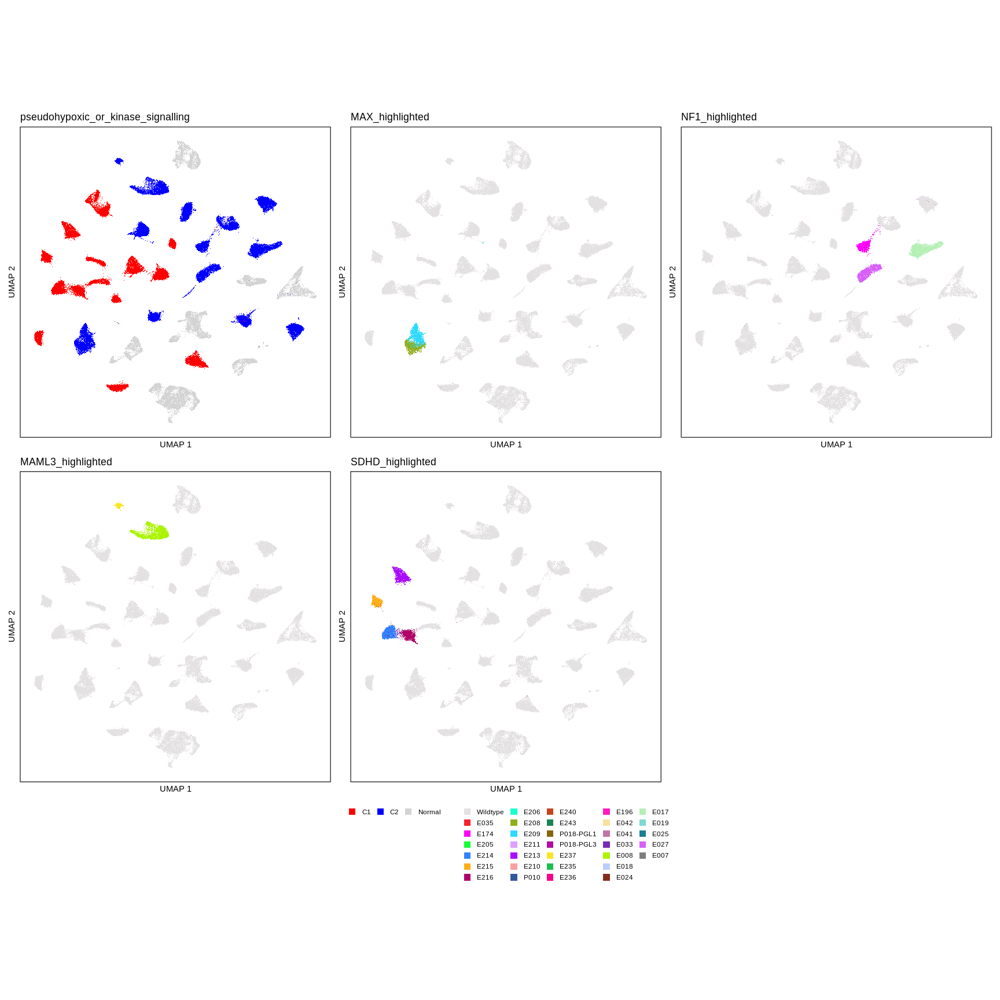
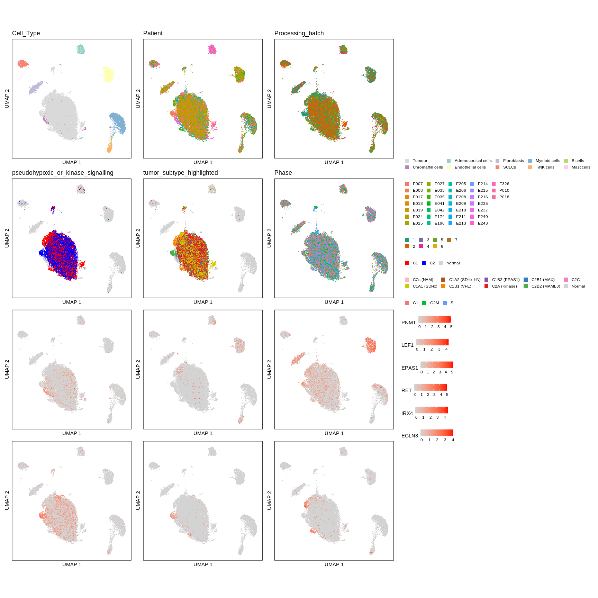
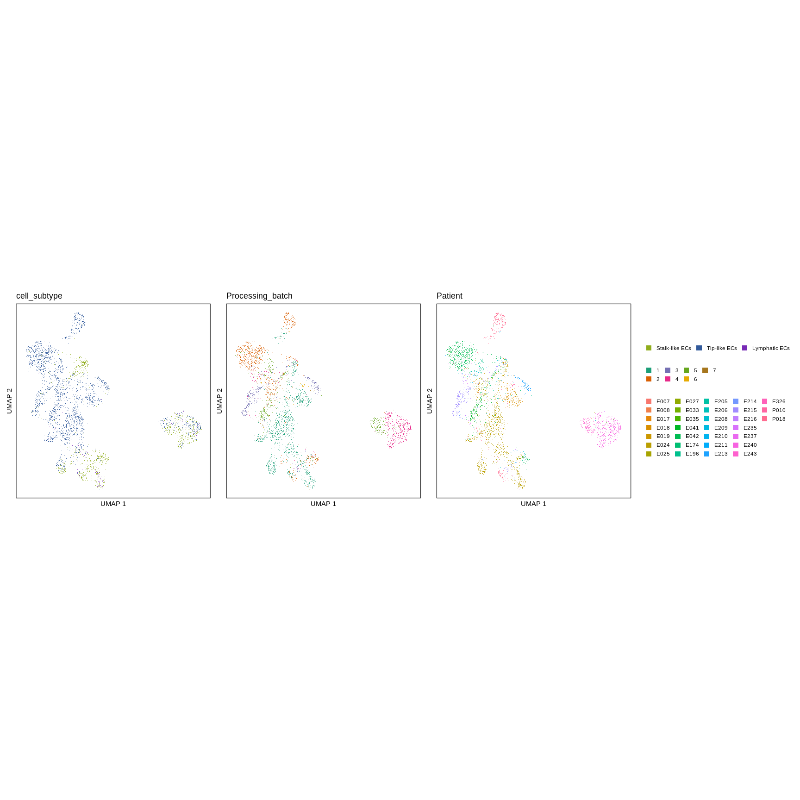

UMAP\_figures
================
Blake Bowen
30/05/2022

``` r
pcpg_rna <- readRDS("Data/pcpg_with_metadata_and_qc.RDS")
pcpg_rna$cell_subtype <- recode(pcpg_rna$cell_subtype, "Sustentacular cells" = "SCLCs")
```

# Figure 3

``` r
###########
# FIGURE 3
###########

# PANEL C: ----

fib_umap_table <- getPlotData(pcpg_rna,
                              reduction = "Fibroblasts")

fib_umap <- ggUMAPplot(fib_umap_table,
                       group.by = "cell_subtype",
                       colorpal = cell_subtype_cols[unique(fib_umap_table$cell_subtype)],
                       plot.title = "Fibroblasts",
                       stroke=0.4)
fib_umap
```

<!-- -->

``` r
ggsave(plot = fib_umap,
       width = 125, height = 100, units = "mm", dpi = 600,
       filename = "Figures/fib_umap.png")

ggsave(plot = fib_umap,
       width = 125, height = 100, units = "mm",
       filename = "Figures/fib_umap.pdf")

# PANEL D: ----

ec_umap_table <- getPlotData(pcpg_rna, reduction = "Endothelial.cells")

ec_umap <- ggUMAPplot(ec_umap_table,
                      group.by = "cell_subtype",
                      colorpal = cell_subtype_cols[unique(ec_umap_table$cell_subtype)],
                      plot.title = "Endothelial cells",
                      stroke=0.4)

ec_umap
```

<!-- -->

``` r
ggsave(plot = ec_umap,
        width = 150, height = 100, units = "mm", dpi = 600,
       filename = "Figures/ec_umap.png")

ggsave(plot = ec_umap,
        width = 150, height = 100, units = "mm",
       filename = "Figures/ec_umap.pdf")
```

# Figure 4

``` r
###########
# FIGURE 4
###########

# PANEL B: ----
myeloid_umap_table <- getPlotData(pcpg_rna, reduction = "Myeloid.cells")

myeloid_umap <- ggUMAPplot(myeloid_umap_table,
                      group.by = "cell_subtype",
                      colorpal = cell_subtype_cols[unique(myeloid_umap_table$cell_subtype)],
                      plot.title = "Myeloid cells",
                      stroke=0.4)

myeloid_umap
```

<!-- -->

``` r
ggsave(plot = myeloid_umap,
        width = 150, height = 100, units = "mm", dpi = 600,
       filename = "Figures/myeloid_umap.png")

ggsave(plot = myeloid_umap,
        width = 150, height = 100, units = "mm",
       filename = "Figures/myeloid_umap.pdf")

# PANEL D: ----

# TODO: finish this plot when magnus provides the UMAP coordinates

lymphoid_umap_table <- getPlotData(pcpg_rna, reduction = "Lymphoid.cells")

lymphoid_umap <- ggUMAPplot(lymphoid_umap_table,
                      group.by = "cell_subtype",
                      colorpal = cell_subtype_cols[unique(lymphoid_umap_table$cell_subtype)],
                      plot.title = "Lymphoid cells",
                      stroke=0.4)

lymphoid_umap
```

<!-- -->

``` r
ggsave(plot = lymphoid_umap,
       width = 150, height = 100, units = "mm", dpi = 600,
       filename = "Figures/lymphoid_umap.png")

ggsave(plot = lymphoid_umap,
       width = 150, height = 100, units = "mm",
       filename = "Figures/lymphoid_umap.pdf")
```

# Figure 1

``` r
###########
# FIGURE 1
###########

# Panel H: C1 and C2 UMAP

c1c2_cols <- c("C1" = "red", "C2" = "blue", "Normal" = "lightgrey")

pcpg_rna_table <- getPlotData(pcpg_rna)

c1c2_umap <- ggUMAPplot(data = pcpg_rna_table, group.by = "pseudohypoxic_or_kinase_signalling", colorpal = c1c2_cols)

c1c2_umap
```

<!-- -->

``` r
#NOTE:  other figure1 UMAPS in "Figures.R"
```

# Supplementary Figure UMAPs

``` r
genes_of_interest <- c(
  "PNMT",
  "LEF1",
  "EPAS1",
  "RET",
  "IRX4",
  "EGLN3"
)

metadata_of_interest_pcpg <- c(
  "Processing_batch",
  "Patient",
  "Cell_Type",
  "pseudohypoxic_or_kinase_signalling")

metadata_of_interest <- c(
  "Cell_Type",
  "Processing_batch",
  "Patient",
  "pseudohypoxic_or_kinase_signalling",
  "tumor_subtype",
  "phase") # TODO: add in annotation columns for individual genotype true or false for tumor only


# FIGURE SX --------------------------------------------------------
# panel A: batch UMAP
# panel B: Normal Chromaffin cells colored by sample UMAP
# panel C: PGL1 and PGL3 tumor cells colored by sample

# TODO make UMAPs where all cells greyed out except a single genotype, color by sample 

# make table with metadata, UMAP coords and normalised, scaled gene expression
pcpg_rna_table <- getPlotData(pcpg_rna, genes_of_interest)

Genotypes <- c("MAX", "NF1", "MAML3", "SDHD")
genotype_columns <- c()
for (i in seq_along(Genotypes)){
  genotype <- Genotypes[i]
  varname <- paste0(genotype, "_highlighted")
  print(varname)
  pcpg_rna_table[[varname]] <-  if_else(pcpg_rna_table$Genotype == genotype & 
                                          pcpg_rna_table$Cell_Type == "Tumour",
                                        pcpg_rna_table$Sample,
                                        "Wildtype")
  genotype_columns[i] <- varname
}
```

    ## [1] "MAX_highlighted"
    ## [1] "NF1_highlighted"
    ## [1] "MAML3_highlighted"
    ## [1] "SDHD_highlighted"

``` r
# make metadata columns which will be used to colour the umaps
pcpg_rna_table$Chromaffin_cells_highlighted <- if_else(pcpg_rna_table$Sample %in% c("E240", "E243") & 
                                                         pcpg_rna_table$Cell_Type == "Chromaffin cells",
                                                       pcpg_rna_table$Sample,
                                                       "Wildtype")
pcpg_rna_table$PGL1_PGL3_highlighted <- if_else(pcpg_rna_table$Sample %in% c("P018-PGL1", "P018-PGL3") & 
                                                  pcpg_rna_table$Cell_Type == "Tumour",
                                                pcpg_rna_table$Sample,
                                                "Wildtype")

pcpg_rna_table$Processing_batch <- factor(pcpg_rna_table$Processing_batch,
                                          levels = as.character(1:7))
# umaps
batch.cols <- setNames(brewer.pal("Dark2", n=7),
                       as.character(1:7))
c1c2_cols <- c("C1" = "red", "C2" = "blue", "Normal" = "lightgrey")
samples <- unique(pcpg_rna_table$Sample)
sample_cols <- pals::polychrome(n = 33)[2:34]
names(sample_cols) <- c("Wildtype", samples)

md_columns_fig1 <- c("Processing_batch", "Chromaffin_cells_highlighted", "PGL1_PGL3_highlighted")
colorpals_fig1 <- list(batch.cols, sample_cols, sample_cols)

fig1_plot_list <- map2(.x = md_columns_fig1,
                       .y = colorpals_fig1,
                       .f = function(x, y){ggUMAPplot(data = pcpg_rna_table,
                                                      group.by=x,
                                                      colorpal=y)})

fig1_umaps <- wrap_plots(fig1_plot_list, ncol = 3, guides = "collect") &
  theme(legend.position = 'bottom')
fig1_umaps
```

<!-- -->

``` r
# ggsave(plot = fig1_umaps,
#        width = 300, height = 300, units = "mm",
#        filename = "Figures/rebuttal_fig1_umaps.pdf")
# 
# ggsave(plot = fig1_umaps, dpi=600,
#        width = 300, height = 300, units = "mm",
#        filename = "Figures/rebuttal_fig1_umaps.png")

# FIGURE SX ------------------------------------------------------------------------------------
# Panel A: C1 and C2 subtypes
# Panel C-E: samples within specific genotypes

md_columns_fig2 <- c("pseudohypoxic_or_kinase_signalling", genotype_columns)
colorpals_fig2 <- list(c1c2_cols, sample_cols, sample_cols, sample_cols, sample_cols)

fig2_plot_list <- map2(.x = md_columns_fig2,
                       .y = colorpals_fig2,
                       .f = function(x, y){ggUMAPplot(data = pcpg_rna_table,
                                                      group.by=x,
                                                      colorpal=y)})

fig2_umaps <- wrap_plots(fig2_plot_list, ncol = 3, guides = "collect") &
  theme(legend.position = 'bottom')
fig2_umaps
```

<!-- -->

``` r
# ggsave(plot = fig2_umaps,
#        width = 300, height = 300, units = "mm",
#        filename = "Figures/rebuttal_fig2_umaps.pdf")
# ggsave(plot = fig2_umaps, dpi=300,
#        width = 300, height = 300, units = "mm",
#        filename = "Figures/rebuttal_fig2_umaps.png")

# FIGURE SX:  ------------------------------------------------------------------------------------
# Panel A-F: Harmony batch-corrected UMAPS 
# Panel G-L: featureplots

pcpg_rna_harmonized <- readRDS("Results/pcpg_harmonized_patient.RDS")

# make table with metadata, UMAP coords and normalised, scaled gene expression 
harmony_table <- getPlotData(pcpg_rna_harmonized, genes_of_interest)

harmony_table$Processing_batch <- factor(harmony_table$Processing_batch, 
                                         levels = as.character(1:7))

harmony_table$tumor_subtype_highlighted <- if_else(harmony_table$Cell_Type == "Tumour",
                                                    harmony_table$tumor_subtype, "Normal",)

md_columns_fig3 <- c("Cell_Type", "Patient", "Processing_batch", "pseudohypoxic_or_kinase_signalling", "tumor_subtype_highlighted", "Phase")

subtype_genotype_cols2 <- c(subtype_genotype_cols, "Normal" = "lightgrey")

colorpals_fig3 <- list(cell.cols, "auto", batch.cols, c1c2_cols, subtype_genotype_cols2, "auto")

fig3_umap_list <- map2(.x = md_columns_fig3,
                       .y = colorpals_fig3,
                       .f = function(x, y){ggUMAPplot(data = harmony_table,
                                                      group.by=x,
                                                      colorpal=y)})
# featureplots
fig3_feature_plot_list <- map(.x = genes_of_interest,
                                 .f = function(x){ggFeaturePlot(harmony_table, x)})

fig3 <- wrap_plots(c(fig3_umap_list,fig3_feature_plot_list), ncol = 3, guides = 'collect')

fig3
```

<!-- -->

``` r
# check featureplot gene order:
# wrap_plots(fig3_feature_plot_list, ncol = 3)

# ggsave(plot = fig3,
#        width = 600, height = 400, units = "mm", dpi = 600,
#        filename = "Figures/fig3_harmony_featureplots.png")
# ggsave(plot = fig3,
#        width = 600, height = 400, units = "mm",
#        filename = "Figures/fig3_harmony_featureplots.pdf")

# FIGURE SX:  ------------------------------------------------------------------------------------
# Endothelial cell subclustering plots

# get the endothelial cells UMAPs
endothelial_table <- getPlotData(pcpg_rna, genes_of_interest, reduction = "Endothelial.cells")

cell.subtype.cols <- setNames(pals::polychrome(n=27), unique(pcpg_rna$cell_subtype))

md_columns_endothelial <- c("cell_subtype", "Processing_batch", "Patient")

endothelial_table$Processing_batch <- factor(endothelial_table$Processing_batch, 
                                         levels = as.character(1:7))

colorpals_endothelial <- list(cell.subtype.cols[unique(endothelial_table$cell_subtype)],
                              batch.cols, "auto")

# endothelial umaps
umap_list_endothelial <- map2(.x = md_columns_endothelial,
                       .y = colorpals_endothelial,
                       .f = function(x, y){ggUMAPplot(data=endothelial_table,
                                                      group.by=x,
                                                      colorpal=y)})

endothelial <- wrap_plots(umap_list_endothelial, ncol = 3, guides = 'collect')

endothelial
```

<!-- -->

``` r
# ggsave(plot = endothelial,
#        width = 400, height = 200, units = "mm", dpi = 600,
#        filename = "Figures/endothelial_umaps_rebuttal.png")
# ggsave(plot = endothelial,
#        width = 400, height = 200, units = "mm",
#        filename = "Figures/endothelial_umaps_rebuttal.pdf")
```
