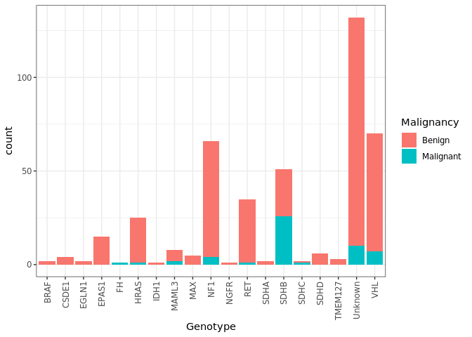
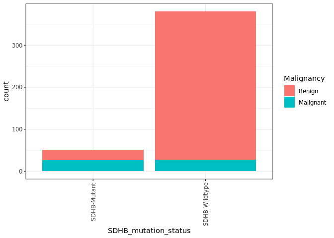
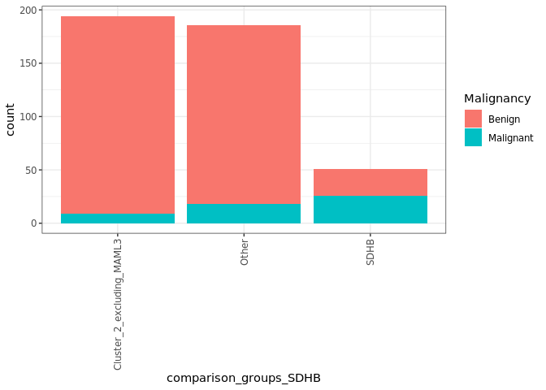

bulk PCPG clinical data (benign vs malignant) stats
================
Blake Bowen
02/03/2022

``` r
rm(list=ls())

library(tidyverse)
```

    ## ── Attaching packages ─────────────────────────────────────── tidyverse 1.3.1 ──

    ## ✓ ggplot2 3.3.5     ✓ purrr   0.3.4
    ## ✓ tibble  3.1.3     ✓ dplyr   1.0.7
    ## ✓ tidyr   1.1.3     ✓ stringr 1.4.0
    ## ✓ readr   2.0.0     ✓ forcats 0.5.1

    ## ── Conflicts ────────────────────────────────────────── tidyverse_conflicts() ──
    ## x dplyr::filter() masks stats::filter()
    ## x dplyr::lag()    masks stats::lag()

``` r
source("singlecell_colour_palettes.R")
```

    ## 
    ## Attaching package: 'scales'

    ## The following object is masked from 'package:purrr':
    ## 
    ##     discard

    ## The following object is masked from 'package:readr':
    ## 
    ##     col_factor

``` r
# bulk PCPG clinical data (benign vs malignant) stats
# bulk metadata
bulk_metadata_all <- read_csv("Data/Table S3. Pheo-atlas metadata.csv") %>%
  mutate(Platform = "Microarray") %>%
  mutate(Platform = replace(Platform, Batch %in% c("TCGA", "Flynn_filtered"),
                            "RNA-Seq")) %>%
  dplyr::select(Sample_raw, Genotype, Subtype, Malignancy, Location) %>%
  mutate(Subtype = recode(Subtype,!!!subtype_key2)) %>%
  dplyr::rename("Sample" = Sample_raw) %>%
  mutate(comparison_groups_SDHB = case_when(
    Genotype == "SDHB" ~ "SDHB",
    Genotype %in% c("HRAS", "MAX", "NF1", "NGFR", "RET", "TMEM127", "BRAF", "Unknown") & 
      Subtype %in% c("C2A (Kinase)", "C2B1 (MAX)") ~ "Cluster_2_excluding_MAML3",
      TRUE ~ "Other"
    )) %>%  # SDHB mutants vs C2 (excluding MAML3 mutants)
  mutate(SDHB_mutation_status = if_else(Genotype == "SDHB", "SDHB-Mutant", "SDHB-Wildtype")) %>% 
    mutate(comparison_groups_MAML3 = case_when(
    Genotype == "MAML3" ~ "MAML3",
    Genotype %in% c("HRAS", "MAX", "NF1", "NGFR", "RET", "TMEM127", "BRAF", "Unknown") & 
      Subtype %in% c("C2A (Kinase)", "C2B1 (MAX)") ~ "Cluster_2_excluding_MAML3",
      TRUE ~ "Other"
    )) %>% # MAML3 Mutants vs C2 (excluding MAML3 mutants)
  mutate(MAML3_mutation_status = if_else(Genotype == "MAML3", "MAML3-Mutant", "MAML3-Wildtype"))
```

    ## Rows: 735 Columns: 23

    ## ── Column specification ────────────────────────────────────────────────────────
    ## Delimiter: ","
    ## chr (18): Sample, Sample_raw, Alias, Accession_ID, Dataset, Batch, Location,...
    ## dbl  (5): Purity, ConsensusCluster, Consensus, UMAP_1, UMAP_2

    ## 
    ## ℹ Use `spec()` to retrieve the full column specification for this data.
    ## ℹ Specify the column types or set `show_col_types = FALSE` to quiet this message.

``` r
table(is.na(bulk_metadata_all$Malignancy))
```

    ## 
    ## FALSE  TRUE 
    ##   482   253

``` r
# filter out the samples without malignancy status
bulk_metadata_filtered <- bulk_metadata_all %>% 
  filter(!is.na(Malignancy)) %>% 
  filter(Location != "Head and neck")
```

253 samples in the pheo atlas did not have malignancy status available.
These were removed from the analysis.

``` r
# bar plot of malignancy in each genotype
ggplot(data = bulk_metadata_filtered, aes(x = Genotype, fill = Malignancy)) +
  geom_bar() +
  theme_bw() +
  theme(axis.text.x = element_text(angle = 90, vjust = 0.5, hjust=1))
```

<!-- -->

``` r
# bar plot of SDHB mutant vs wildtype
ggplot(data = bulk_metadata_filtered, aes(x = SDHB_mutation_status, fill = Malignancy)) +
  geom_bar() +
  theme_bw() +
  theme(axis.text.x = element_text(angle = 90, vjust = 0.5, hjust=1))
```

<!-- -->

``` r
# bar plot of SDHB vs cluster 2 (not MAML3)
ggplot(data = bulk_metadata_filtered, aes(x = comparison_groups_SDHB, fill = Malignancy)) +
  geom_bar() +
  theme_bw() +
  theme(axis.text.x = element_text(angle = 90, vjust = 0.5, hjust=1))
```

<!-- -->

``` r
# use fisher exact test to look for association between each of the PCPG subtypes and metastatic disease
contingency_table <- table(bulk_metadata_filtered$Subtype, bulk_metadata_filtered$Malignancy) %>% 
  data.frame() %>% 
  rename('Subtype'= Var1, 'Malignancy'=Var2)

subtypes <- unique(contingency_table$Subtype)
ft_list = list()

# create a 2x2 contingency table for each subtype and perform fisher exact test, then correct the p values for multiple testing
for (i in seq_along(subtypes)){
  subtype <- subtypes[i]
  subtype_benign <- contingency_table[contingency_table$Subtype == subtype &
                                      contingency_table$Malignancy == "Benign", "Freq"]
  subtype_malignant <- contingency_table[contingency_table$Subtype == subtype &
                                      contingency_table$Malignancy == "Malignant", "Freq"]
  other_subtypes_benign <- sum(contingency_table[contingency_table$Subtype != subtype &
                                      contingency_table$Malignancy == "Benign", "Freq"])
  other_subtypes_malignant <- sum(contingency_table[contingency_table$Subtype != subtype &
                                      contingency_table$Malignancy == "Malignant", "Freq"])
  
  tab = data.frame(subtype = c(subtype_malignant, subtype_benign),
                 "other_subtypes" = c(other_subtypes_malignant, other_subtypes_benign))
  names(tab)[1] <- make.names(subtype)
  rownames(tab) <- c("Malignant", "Benign")
  ft <- fisher.test(tab) # two-tailed test 
  result <- data.frame("subtype" = subtype,
                       "n_malignant" = tab[1,1], 
                       "n_benign" = tab[2,1],
                       odds_ratio=unname(ft$estimate),
                       "p.value"=ft$p.value)
  ft_list[length(ft_list)+1] <- list(result)
}

ft_table <- reduce(ft_list, bind_rows)

# BH correction 
ft_table$p.adjust <- p.adjust(p = ft_table$p.value, method = "BH")

ft_table %>%
  write_csv(file = "Results/malignancy_fet_table.csv")

ft_table %>%
  knitr::kable(label = "Fisher Exact Test Results")
```

| subtype        | n\_malignant | n\_benign | odds\_ratio |   p.value |  p.adjust |
| :------------- | -----------: | --------: | ----------: | --------: | --------: |
| C1A1 (SDHx)    |           23 |        31 |   8.5091868 | 0.0000000 | 0.0000000 |
| C1A2 (SDHx-HN) |            8 |         9 |   7.2294733 | 0.0003177 | 0.0008472 |
| C1B1 (VHL)     |            8 |        69 |   0.7965402 | 0.7028785 | 0.7028785 |
| C1B2 (EPAS1)   |            0 |        19 |   0.0000000 | 0.1482343 | 0.1694107 |
| C2A (Kinase)   |            7 |       145 |   0.2451776 | 0.0001939 | 0.0007758 |
| C2B1 (MAX)     |            2 |        48 |   0.2701529 | 0.0657083 | 0.0876110 |
| C2B2 (MAML3)   |            4 |         9 |   3.3329279 | 0.0626633 | 0.0876110 |
| C2C            |            1 |        48 |   0.1325445 | 0.0185607 | 0.0371215 |

# Conclusion

Fisher’s exact test: There was a significant association between C1A1
and malignancy (BH Adj. P \< 0.05).  
There was a significant association between C1A2 mutation status and
malignancy (BH Adj. P \< 0.05).

``` r
sessionInfo()
```

    ## R version 4.0.4 (2021-02-15)
    ## Platform: x86_64-pc-linux-gnu (64-bit)
    ## Running under: Red Hat Enterprise Linux
    ## 
    ## Matrix products: default
    ## BLAS/LAPACK: /usr/local/easybuild-2019/easybuild/software/compiler/gcc/10.2.0/openblas/0.3.12/lib/libopenblas_haswellp-r0.3.12.so
    ## 
    ## locale:
    ##  [1] LC_CTYPE=en_AU.UTF-8       LC_NUMERIC=C              
    ##  [3] LC_TIME=en_AU.UTF-8        LC_COLLATE=en_AU.UTF-8    
    ##  [5] LC_MONETARY=en_AU.UTF-8    LC_MESSAGES=en_AU.UTF-8   
    ##  [7] LC_PAPER=en_AU.UTF-8       LC_NAME=C                 
    ##  [9] LC_ADDRESS=C               LC_TELEPHONE=C            
    ## [11] LC_MEASUREMENT=en_AU.UTF-8 LC_IDENTIFICATION=C       
    ## 
    ## attached base packages:
    ## [1] stats     graphics  grDevices utils     datasets  methods   base     
    ## 
    ## other attached packages:
    ##  [1] ggsci_2.9          pals_1.7           scales_1.1.1       RColorBrewer_1.1-2
    ##  [5] forcats_0.5.1      stringr_1.4.0      dplyr_1.0.7        purrr_0.3.4       
    ##  [9] readr_2.0.0        tidyr_1.1.3        tibble_3.1.3       ggplot2_3.3.5     
    ## [13] tidyverse_1.3.1   
    ## 
    ## loaded via a namespace (and not attached):
    ##  [1] Rcpp_1.0.7        lubridate_1.7.10  assertthat_0.2.1  rprojroot_2.0.2  
    ##  [5] digest_0.6.27     utf8_1.2.2        R6_2.5.0          cellranger_1.1.0 
    ##  [9] backports_1.2.1   reprex_2.0.0      evaluate_0.14     highr_0.9        
    ## [13] httr_1.4.2        pillar_1.6.2      rlang_0.4.12      readxl_1.3.1     
    ## [17] rstudioapi_0.13   rmarkdown_2.9     labeling_0.4.2    bit_4.0.4        
    ## [21] munsell_0.5.0     broom_0.7.9       compiler_4.0.4    modelr_0.1.8     
    ## [25] xfun_0.24         pkgconfig_2.0.3   htmltools_0.5.1.1 tidyselect_1.1.1 
    ## [29] fansi_0.5.0       crayon_1.4.1      tzdb_0.1.2        dbplyr_2.1.1     
    ## [33] withr_2.4.2       grid_4.0.4        jsonlite_1.7.2    gtable_0.3.0     
    ## [37] lifecycle_1.0.0   DBI_1.1.1         magrittr_2.0.1    cli_3.0.1        
    ## [41] stringi_1.7.3     vroom_1.5.3       farver_2.1.0      mapproj_1.2.7    
    ## [45] fs_1.5.0          xml2_1.3.2        ellipsis_0.3.2    generics_0.1.0   
    ## [49] vctrs_0.3.8       tools_4.0.4       dichromat_2.0-0   bit64_4.0.5      
    ## [53] glue_1.4.2        maps_3.3.0        hms_1.1.0         parallel_4.0.4   
    ## [57] yaml_2.2.1        colorspace_2.0-2  rvest_1.0.1       knitr_1.33       
    ## [61] haven_2.4.1
