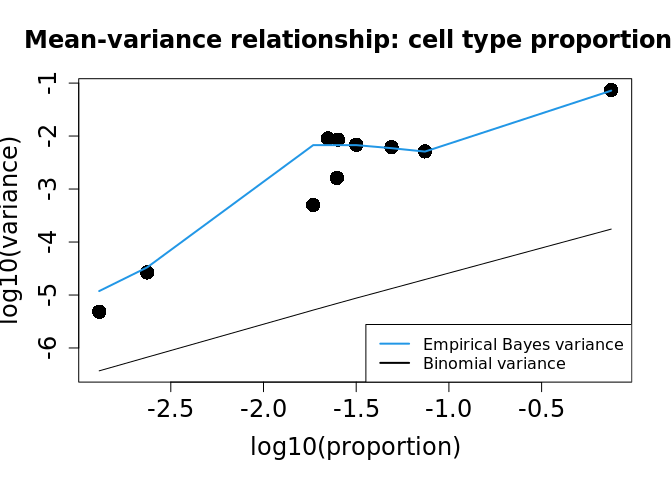
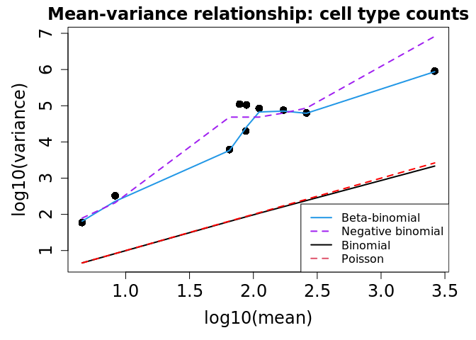
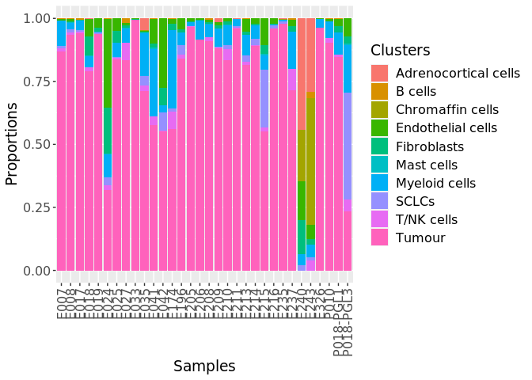

Differential cell type abundance analysis with propeller
================
Blake Bowen
04/02/2022

``` r
knitr::opts_knit$set(root.dir = '/data/gpfs/projects/punim0648/Projects/Blake/single_cell_R_project/',
                     cache = TRUE,cache.lazy = FALSE)

rm(list=ls())

library(Seurat)
library(tidyverse)
```

    ## Registered S3 method overwritten by 'cli':
    ##   method     from    
    ##   print.boxx spatstat

    ## ── Attaching packages ─────────────────────────────────────── tidyverse 1.3.1 ──

    ## ✓ ggplot2 3.3.5     ✓ purrr   0.3.4
    ## ✓ tibble  3.1.3     ✓ dplyr   1.0.7
    ## ✓ tidyr   1.1.3     ✓ stringr 1.4.0
    ## ✓ readr   2.0.0     ✓ forcats 0.5.1

    ## ── Conflicts ────────────────────────────────────────── tidyverse_conflicts() ──
    ## x dplyr::filter() masks stats::filter()
    ## x dplyr::lag()    masks stats::lag()

``` r
library(patchwork)
library(limma)
library(speckle)
```

    ## 

    ## 

``` r
library(UpSetR)
```

    ## Warning: package 'UpSetR' was built under R version 4.0.5

``` r
library(grid)
```

This is a comparative analysis of cell populations between between
different PCPG genotypes and subtypes.

``` r
# read in the single cell seuratobj containing all of the samples 
pcpg_rna <- readRDS("Data/pcpg_with_metadata.RDS")
pcpg_rna$tumor_or_normal <- if_else(pcpg_rna$Sample %in% c("E240", "E243"), "Normal", "Tumor")
pcpg_rna$C1_or_C2 <- case_when(
  grepl("C1", pcpg_rna$tumor_subtype) ~ "C1",
  grepl("C2", pcpg_rna$tumor_subtype) ~ "C2",
  TRUE ~ "Normal")
```

``` r
# get logit transformed proportions of each cell type
props <- getTransformedProps(pcpg_rna$Cell_Type, pcpg_rna$Sample, transform="logit")
```

    ## Performing logit transformation of proportions

Look at how well each model fits the data.

``` r
# emirical bayes fits better
plotCellTypePropsMeanVar(props$Counts)
```

<!-- -->

``` r
plotCellTypeMeanVar(props$Counts)
```

    ## Using classic mode.

<!-- -->

``` r
# make a sample data table 
samples <-  tibble(Sample = colnames(props$Counts)) %>%
  left_join(pcpg_rna[[c("Sample", "Genotype", "tumor_subtype")]]) %>%
  distinct() 
```

    ## Joining, by = "Sample"

``` r
Genotype <- samples$Genotype
tumor_subtype <- make.names(samples$tumor_subtype) %>%
  str_replace("\\.\\.", "_") %>% 
  str_remove("\\.$") %>% 
  str_replace("\\.", "_")
```

``` r
# make design matrix describing tumor subtype
design_sub <- model.matrix(~0 + tumor_subtype)
colnames(design_sub) <- colnames(design_sub) %>% str_remove("tumor_subtype")
# make a contrast to compare VHL-mutant vs VHL-Wildtype
contrasts_sub <- makeContrasts(
  "C1_vs_C2" = (C1A1_SDHx + C1A2_SDHx_HN + C1B1_VHL + C1B2_EPAS1)/4 - (C2A_Kinase + C2B1_MAX + C2B2_MAML3)/3,
    "C2_vs_C1" = (C2A_Kinase + C2B1_MAX + C2B2_MAML3)/3 - (C1A1_SDHx + C1A2_SDHx_HN + C1B1_VHL + C1B2_EPAS1)/4,
  "C1A2_SDHx_HN_vs_rest" = C1A2_SDHx_HN - (C2A_Kinase + C2B2_MAML3 + C1A1_SDHx + C2B1_MAX + C1B1_VHL + C1B2_EPAS1)/6,
  "C1B1_VHL_vs_rest" = C1B1_VHL - (C2A_Kinase + C2B2_MAML3 + C1A1_SDHx + C2B1_MAX + C1A2_SDHx_HN + C1B2_EPAS1)/6,
  "C2A_Kinase_vs_rest" = C2A_Kinase - (C1B1_VHL + C2B2_MAML3 + C1A1_SDHx + C2B1_MAX + C1A2_SDHx_HN + C1B2_EPAS1)/6,
  "C2B2_MAML3_vs_rest" = C2B2_MAML3 - (C2A_Kinase + C1B1_VHL + C1A1_SDHx + C2B1_MAX + C1A2_SDHx_HN + C1B2_EPAS1)/6,
  "C1A1_SDHx_vs_rest" = C1A1_SDHx - (C2A_Kinase + C2B2_MAML3 + C1B1_VHL + C2B1_MAX + C1A2_SDHx_HN + C1B2_EPAS1)/6,
  "C2B1_MAX_vs_rest" = C2B1_MAX - (C2A_Kinase + C2B2_MAML3 + C1A1_SDHx + C1B1_VHL+ C1A2_SDHx_HN + C1B2_EPAS1)/6,
  "C1B2_EPAS1_vs_rest" = C1B2_EPAS1 - (C2A_Kinase + C2B2_MAML3 + C1A1_SDHx + C2B1_MAX + C1A2_SDHx_HN + C1B1_VHL)/6,
  levels = design_sub)

contrast_names_sub <- colnames(contrasts_sub)
res_table_subtypes <- contrast_names_sub %>%
  map(function(x){
    ttest_res <- propeller.ttest(props,
                                 design_sub,
                                 contrasts=contrasts_sub[,x],
                                 robust=TRUE, 
                                 trend=FALSE,
                                 sort=TRUE) %>% 
  mutate(contrast = x) %>%
    filter(FDR < 0.05) %>%
    rownames_to_column(var = "cell_type") %>% 
    filter(PropRatio > 1)
  }
) %>%
  bind_rows()

res_table_subtypes %>%
  knitr::kable(caption = "All DA cell types between tumor subtypes (t-test)")
```

| cell\_type        | PropMean.C1A1\_SDHx | PropMean.C1A2\_SDHx\_HN | PropMean.C1B1\_VHL | PropMean.C1B2\_EPAS1 | PropMean.C2A\_Kinase | PropMean.C2B1\_MAX | PropMean.C2B2\_MAML3 | PropRatio | Tstatistic |   P.Value |       FDR | contrast            |
| :---------------- | ------------------: | ----------------------: | -----------------: | -------------------: | -------------------: | -----------------: | -------------------: | --------: | ---------: | --------: | --------: | :------------------ |
| Endothelial cells |           0.0470800 |               0.0482252 |          0.2402920 |            0.0092262 |            0.0149731 |          0.0054249 |            0.0168615 |  4.265156 |   4.237071 | 0.0001670 | 0.0016702 | C1\_vs\_C2          |
| Fibroblasts       |           0.0278991 |               0.0137382 |          0.0891878 |            0.0073549 |            0.0153915 |          0.0039169 |            0.0133787 |  2.405596 |   2.757027 | 0.0093712 | 0.0468562 | C1\_vs\_C2          |
| Endothelial cells |           0.0470800 |               0.0482252 |          0.2402920 |            0.0092262 |            0.0149731 |          0.0054249 |            0.0168615 | 13.733591 |   4.446625 | 0.0000908 | 0.0009084 | C1B1\_VHL\_vs\_rest |
| Tumour            |           0.7134890 |               0.8112652 |          0.4814378 |            0.9064751 |            0.8231004 |          0.9416759 |            0.8241743 |  1.263519 |   2.794088 | 0.0085450 | 0.0284832 | C2B1\_MAX\_vs\_rest |

All DA cell types between tumor subtypes (t-test)

``` r
# create design matrix with Genotype as model factor
design_gen <- model.matrix(~0 + Genotype)
colnames(design_gen) <- colnames(design_gen) %>% str_remove("Genotype")

# make a contrast to compare VHL-mutant vs VHL-wildtype
contrasts_gen <- makeContrasts(
  "VHL_vs_rest" = VHL - (EPAS1 + FH + H3F3A + HRAS + MAML3 + MAX + NF1 + RET + SDHA + SDHB + SDHD + TMEM127 + Unknown)/13,
  "EPAS1_vs_rest" = EPAS1 - (VHL + FH + H3F3A + HRAS + MAML3 + MAX + NF1 + RET + SDHA + SDHB + SDHD + TMEM127 + Unknown)/13,
  "FH_vs_rest" = FH  - (VHL + EPAS1 + H3F3A + HRAS + MAML3 + MAX + NF1 + RET + SDHA + SDHB + SDHD + TMEM127 + Unknown)/13,
  "H3F3A_vs_rest" = H3F3A - (VHL + EPAS1 + FH + HRAS + MAML3 + MAX + NF1 + RET + SDHA + SDHB + SDHD + TMEM127 + Unknown)/13,
  "HRAS_vs_rest" = HRAS - (VHL + EPAS1 + FH + H3F3A + MAML3 + MAX + NF1 + RET + SDHA + SDHB + SDHD + TMEM127 + Unknown)/13,
  "MAML3_vs_rest" = MAML3 - (VHL + EPAS1 + FH + H3F3A + HRAS + MAX + NF1 + RET + SDHA + SDHB + SDHD + TMEM127 + Unknown)/13,
  "MAX_vs_rest" = MAX - (VHL + EPAS1 + FH + H3F3A + HRAS + MAML3 + NF1 + RET + SDHA + SDHB + SDHD + TMEM127 + Unknown)/13,
  "NF1_vs_rest" = NF1 - (VHL + EPAS1 + FH + H3F3A + HRAS + MAML3 + MAX  + RET + SDHA + SDHB + SDHD + TMEM127 + Unknown)/13,
  "RET_vs_rest" = RET - (VHL + EPAS1 + FH + H3F3A + HRAS + MAML3 + MAX + NF1 + SDHA + SDHB + SDHD + TMEM127 + Unknown)/13,
  "SDHA_vs_rest" = SDHA - (VHL + EPAS1 + FH + H3F3A + HRAS + MAML3 + MAX + NF1 + RET  + SDHB + SDHD + TMEM127 + Unknown)/13,
  "SDHB_vs_rest" = SDHB - (VHL + EPAS1 + FH + H3F3A + HRAS + MAML3 + MAX + NF1 + RET + SDHA  + SDHD + TMEM127 + Unknown)/13,
  "SDHD_vs_rest" = SDHD - (VHL + EPAS1 + FH + H3F3A + HRAS + MAML3 + MAX + NF1 + RET + SDHA + SDHB  + TMEM127 + Unknown)/13,
  "TMEM127_vs_rest" = TMEM127 - (VHL + EPAS1 + FH + H3F3A + HRAS + MAML3 + MAX + NF1 + RET + SDHA + SDHB + SDHD + Unknown)/13,
  levels = design_gen)

contrast_names_gen <- colnames(contrasts_gen)
res_table_genotypes <- contrast_names_gen %>%
  map(function(x){
    ttest_res <- propeller.ttest(props,
                                 design_gen,
                                 contrasts=contrasts_gen[,x],
                                 robust=TRUE,
                                 trend=FALSE,
                                 sort=TRUE) %>%
  mutate(contrast = x) %>%
    filter(FDR < 0.05) %>%
    rownames_to_column(var = "cell_type") %>%
    filter(PropRatio > 1)
  }
) %>%
  bind_rows()

res_table_genotypes %>%
  knitr::kable(caption = "All DA cell types between tumor genotypes (t-test)")
```

| cell\_type           | PropMean.EPAS1 | PropMean.FH | PropMean.H3F3A | PropMean.HRAS | PropMean.MAML3 | PropMean.MAX | PropMean.NF1 | PropMean.RET | PropMean.SDHA | PropMean.SDHB | PropMean.SDHD | PropMean.TMEM127 | PropMean.Unknown | PropMean.VHL | PropRatio | Tstatistic |   P.Value |       FDR | contrast       |
| :------------------- | -------------: | ----------: | -------------: | ------------: | -------------: | -----------: | -----------: | -----------: | ------------: | ------------: | ------------: | ---------------: | ---------------: | -----------: | --------: | ---------: | --------: | --------: | :------------- |
| Endothelial cells    |       0.007564 |   0.0065205 |      0.0004878 |     0.0031612 |      0.0168615 |    0.0114831 |    0.0097999 |    0.0392707 |     0.0488141 |     0.0456932 |     0.0494647 |        0.0043412 |        0.0031801 |    0.2402920 |  24.30261 |   5.481373 | 0.0000157 | 0.0001574 | VHL\_vs\_rest  |
| Fibroblasts          |       0.004757 |   0.0067656 |      0.0000000 |     0.0031612 |      0.0133787 |    0.0088682 |    0.0133121 |    0.0388999 |     0.0466078 |     0.0193377 |     0.0140823 |        0.0011173 |        0.0008673 |    0.0891878 |       Inf |   3.299803 | 0.0032182 | 0.0126519 | VHL\_vs\_rest  |
| Adrenocortical cells |       0.000000 |   0.0008581 |      0.0004878 |     0.0465753 |      0.0001088 |    0.0071648 |    0.0001601 |    0.0006166 |     0.0002758 |     0.0001842 |     0.0001604 |        0.0014132 |        0.0000000 |    0.0001709 |       Inf |   4.206163 | 0.0003550 | 0.0035498 | HRAS\_vs\_rest |
| Chromaffin cells     |       0.000000 |   0.0000000 |      0.0000000 |     0.0037935 |      0.0003487 |    0.0000000 |    0.0000000 |    0.0000000 |     0.0000000 |     0.0000000 |     0.0000773 |        0.0007066 |        0.0000000 |    0.0000000 |       Inf |   3.863424 | 0.0008231 | 0.0041154 | HRAS\_vs\_rest |

All DA cell types between tumor genotypes (t-test)

The t-test shows significant difference in endothelial cell abundance
between VHL-mutant and VHL-widltype PCPG (FDR \< 0.05).

# Run Propeller for the cell subsets.

``` r
# get transformed proportions of each cell type
subsets_props <- getTransformedProps(pcpg_rna$cell_subtype,
                                     pcpg_rna$Sample,
                                     transform="logit")
```

    ## Performing logit transformation of proportions

``` r
res_table_subsets_subtypes <- contrast_names_sub %>%
  map(function(x){
    ttest_res <- propeller.ttest(subsets_props,
                                 design_sub,
                                 contrasts=contrasts_sub[,x],
                                 robust=TRUE, 
                                 trend=FALSE,
                                 sort=TRUE) %>% 
  mutate(contrast = x) %>%
    filter(FDR < 0.05) %>%
    #select(PropRatio, FDR, contrast) %>% 
    rownames_to_column(var = "cell_type") %>% 
    filter(PropRatio > 1)
  }
) %>%
  bind_rows()
```

``` r
all_comparisons_subtypes <-res_table_subtypes %>%
  bind_rows(res_table_subsets_subtypes) %>%
  write_csv("Results/propeller_differential_cell_abundance.csv")
  
all_comparisons_subtypes %>% select(cell_type, contrast, FDR, PropRatio, Tstatistic) %>% knitr::kable(caption = "all of the subtype comparison significant results")
```

| cell\_type          | contrast            |       FDR | PropRatio | Tstatistic |
| :------------------ | :------------------ | --------: | --------: | ---------: |
| Endothelial cells   | C1\_vs\_C2          | 0.0016702 |  4.265156 |   4.237071 |
| Fibroblasts         | C1\_vs\_C2          | 0.0468562 |  2.405596 |   2.757027 |
| Endothelial cells   | C1B1\_VHL\_vs\_rest | 0.0009084 | 13.733591 |   4.446625 |
| Tumour              | C2B1\_MAX\_vs\_rest | 0.0284832 |  1.263519 |   2.794088 |
| Tip-like ECs        | C1\_vs\_C2          | 0.0040919 |  4.099178 |   4.166169 |
| Stalk-like ECs      | C1\_vs\_C2          | 0.0139853 |  5.637759 |   3.526486 |
| Smooth muscle cells | C1\_vs\_C2          | 0.0393758 |  5.415913 |   3.013164 |
| Tip-like ECs        | C1B1\_VHL\_vs\_rest | 0.0013306 | 14.350449 |   4.524711 |
| Stalk-like ECs      | C1B1\_VHL\_vs\_rest | 0.0196276 | 11.940668 |   3.408944 |
| Lymphatic ECs       | C1B1\_VHL\_vs\_rest | 0.0216994 |       Inf |   3.230072 |
| Pericytes           | C1B1\_VHL\_vs\_rest | 0.0266207 |  9.636829 |   3.027630 |
| Tumour              | C2B1\_MAX\_vs\_rest | 0.0390384 |  1.263519 |   2.819653 |

all of the subtype comparison significant results

``` r
# Plot cell type proportions in each sample
props_plot <- plotCellTypeProps(x = pcpg_rna, sample = pcpg_rna$Sample, clusters = pcpg_rna$Cell_Type) 
```

    ## Performing logit transformation of proportions

``` r
props_plot +
  theme(axis.text.x = element_text(angle = 90, vjust = 0.5, hjust=1))
```

<!-- -->

<!-- ```{r} -->

<!-- # compare percentage of macrophages expressing HLA-DR and CD86 in C1 and C2 tumours  -->

<!-- genes.use <- c("CD86", "HLA-DRA", "HLA-DRB1") -->

<!-- VlnPlot(subset(pcpg_rna, subset = cell_subtype == "Macrophages"), features = genes.use, group.by = "C1_or_C2") -->

<!-- VlnPlot(subset(pcpg_rna, subset = cell_subtype == "Macrophages"), features = genes.use, group.by = "C1_or_C2", assay='RNA') -->

<!-- GetExpressionVector <- function(gene, seuratobj){ -->

<!--   gene_pat <- paste0("^", gene, "$") # exact match the gene name  -->

<!--   # get the rownumber of the gene in the counts matrix -->

<!--   gene_rownum <-  grep(gene_pat, rownames(seuratobj@assays$RNA@counts)) -->

<!--   # initialise vector of zeroes for each sample to store the result -->

<!--   gene_is_expressed <-  rep(0, ncol(seuratobj@assays$RNA@counts)) -->

<!--   print(length(gene_is_expressed)) -->

<!--   # get expression values for the gene -->

<!--   expression_counts <- seuratobj@assays$RNA@counts[rownames(seuratobj@assays$RNA@counts)[gene_rownum], ] -->

<!--   # print(expression_counts) -->

<!--   # go through each cell, if the gene has more than 1 reads in that cell, consider the gene expressed and set the value from 0 to 1 -->

<!--   gene_is_expressed[which(expression_counts >= 1)] <- 1 -->

<!--   print(length(gene_is_expressed)) -->

<!--   gene_is_expressed <- setNames(object = gene_is_expressed, nm = colnames(seuratobj@assays$RNA@counts)) -->

<!--   print(length(gene_is_expressed)) -->

<!--   return(gene_is_expressed) # 1 for expressed, 0 for not expressed -->

<!-- } -->

<!-- # Make a metadata column for each of the macrophage canonical markers and whether or not they are expressed  -->

<!-- for (i in 1:length(genes.use)){ -->

<!--   gene = genes.use[i] -->

<!--   vector = GetExpressionVector(gene, pcpg_rna) -->

<!--   pcpg_rna <- AddMetaData(object = pcpg_rna, metadata = vector, col.name = paste0(make.names(gene), "_is_expressed"))  -->

<!-- } -->

<!-- ``` -->

<!-- ```{r mac-upset-plots} -->

<!-- macs_subtypes <- pcpg_rna[[c(paste0(make.names(genes.use), "_is_expressed"), "C1_or_C2", "cell_subtype")]] -->

<!-- macs_subtypes_C1 <- macs_subtypes %>% -->

<!--   filter(cell_subtype == "Macrophages" & C1_or_C2 == "C1") %>% -->

<!--   select(-cell_subtype) -->

<!-- macs_subtypes_C2 <- macs_subtypes %>% -->

<!--   filter(cell_subtype == "Macrophages" & C1_or_C2 == "C2") %>% -->

<!--   select(-cell_subtype) -->

<!-- macs_subtypes_normal <- macs_subtypes %>% -->

<!--   filter(cell_subtype == "Macrophages" & C1_or_C2 == "Normal") %>% -->

<!--   select(-cell_subtype) -->

<!-- upset(macs_subtypes_C1, -->

<!--       order.by = "freq", -->

<!--       empty.intersections = "on", -->

<!--       nintersects = NA)  -->

<!-- grid.text("tumor C1",x = 0.65, y=0.95, gp=gpar(fontsize=20)) -->

<!-- upset(macs_subtypes_C2, -->

<!--       order.by = "freq", -->

<!--       empty.intersections = "on", -->

<!--       nintersects = NA)  -->

<!-- grid.text("tumor C2",x = 0.65, y=0.95, gp=gpar(fontsize=20)) -->

<!-- upset(macs_subtypes_normal, -->

<!--       order.by = "freq", -->

<!--       empty.intersections = "on") -->

<!-- grid.text("normal",x = 0.65, y=0.95, gp=gpar(fontsize=20)) -->

<!-- ``` -->

<!-- ```{r propeller-mac-subsets} -->

<!-- mac_subtypes_vec <- paste0("CD86_", if_else(macs_subtypes$CD86_is_expressed == 1, "pos", "neg"), -->

<!--                            "_HLA_DRA_", if_else(macs_subtypes$HLA.DRA_is_expressed == 1, "pos", "neg") -->

<!--                            # "_HLA_DRB1_", if_else(macs_subtypes$HLA.DRB1_is_expressed == 1, "pos", "neg") -->

<!--                            ) -->

<!-- names(mac_subtypes_vec) <- rownames(macs_subtypes) -->

<!-- pcpg_rna <- AddMetaData(pcpg_rna, metadata = mac_subtypes_vec, col.name = "mac_gene_expression_subype") -->

<!-- mac_rna <- subset(pcpg_rna, subset = cell_subtype == "Macrophages") -->

<!-- # do a t-test to see if there are differences in the number of macrophages expressing the M1 / M2 genes in Cluster 1 vs Cluster 2 -->

<!-- mac_props <- getTransformedProps(mac_rna$mac_gene_expression_subype, -->

<!--                                  mac_rna$Sample, transform="logit") -->

<!-- samples_macrophages <- tibble(Sample = colnames(mac_props$Counts)) %>% -->

<!--   left_join(mac_rna[[c("Sample", "C1_or_C2")]]) %>% -->

<!--   distinct() -->

<!-- tumor_cluster <- samples_macrophages$C1_or_C2 -->

<!-- # create design matrix  -->

<!-- mac_design <- model.matrix(~0 + tumor_cluster) -->

<!-- # make a contrast to compare C1 vs C2 -->

<!-- mac_contr <- makeContrasts("C1_vs_C2" = tumor_clusterC1 - tumor_clusterC2, levels = mac_design) -->

<!-- mac_ttest <- propeller.ttest(mac_props, mac_design, contrasts = mac_contr, robust=TRUE, trend=FALSE, sort=TRUE) -->

<!-- mac_ttest %>% -->

<!--   knitr::kable(caption = "C1 vs C2 macrophage DA cell types (t-test)") -->

<!-- # mac_ttest %>% -->

<!-- #   rownames_to_column(var = "Cell type") %>%  -->

<!-- #   mutate(across(!`Cell type` & !Tstatistic & !P.Value & !FDR, round, 3)) %>%  -->

<!-- #   write_csv("Results/ttest_VHL_propeller.csv") -->

<!-- ``` -->

<!-- ```{r mac-prop-plot} -->

<!-- mac_props_plot <- plotCellTypeProps(x = pcpg_rna, sample = pcpg_rna$Sample, clusters = pcpg_rna$mac_gene_expression_subype)  -->

<!-- mac_props_plot2 <- plotCellTypeProps(x = pcpg_rna, sample = pcpg_rna$C1_or_C2, clusters = pcpg_rna$mac_gene_expression_subype)  -->

<!-- mac_props_plot + -->

<!--   mac_props_plot2+ -->

<!--   plot_layout(ncol=1) & -->

<!--   theme(axis.text.x = element_text(angle = 90, vjust = 0.5, hjust=1)) -->

<!-- ``` -->

``` r
sessionInfo()
```

    ## R version 4.0.4 (2021-02-15)
    ## Platform: x86_64-pc-linux-gnu (64-bit)
    ## Running under: Red Hat Enterprise Linux
    ## 
    ## Matrix products: default
    ## BLAS/LAPACK: /usr/local/easybuild-2019/easybuild/software/compiler/gcc/10.2.0/openblas/0.3.12/lib/libopenblas_haswellp-r0.3.12.so
    ## 
    ## locale:
    ##  [1] LC_CTYPE=en_AU.UTF-8       LC_NUMERIC=C              
    ##  [3] LC_TIME=en_AU.UTF-8        LC_COLLATE=en_AU.UTF-8    
    ##  [5] LC_MONETARY=en_AU.UTF-8    LC_MESSAGES=en_AU.UTF-8   
    ##  [7] LC_PAPER=en_AU.UTF-8       LC_NAME=C                 
    ##  [9] LC_ADDRESS=C               LC_TELEPHONE=C            
    ## [11] LC_MEASUREMENT=en_AU.UTF-8 LC_IDENTIFICATION=C       
    ## 
    ## attached base packages:
    ## [1] grid      stats     graphics  grDevices utils     datasets  methods  
    ## [8] base     
    ## 
    ## other attached packages:
    ##  [1] UpSetR_1.4.0    speckle_0.0.3   limma_3.46.0    patchwork_1.1.1
    ##  [5] forcats_0.5.1   stringr_1.4.0   dplyr_1.0.7     purrr_0.3.4    
    ##  [9] readr_2.0.0     tidyr_1.1.3     tibble_3.1.3    ggplot2_3.3.5  
    ## [13] tidyverse_1.3.1 Seurat_3.2.3   
    ## 
    ## loaded via a namespace (and not attached):
    ##   [1] readxl_1.3.1                backports_1.2.1            
    ##   [3] plyr_1.8.6                  igraph_1.2.6               
    ##   [5] lazyeval_0.2.2              splines_4.0.4              
    ##   [7] BiocParallel_1.24.1         listenv_0.8.0              
    ##   [9] scattermore_0.7             GenomeInfoDb_1.26.7        
    ##  [11] digest_0.6.27               htmltools_0.5.1.1          
    ##  [13] fansi_0.5.0                 magrittr_2.0.1             
    ##  [15] memoise_2.0.0               tensor_1.5                 
    ##  [17] cluster_2.1.1               ROCR_1.0-11                
    ##  [19] tzdb_0.1.2                  globals_0.14.0             
    ##  [21] modelr_0.1.8                matrixStats_0.60.0         
    ##  [23] vroom_1.5.3                 colorspace_2.0-2           
    ##  [25] blob_1.2.2                  rvest_1.0.1                
    ##  [27] ggrepel_0.9.1               haven_2.4.1                
    ##  [29] xfun_0.24                   RCurl_1.98-1.3             
    ##  [31] crayon_1.4.1                jsonlite_1.7.2             
    ##  [33] org.Mm.eg.db_3.12.0         spatstat_1.64-1            
    ##  [35] spatstat.data_2.1-0         survival_3.2-7             
    ##  [37] zoo_1.8-9                   glue_1.4.2                 
    ##  [39] polyclip_1.10-0             gtable_0.3.0               
    ##  [41] zlibbioc_1.36.0             XVector_0.30.0             
    ##  [43] leiden_0.3.7                DelayedArray_0.16.3        
    ##  [45] SingleCellExperiment_1.12.0 future.apply_1.7.0         
    ##  [47] BiocGenerics_0.36.1         abind_1.4-5                
    ##  [49] scales_1.1.1                edgeR_3.32.1               
    ##  [51] DBI_1.1.1                   miniUI_0.1.1.1             
    ##  [53] Rcpp_1.0.7                  viridisLite_0.4.0          
    ##  [55] xtable_1.8-4                reticulate_1.20            
    ##  [57] bit_4.0.4                   rsvd_1.0.5                 
    ##  [59] stats4_4.0.4                htmlwidgets_1.5.3          
    ##  [61] httr_1.4.2                  RColorBrewer_1.1-2         
    ##  [63] ellipsis_0.3.2              ica_1.0-2                  
    ##  [65] farver_2.1.0                scuttle_1.0.4              
    ##  [67] pkgconfig_2.0.3             uwot_0.1.10                
    ##  [69] dbplyr_2.1.1                deldir_0.2-10              
    ##  [71] locfit_1.5-9.4              utf8_1.2.2                 
    ##  [73] labeling_0.4.2              tidyselect_1.1.1           
    ##  [75] rlang_0.4.12                reshape2_1.4.4             
    ##  [77] later_1.2.0                 AnnotationDbi_1.52.0       
    ##  [79] munsell_0.5.0               cellranger_1.1.0           
    ##  [81] tools_4.0.4                 cachem_1.0.5               
    ##  [83] cli_3.0.1                   generics_0.1.0             
    ##  [85] RSQLite_2.2.7               broom_0.7.9                
    ##  [87] ggridges_0.5.3              evaluate_0.14              
    ##  [89] fastmap_1.1.0               yaml_2.2.1                 
    ##  [91] goftest_1.2-2               org.Hs.eg.db_3.12.0        
    ##  [93] knitr_1.33                  bit64_4.0.5                
    ##  [95] fs_1.5.0                    fitdistrplus_1.1-5         
    ##  [97] RANN_2.6.1                  sparseMatrixStats_1.2.1    
    ##  [99] pbapply_1.4-3               future_1.21.0              
    ## [101] nlme_3.1-152                mime_0.11                  
    ## [103] xml2_1.3.2                  compiler_4.0.4             
    ## [105] rstudioapi_0.13             plotly_4.9.4.1             
    ## [107] png_0.1-7                   spatstat.utils_2.2-0       
    ## [109] reprex_2.0.0                statmod_1.4.36             
    ## [111] stringi_1.7.3               highr_0.9                  
    ## [113] lattice_0.20-41             Matrix_1.3-4               
    ## [115] vctrs_0.3.8                 pillar_1.6.2               
    ## [117] lifecycle_1.0.0             lmtest_0.9-38              
    ## [119] RcppAnnoy_0.0.19            bitops_1.0-7               
    ## [121] data.table_1.14.0           cowplot_1.1.1              
    ## [123] irlba_2.3.3                 GenomicRanges_1.42.0       
    ## [125] httpuv_1.6.1                R6_2.5.0                   
    ## [127] promises_1.2.0.1            KernSmooth_2.23-18         
    ## [129] gridExtra_2.3               IRanges_2.24.1             
    ## [131] parallelly_1.27.0           codetools_0.2-18           
    ## [133] MASS_7.3-53.1               assertthat_0.2.1           
    ## [135] SummarizedExperiment_1.20.0 withr_2.4.2                
    ## [137] sctransform_0.3.2           GenomeInfoDbData_1.2.4     
    ## [139] S4Vectors_0.28.1            mgcv_1.8-34                
    ## [141] parallel_4.0.4              hms_1.1.0                  
    ## [143] beachmat_2.6.4              rpart_4.1-15               
    ## [145] DelayedMatrixStats_1.12.3   rmarkdown_2.9              
    ## [147] MatrixGenerics_1.2.1        Rtsne_0.15                 
    ## [149] Biobase_2.50.0              shiny_1.6.0                
    ## [151] lubridate_1.7.10
